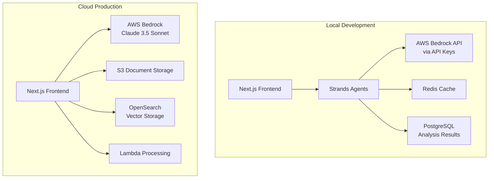

<!--
SPDX-License-Identifier: PolyForm-Perimeter-1.0.0
SPDX-FileCopyrightText: 2025 Seventeen Sierra LLC
-->

# AI Component Design Document

## Overview

The AI component provides intelligent document analysis and compliance validation using AWS Bedrock (Claude 3.5 Sonnet). It implements automated proposal analysis, natural language processing of FAR/DFARS requirements, and intelligent recommendations for compliance improvements through a hybrid architecture supporting both local development and cloud deployment.

## Architecture

### AI Service Architecture



## Components and Interfaces

### Core AI Components

#### AWS Bedrock Integration
```typescript
interface BedrockClient {
  analyzeDocument(document: DocumentContent): Promise<AnalysisResult>;
  validateCompliance(content: string, rules: FARRule[]): Promise<ComplianceResult>;
  generateRecommendations(findings: ComplianceFinding[]): Promise<string[]>;
}

class BedrockService implements BedrockClient {
  private client: BedrockRuntimeClient;
  
  constructor(config: AWSConfig) {
    this.client = new BedrockRuntimeClient({
      region: config.region,
      credentials: config.credentials
    });
  }
  
  async analyzeDocument(document: DocumentContent): Promise<AnalysisResult> {
    const prompt = this.buildAnalysisPrompt(document);
    const response = await this.client.send(new InvokeModelCommand({
      modelId: "anthropic.claude-3-5-sonnet-20241022-v2:0",
      body: JSON.stringify({
        anthropic_version: "bedrock-2023-05-31",
        max_tokens: 4000,
        messages: [{ role: "user", content: prompt }]
      })
    }));
    
    return this.parseAnalysisResponse(response);
  }
}
```

#### Document Intelligence Engine
```typescript
interface DocumentProcessor {
  extractContent(file: Buffer): Promise<DocumentContent>;
  identifyStructure(content: string): Promise<DocumentStructure>;
  extractMetadata(file: Buffer): Promise<DocumentMetadata>;
}

interface DocumentContent {
  text: string;
  sections: DocumentSection[];
  tables: TableData[];
  metadata: DocumentMetadata;
}

interface DocumentSection {
  title: string;
  content: string;
  pageNumber: number;
  confidence: number;
}
```

### Compliance Reasoning Engine

```typescript
interface ComplianceEngine {
  validateAgainstFAR(content: DocumentContent): Promise<ComplianceResult>;
  validateAgainstDFARS(content: DocumentContent): Promise<ComplianceResult>;
  generateFindings(violations: RuleViolation[]): Promise<ComplianceFinding[]>;
}

interface ComplianceResult {
  overallScore: number;
  findings: ComplianceFinding[];
  recommendations: string[];
  confidence: number;
  processingTime: number;
}

interface ComplianceFinding {
  ruleId: string;
  severity: 'critical' | 'major' | 'minor' | 'info';
  title: string;
  description: string;
  citation: string;
  proposalText: string;
  recommendation: string;
  confidence: number;
  aiReasoning: string;
}
```

## Data Models

### AI Processing Models

```typescript
interface AIAnalysisRequest {
  documentId: string;
  analysisType: 'far' | 'dfars' | 'combined';
  options: {
    confidenceThreshold: number;
    includeRecommendations: boolean;
    detailLevel: 'basic' | 'detailed' | 'comprehensive';
  };
}

interface AIAnalysisResult {
  requestId: string;
  documentId: string;
  status: 'processing' | 'completed' | 'failed';
  results?: ComplianceResult;
  error?: string;
  startTime: Date;
  completionTime?: Date;
  tokensUsed: number;
  cost: number;
}
```

## Correctness Properties

### Acceptance Criteria Testing Prework

3.1 AWS Bedrock integration with secure API authentication
  Thoughts: This is about the reliability of connecting to and using AWS Bedrock across different scenarios. We can test API connectivity, authentication, and response handling.
  Testable: yes - property

3.2 Basic rate limiting and error handling
  Thoughts: This is about how the system handles API limits and failures. We can test rate limiting behavior and error recovery.
  Testable: yes - property

3.3 Exponential backoff for reliability
  Thoughts: This is about retry behavior when services are temporarily unavailable. We can test backoff timing and retry logic.
  Testable: yes - property

### Correctness Properties

**Property 1: Bedrock API reliability**
*For any* valid API request to AWS Bedrock, the system should handle authentication, rate limiting, and responses correctly with appropriate error handling
**Validates: Requirements 3.1, 3.2, 3.3**

**Property 2: Document processing completeness**
*For any* valid document input, the AI system should extract content and return structured analysis results with confidence scores
**Validates: Requirements 3.1**

**Property 3: Error recovery consistency**
*For any* API failure or rate limit, the system should implement exponential backoff and graceful degradation without data loss
**Validates: Requirements 3.3**

## Error Handling

### AI Service Error Categories

1. **API Errors**
   - Authentication failures
   - Rate limiting (429 responses)
   - Service unavailability (503 responses)
   - Invalid model requests

2. **Processing Errors**
   - Document parsing failures
   - Content extraction errors
   - Analysis timeout errors
   - Insufficient confidence scores

3. **Integration Errors**
   - Network connectivity issues
   - Configuration errors
   - Resource exhaustion
   - Token limit exceeded

### Error Response Strategy

```typescript
interface AIErrorResponse {
  error: {
    type: 'authentication' | 'rate_limit' | 'processing' | 'service_unavailable';
    message: string;
    retryAfter?: number;
    suggestions: string[];
  };
}
```

## Testing Strategy

### Property-Based Testing
- Use fast-check for testing AI service reliability
- Test document processing across various input formats
- Validate error handling and recovery mechanisms
- Minimum 100 iterations per property test

### Unit Testing
- Mock AWS Bedrock responses for consistent testing
- Test document parsing and content extraction
- Validate compliance rule application
- Test confidence scoring algorithms

## Security Considerations

### Data Protection
- No proposal content stored in AI service logs
- Encrypted communication with AWS Bedrock
- Secure deletion of temporary processing files
- Data masking for PII in analysis results

### Access Controls
- IAM roles for AWS Bedrock access
- API key rotation and management
- Request rate limiting and monitoring
- Audit logging for all AI operations

## Performance Optimization

### Caching Strategy
- Cache analysis results for similar content
- Cache FAR/DFARS rule interpretations
- Implement request deduplication
- Use Redis for fast result retrieval

### Resource Management
- Request queuing for high-volume processing
- Parallel processing for independent analysis
- Token usage optimization
- Cost monitoring and alerting