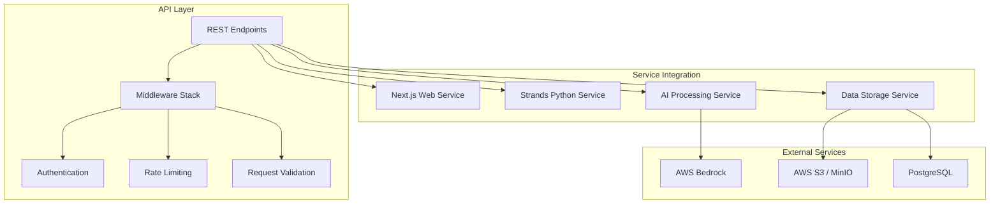

<!--
SPDX-License-Identifier: PolyForm-Perimeter-1.0.0
SPDX-FileCopyrightText: 2025 Seventeen Sierra LLC
-->

# API Component Design Document

## Overview

The API component establishes REST endpoints, service integration patterns, and communication protocols between the Next.js web application and backend services. It provides secure, efficient data exchange for proposal validation, compliance analysis, and AI orchestration while supporting both local development and cloud deployment scenarios.

## Architecture

### API Architecture



## Components and Interfaces

### REST API Endpoints

#### Proposal Management API
```typescript
// /api/proposals
interface ProposalAPI {
  // POST /api/proposals - Upload new proposal
  uploadProposal(file: File, metadata: ProposalMetadata): Promise<ProposalResponse>;
  
  // GET /api/proposals - List proposals with pagination
  listProposals(params: ListParams): Promise<ProposalListResponse>;
  
  // GET /api/proposals/{id} - Get proposal details
  getProposal(id: string): Promise<ProposalResponse>;
  
  // PUT /api/proposals/{id} - Update proposal
  updateProposal(id: string, updates: ProposalUpdate): Promise<ProposalResponse>;
  
  // DELETE /api/proposals/{id} - Delete proposal
  deleteProposal(id: string): Promise<void>;
}

interface ProposalResponse {
  id: string;
  filename: string;
  uploadedAt: Date;
  size: number;
  status: 'uploaded' | 'processing' | 'analyzed' | 'error';
  metadata: ProposalMetadata;
}
```

#### Validation API
```typescript
// /api/validate
interface ValidationAPI {
  // POST /api/proposals/{id}/validate - Start validation
  startValidation(proposalId: string, options: ValidationOptions): Promise<ValidationJobResponse>;
  
  // GET /api/validation/{jobId} - Get validation status
  getValidationStatus(jobId: string): Promise<ValidationStatusResponse>;
  
  // GET /api/proposals/{id}/results - Get validation results
  getValidationResults(proposalId: string): Promise<ValidationResultsResponse>;
}

interface ValidationOptions {
  type: 'far' | 'dfars' | 'combined';
  confidenceThreshold: number;
  includeRecommendations: boolean;
  detailLevel: 'basic' | 'detailed' | 'comprehensive';
}

interface ValidationJobResponse {
  jobId: string;
  proposalId: string;
  status: 'queued' | 'processing' | 'completed' | 'failed';
  estimatedCompletion?: Date;
}
```

### Service Integration Patterns

#### Inter-Service Communication
```typescript
interface ServiceClient {
  // Communication with Strands Python service
  callStrandsService<T>(endpoint: string, data: any): Promise<T>;
  
  // Communication with AI processing service
  callAIService<T>(endpoint: string, data: any): Promise<T>;
  
  // Health checks for all services
  checkServiceHealth(serviceName: string): Promise<HealthStatus>;
}

interface HealthStatus {
  service: string;
  status: 'healthy' | 'degraded' | 'unhealthy';
  lastCheck: Date;
  responseTime: number;
  details?: any;
}
```

## Data Models

### API Request/Response Models

```typescript
interface APIRequest<T = any> {
  method: 'GET' | 'POST' | 'PUT' | 'DELETE';
  path: string;
  headers: Record<string, string>;
  body?: T;
  query?: Record<string, string>;
  user?: AuthenticatedUser;
}

interface APIResponse<T = any> {
  success: boolean;
  data?: T;
  error?: APIError;
  metadata?: {
    requestId: string;
    timestamp: Date;
    processingTime: number;
  };
}

interface APIError {
  code: string;
  message: string;
  details?: any;
  statusCode: number;
}
```

### Authentication Models
```typescript
interface AuthenticatedUser {
  id: string;
  email: string;
  roles: string[];
  permissions: string[];
  organizationId?: string;
}

interface JWTPayload {
  sub: string; // user ID
  email: string;
  roles: string[];
  iat: number;
  exp: number;
  iss: string;
}
```

## Correctness Properties

### Acceptance Criteria Testing Prework

Since all API requirements are objective (future enhancement), we focus on the core API functionality that supports the threshold requirements:

API.1 REST endpoints for proposal operations
  Thoughts: This is about the reliability of API endpoints across different request types and data. We can test that all endpoints respond correctly and handle various inputs.
  Testable: yes - property

API.2 Service integration patterns
  Thoughts: This is about communication between services working correctly. We can test that service calls succeed and handle failures appropriately.
  Testable: yes - property

API.3 API security controls
  Thoughts: This is about authentication and authorization working correctly. We can test that security controls are enforced consistently.
  Testable: yes - property

### Correctness Properties

**Property 1: API endpoint reliability**
*For any* valid API request, the system should return appropriate responses with correct status codes and error handling
**Validates: API Requirements (supporting threshold functionality)**

**Property 2: Service integration consistency**
*For any* inter-service communication, the system should handle requests, responses, and failures consistently with proper retry logic
**Validates: API Requirements (supporting threshold functionality)**

**Property 3: API security enforcement**
*For any* API request, the system should properly authenticate, authorize, and audit access according to security policies
**Validates: API Requirements (supporting threshold functionality)**

## Error Handling

### API Error Categories

1. **Client Errors (4xx)**
   - 400 Bad Request - Invalid request format
   - 401 Unauthorized - Authentication required
   - 403 Forbidden - Insufficient permissions
   - 404 Not Found - Resource not found
   - 409 Conflict - Resource conflict
   - 422 Unprocessable Entity - Validation errors
   - 429 Too Many Requests - Rate limit exceeded

2. **Server Errors (5xx)**
   - 500 Internal Server Error - Unexpected server error
   - 502 Bad Gateway - Service communication failure
   - 503 Service Unavailable - Service temporarily unavailable
   - 504 Gateway Timeout - Service timeout

### Error Response Format
```typescript
interface StandardErrorResponse {
  error: {
    code: string;
    message: string;
    details?: any;
    timestamp: string;
    requestId: string;
    path: string;
  };
}
```

## Testing Strategy

### Property-Based Testing
- Test API endpoints with various input combinations
- Validate service integration patterns under different conditions
- Test security controls across different user roles and permissions
- Minimum 100 iterations per property test

### Unit Testing
- Test individual API route handlers
- Mock external service dependencies
- Validate request/response serialization
- Test middleware functionality

### Integration Testing
- Test complete API workflows
- Validate service-to-service communication
- Test error propagation and handling
- Validate authentication and authorization flows

## Security Implementation

### Authentication & Authorization
```typescript
// JWT-based authentication middleware
async function authenticateRequest(req: APIRequest): Promise<AuthenticatedUser | null> {
  const token = extractBearerToken(req.headers.authorization);
  if (!token) return null;
  
  try {
    const payload = jwt.verify(token, process.env.JWT_SECRET) as JWTPayload;
    return await getUserFromPayload(payload);
  } catch (error) {
    return null;
  }
}

// Role-based authorization
function requireRole(roles: string[]) {
  return (req: APIRequest, res: APIResponse, next: NextFunction) => {
    if (!req.user || !roles.some(role => req.user.roles.includes(role))) {
      return res.status(403).json({ error: 'Insufficient permissions' });
    }
    next();
  };
}
```

### Rate Limiting
```typescript
interface RateLimitConfig {
  windowMs: number; // Time window in milliseconds
  maxRequests: number; // Max requests per window
  keyGenerator: (req: APIRequest) => string; // Rate limit key
  skipSuccessfulRequests?: boolean;
  skipFailedRequests?: boolean;
}

const rateLimitConfig: RateLimitConfig = {
  windowMs: 15 * 60 * 1000, // 15 minutes
  maxRequests: 100, // 100 requests per window
  keyGenerator: (req) => req.user?.id || req.ip
};
```

## Performance Considerations

### Caching Strategy
- Cache frequently accessed data with Redis
- Implement response caching for read-heavy endpoints
- Use ETags for conditional requests
- Cache service health status

### Request Optimization
- Implement request compression
- Use connection pooling for database connections
- Batch similar requests where possible
- Implement request deduplication

### Monitoring & Observability
- Log all API requests and responses
- Track response times and error rates
- Monitor service health and availability
- Implement distributed tracing for service calls