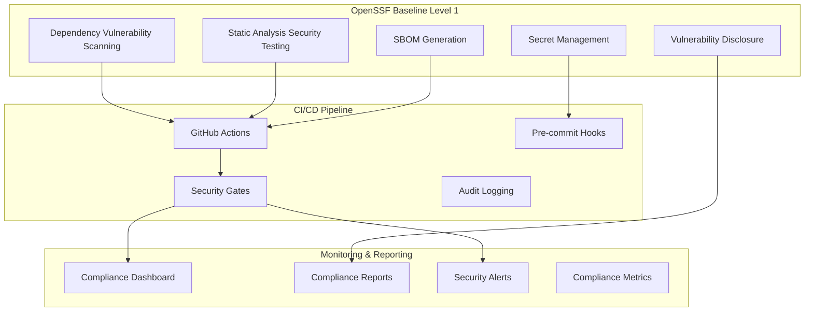

<!--
SPDX-License-Identifier: PolyForm-Perimeter-1.0.0
SPDX-FileCopyrightText: 2025 Seventeen Sierra LLC
-->

# Compliance Component Design Document

## Overview

The Compliance component ensures the Proposal Prepper application meets OpenSSF Baseline Level 1 security standards and provides the foundation for future federal compliance frameworks. It implements automated security scanning, SBOM generation, vulnerability management, and compliance reporting to meet production deployment requirements.

## Architecture

### Compliance Architecture



## Components and Interfaces

### OpenSSF Baseline Level 1 Implementation

#### Dependency Vulnerability Scanning
```typescript
interface DependencyScanner {
  scanDependencies(): Promise<VulnerabilityReport>;
  checkForUpdates(): Promise<UpdateReport>;
  generateSBOM(): Promise<SBOM>;
}

interface VulnerabilityReport {
  scanDate: Date;
  totalDependencies: number;
  vulnerabilities: Vulnerability[];
  riskScore: number;
  recommendations: string[];
}

interface Vulnerability {
  id: string; // CVE ID
  severity: 'critical' | 'high' | 'medium' | 'low';
  package: string;
  version: string;
  description: string;
  fixedVersion?: string;
  patchAvailable: boolean;
}
```

#### Static Analysis Security Testing (SAST)
```typescript
interface SASTScanner {
  scanCode(files: string[]): Promise<SecurityIssue[]>;
  scanConfiguration(): Promise<ConfigIssue[]>;
  validateSecrets(): Promise<SecretScanResult>;
}

interface SecurityIssue {
  id: string;
  type: 'vulnerability' | 'code_smell' | 'security_hotspot';
  severity: 'critical' | 'major' | 'minor' | 'info';
  file: string;
  line: number;
  description: string;
  recommendation: string;
  cweId?: string;
}
```

#### Software Bill of Materials (SBOM)
```typescript
interface SBOMGenerator {
  generateSBOM(): Promise<SBOM>;
  validateSBOM(sbom: SBOM): Promise<ValidationResult>;
  exportSBOM(format: 'spdx' | 'cyclonedx'): Promise<string>;
}

interface SBOM {
  spdxVersion: string;
  creationInfo: {
    created: Date;
    creators: string[];
    licenseListVersion: string;
  };
  packages: SBOMPackage[];
  relationships: SBOMRelationship[];
  vulnerabilities?: VulnerabilityReference[];
}

interface SBOMPackage {
  name: string;
  version: string;
  downloadLocation: string;
  filesAnalyzed: boolean;
  licenseConcluded: string;
  copyrightText: string;
  supplier?: string;
  homepage?: string;
}
```

## Data Models

### Compliance Tracking Models

```typescript
interface ComplianceStatus {
  id: string;
  framework: 'openssf-baseline-l1' | 'fedramp' | 'ssdf';
  status: 'compliant' | 'non-compliant' | 'partial' | 'unknown';
  lastAssessment: Date;
  requirements: ComplianceRequirement[];
  overallScore: number;
}

interface ComplianceRequirement {
  id: string;
  title: string;
  description: string;
  status: 'met' | 'not-met' | 'partial' | 'not-applicable';
  evidence: string[];
  lastVerified: Date;
  automatedCheck: boolean;
}

interface SecurityEvent {
  id: string;
  type: 'vulnerability_detected' | 'secret_exposed' | 'compliance_violation';
  severity: 'critical' | 'high' | 'medium' | 'low';
  description: string;
  source: string;
  timestamp: Date;
  resolved: boolean;
  resolution?: string;
}
```

## Correctness Properties

### Acceptance Criteria Testing Prework

1.1 Automated dependency vulnerability scanning
  Thoughts: This is about the scanning process working correctly across all dependencies. We can test that scanning completes and identifies known vulnerabilities.
  Testable: yes - property

1.2 Static analysis security testing in CI/CD pipeline
  Thoughts: This is about SAST tools running correctly and catching security issues. We can test that SAST runs and reports findings.
  Testable: yes - property

1.3 Never commit secrets to version control
  Thoughts: This is about preventing secrets from being committed. We can test that secret scanning catches and prevents secret commits.
  Testable: yes - property

1.4 Maintain basic SBOM
  Thoughts: This is about SBOM generation working correctly. We can test that SBOMs are generated and contain required information.
  Testable: yes - property

1.5 Documented vulnerability disclosure process
  Thoughts: This is about having proper documentation and processes. We can test that documentation exists and is accessible.
  Testable: yes - example

### Correctness Properties

**Property 1: Dependency scanning completeness**
*For any* project dependency set, the vulnerability scanner should identify all known vulnerabilities and generate accurate reports
**Validates: Requirements 1.1**

**Property 2: SAST detection reliability**
*For any* code with security issues, the SAST pipeline should detect and report security vulnerabilities with appropriate severity levels
**Validates: Requirements 1.2**

**Property 3: Secret protection enforcement**
*For any* attempt to commit secrets, the system should detect and prevent the commit while providing clear remediation guidance
**Validates: Requirements 1.3**

**Property 4: SBOM generation accuracy**
*For any* project state, the SBOM generator should produce complete and accurate software bills of materials in SPDX format
**Validates: Requirements 1.4**

## Error Handling

### Compliance Error Categories

1. **Scanning Errors**
   - Dependency resolution failures
   - SAST tool execution errors
   - Network connectivity issues
   - Tool configuration problems

2. **Compliance Violations**
   - Critical vulnerabilities detected
   - Secrets found in code
   - SBOM generation failures
   - Policy violations

3. **Reporting Errors**
   - Report generation failures
   - Data export errors
   - Dashboard update failures
   - Alert delivery failures

## Testing Strategy

### Property-Based Testing
- Test vulnerability scanning across different dependency configurations
- Validate SAST detection with various code patterns
- Test secret detection with different secret formats
- Verify SBOM generation with various project structures
- Minimum 100 iterations per property test

### Unit Testing
- Test individual compliance check functions
- Mock external security tools and APIs
- Validate report generation and formatting
- Test compliance status calculations

## Security Implementation

### OpenSSF Baseline Level 1 Controls

1. **Dependency Management**
   ```bash
   # npm audit for vulnerability scanning
   npm audit --audit-level=moderate
   
   # Automated dependency updates
   npm update --save
   
   # Lock file validation
   npm ci --audit
   ```

2. **Static Analysis**
   ```yaml
   # GitHub Actions SAST configuration
   - name: Run SAST
     uses: github/super-linter@v4
     env:
       DEFAULT_BRANCH: main
       GITHUB_TOKEN: ${{ secrets.GITHUB_TOKEN }}
   ```

3. **Secret Scanning**
   ```bash
   # gitleaks configuration
   gitleaks detect --source . --verbose
   ```

4. **SBOM Generation**
   ```bash
   # syft SBOM generation
   syft packages . -o spdx-json > sbom.spdx.json
   ```

## Monitoring and Reporting

### Compliance Dashboard
- Real-time compliance status overview
- Vulnerability trend analysis
- SBOM completeness metrics
- Security event timeline

### Automated Reporting
- Daily vulnerability reports
- Weekly compliance summaries
- Monthly security assessments
- Incident response reports

### Alerting
- Critical vulnerability notifications
- Compliance violation alerts
- SBOM generation failures
- Secret detection alerts