<!--
SPDX-License-Identifier: PolyForm-Perimeter-1.0.0
SPDX-FileCopyrightText: 2025 Seventeen Sierra LLC
-->

# Data Component Design Document

## Overview

The Data component establishes data models, storage patterns, and data management capabilities for proposal documents, compliance validation results, user information, and SBOM tracking. It provides secure, efficient storage and retrieval using a hybrid architecture with local development support (MinIO, PostgreSQL) and cloud production deployment (AWS S3, OpenSearch).

## Architecture

### Data Architecture

```mermaid
graph TB
    subgraph "Local Development"
        LApp[Next.js App]
        LMinIO[MinIO S3-Compatible]
        LPostgres[PostgreSQL Database]
        LRedis[Redis Cache]
    end
    
    subgraph "Cloud Production"
        CApp[Next.js App]
        CS3[AWS S3]
        COpenSearch[AWS OpenSearch]
        CDynamoDB[DynamoDB]
        CRDS[RDS PostgreSQL]
    end
    
    subgraph "Data Models"
        Proposals[Proposal Documents]
        Findings[Compliance Findings]
        SBOM[Software Bill of Materials]
        Users[User Data]
        Analytics[Analytics Data]
    end
    
    LApp --> LMinIO
    LApp --> LPostgres
    LApp --> LRedis
    
    CApp --> CS3
    CApp --> COpenSearch
    CApp --> CDynamoDB
    CApp --> CRDS
    
    Proposals --> LMinIO
    Proposals --> CS3
    Findings --> LPostgres
    Findings --> COpenSearch
    SBOM --> LPostgres
    SBOM --> CDynamoDB
```



## Components and Interfaces

### Data Access Layer

#### Document Storage Interface
```typescript
interface DocumentStorage {
  uploadDocument(file: Buffer, metadata: DocumentMetadata): Promise<string>;
  downloadDocument(key: string): Promise<Buffer>;
  deleteDocument(key: string): Promise<void>;
  listDocuments(prefix?: string): Promise<DocumentInfo[]>;
  getDocumentMetadata(key: string): Promise<DocumentMetadata>;
}

// Local implementation with MinIO
class MinIODocumentStorage implements DocumentStorage {
  private client: Client;
  
  constructor(config: MinIOConfig) {
    this.client = new Client({
      endPoint: config.endpoint,
      port: config.port,
      useSSL: config.useSSL,
      accessKey: config.accessKey,
      secretKey: config.secretKey
    });
  }
  
  async uploadDocument(file: Buffer, metadata: DocumentMetadata): Promise<string> {
    const key = generateDocumentKey(metadata);
    await this.client.putObject(BUCKET_NAME, key, file, file.length, {
      'Content-Type': metadata.contentType,
      'x-amz-meta-filename': metadata.filename,
      'x-amz-meta-uploaded-by': metadata.uploadedBy
    });
    return key;
  }
}

// Cloud implementation with AWS S3
class S3DocumentStorage implements DocumentStorage {
  private client: S3Client;
  
  constructor(config: AWSConfig) {
    this.client = new S3Client({
      region: config.region,
      credentials: config.credentials
    });
  }
}
```

#### Database Access Layer
```typescript
interface DatabaseRepository<T> {
  create(entity: Omit<T, 'id'>): Promise<T>;
  findById(id: string): Promise<T | null>;
  findMany(criteria: Partial<T>): Promise<T[]>;
  update(id: string, updates: Partial<T>): Promise<T>;
  delete(id: string): Promise<void>;
}

class PostgreSQLRepository<T> implements DatabaseRepository<T> {
  constructor(
    private pool: Pool,
    private tableName: string,
    private mapper: EntityMapper<T>
  ) {}
  
  async create(entity: Omit<T, 'id'>): Promise<T> {
    const query = this.mapper.buildInsertQuery(entity);
    const result = await this.pool.query(query.sql, query.params);
    return this.mapper.mapFromRow(result.rows[0]);
  }
}
```

## Data Models

### Core Data Structures

#### Proposal Document Model
```typescript
interface ProposalDocument {
  id: string;
  filename: string;
  originalName: string;
  uploadedAt: Date;
  uploadedBy: string;
  size: number;
  contentType: string;
  storageKey: string; // S3/MinIO key
  checksum: string; // SHA-256 hash
  metadata: {
    pageCount?: number;
    extractedText?: string;
    sections?: DocumentSection[];
    language?: string;
  };
  status: 'uploaded' | 'processing' | 'analyzed' | 'error';
  tags: string[];
  organizationId?: string;
}

interface DocumentSection {
  title: string;
  content: string;
  pageNumber: number;
  startOffset: number;
  endOffset: number;
  confidence: number;
}
```

#### Compliance Finding Model
```typescript
interface ComplianceFinding {
  id: string;
  proposalId: string;
  ruleId: string; // FAR/DFARS reference
  severity: 'critical' | 'major' | 'minor' | 'info';
  title: string;
  description: string;
  citation: string; // Exact regulatory citation
  proposalText: string; // Relevant excerpt
  recommendation: string;
  confidence: number; // 0-100
  aiReasoning: string;
  status: 'open' | 'acknowledged' | 'resolved' | 'false_positive';
  createdAt: Date;
  updatedAt: Date;
  reviewedBy?: string;
  reviewNotes?: string;
}
```

#### SBOM Model
```typescript
interface SoftwareBillOfMaterials {
  id: string;
  spdxVersion: string;
  creationInfo: {
    created: Date;
    creators: string[];
    licenseListVersion: string;
    documentName: string;
    documentNamespace: string;
  };
  packages: SBOMPackage[];
  relationships: SBOMRelationship[];
  vulnerabilities: VulnerabilityReference[];
  generatedAt: Date;
  projectVersion: string;
  checksum: string;
}

interface SBOMPackage {
  id: string;
  name: string;
  version: string;
  downloadLocation: string;
  filesAnalyzed: boolean;
  licenseConcluded: string;
  copyrightText: string;
  supplier?: string;
  homepage?: string;
  sourceInfo?: string;
  vulnerabilities: string[]; // CVE IDs
}

interface VulnerabilityReference {
  id: string; // CVE ID
  severity: 'critical' | 'high' | 'medium' | 'low';
  description: string;
  publishedDate: Date;
  modifiedDate: Date;
  affectedPackages: string[];
  fixedVersion?: string;
}
```

### Database Schema

```sql
-- Proposals table
CREATE TABLE proposals (
    id UUID PRIMARY KEY DEFAULT gen_random_uuid(),
    filename VARCHAR(255) NOT NULL,
    original_name VARCHAR(255) NOT NULL,
    uploaded_at TIMESTAMP DEFAULT NOW(),
    uploaded_by VARCHAR(255) NOT NULL,
    size BIGINT NOT NULL,
    content_type VARCHAR(100),
    storage_key VARCHAR(500) UNIQUE NOT NULL,
    checksum VARCHAR(64) NOT NULL,
    metadata JSONB DEFAULT '{}',
    status VARCHAR(20) DEFAULT 'uploaded',
    tags TEXT[] DEFAULT '{}',
    organization_id UUID,
    created_at TIMESTAMP DEFAULT NOW(),
    updated_at TIMESTAMP DEFAULT NOW()
);

-- Compliance findings table
CREATE TABLE compliance_findings (
    id UUID PRIMARY KEY DEFAULT gen_random_uuid(),
    proposal_id UUID REFERENCES proposals(id) ON DELETE CASCADE,
    rule_id VARCHAR(50) NOT NULL,
    severity VARCHAR(20) NOT NULL,
    title VARCHAR(255) NOT NULL,
    description TEXT,
    citation VARCHAR(255),
    proposal_text TEXT,
    recommendation TEXT,
    confidence INTEGER CHECK (confidence >= 0 AND confidence <= 100),
    ai_reasoning TEXT,
    status VARCHAR(20) DEFAULT 'open',
    created_at TIMESTAMP DEFAULT NOW(),
    updated_at TIMESTAMP DEFAULT NOW(),
    reviewed_by VARCHAR(255),
    review_notes TEXT
);

-- SBOM packages table
CREATE TABLE sbom_packages (
    id UUID PRIMARY KEY DEFAULT gen_random_uuid(),
    sbom_id UUID REFERENCES sboms(id) ON DELETE CASCADE,
    name VARCHAR(255) NOT NULL,
    version VARCHAR(100) NOT NULL,
    download_location TEXT,
    files_analyzed BOOLEAN DEFAULT FALSE,
    license_concluded VARCHAR(255),
    copyright_text TEXT,
    supplier VARCHAR(255),
    homepage TEXT,
    source_info TEXT,
    vulnerabilities TEXT[] DEFAULT '{}',
    created_at TIMESTAMP DEFAULT NOW()
);

-- SBOM main table
CREATE TABLE sboms (
    id UUID PRIMARY KEY DEFAULT gen_random_uuid(),
    spdx_version VARCHAR(20) NOT NULL,
    document_name VARCHAR(255) NOT NULL,
    document_namespace TEXT NOT NULL,
    creators TEXT[] NOT NULL,
    license_list_version VARCHAR(20),
    generated_at TIMESTAMP DEFAULT NOW(),
    project_version VARCHAR(100),
    checksum VARCHAR(64) NOT NULL,
    created_at TIMESTAMP DEFAULT NOW()
);
```

## Correctness Properties

### Acceptance Criteria Testing Prework

1.1 Well-defined data models including SBOM data structures
  Thoughts: This is about data validation and structure consistency. We can test that all data models validate correctly and maintain referential integrity.
  Testable: yes - property

1.6 Comprehensive data security with secret management and SBOM
  Thoughts: This is about data protection and security controls. We can test encryption, access controls, and secure data handling.
  Testable: yes - property

1.9 Data migration and seeding capabilities for local development
  Thoughts: This is about data management operations working correctly. We can test migration scripts and seeding processes.
  Testable: yes - property

### Correctness Properties

**Property 1: Data model validation consistency**
*For any* data entity, the system should validate structure, enforce constraints, and maintain referential integrity across all operations
**Validates: Requirements 1.1**

**Property 2: Data security enforcement**
*For any* data operation, the system should enforce encryption, access controls, and audit logging according to security policies
**Validates: Requirements 1.6**

**Property 3: Data migration reliability**
*For any* migration or seeding operation, the system should complete successfully without data loss or corruption
**Validates: Requirements 1.9**

## Error Handling

### Data Error Categories

1. **Storage Errors**
   - File upload failures
   - Storage quota exceeded
   - Network connectivity issues
   - Corruption detection

2. **Database Errors**
   - Connection failures
   - Constraint violations
   - Transaction rollbacks
   - Query timeouts

3. **Validation Errors**
   - Schema validation failures
   - Data type mismatches
   - Required field violations
   - Business rule violations

## Testing Strategy

### Property-Based Testing
- Test data validation across various input combinations
- Validate storage operations under different conditions
- Test migration and seeding with various data sets
- Minimum 100 iterations per property test

### Unit Testing
- Test individual repository methods
- Mock database and storage dependencies
- Validate data transformation and mapping
- Test error handling and recovery

## Security Implementation

### Data Protection
- **Encryption at Rest**: AES-256 encryption for sensitive data
- **Encryption in Transit**: TLS 1.3 for all data transfers
- **Access Controls**: Role-based access with audit logging
- **Data Masking**: PII protection in logs and exports

### SBOM Security
- **Vulnerability Tracking**: Automated CVE monitoring
- **License Compliance**: License compatibility checking
- **Supply Chain Security**: Dependency integrity verification
- **Audit Trails**: Complete SBOM generation and update history

## Performance Considerations

### Caching Strategy
- Redis caching for frequently accessed data
- Query result caching with TTL
- Document metadata caching
- SBOM component caching

### Database Optimization
- Proper indexing for common queries
- Connection pooling for scalability
- Read replicas for query distribution
- Partitioning for large datasets

### Storage Optimization
- Compression for document storage
- CDN integration for file delivery
- Lifecycle policies for data retention
- Backup and archival strategies