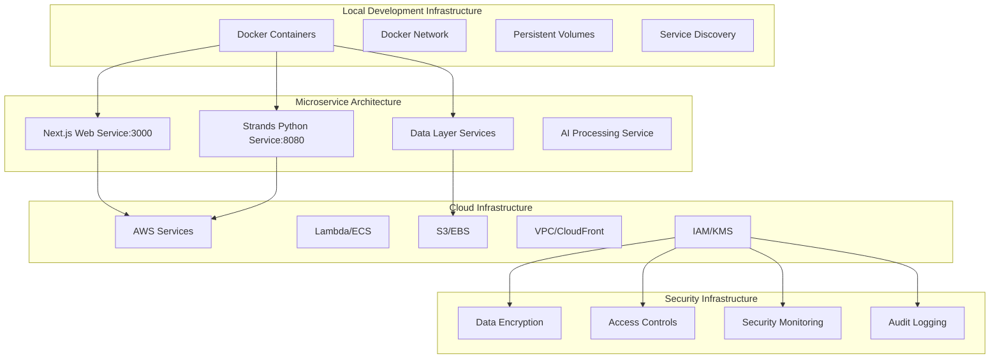

<!--
SPDX-License-Identifier: PolyForm-Perimeter-1.0.0
SPDX-FileCopyrightText: 2025 Seventeen Sierra LLC
-->

# Infrastructure Component Design Document

## Overview

The Infrastructure component establishes the foundational infrastructure patterns, containerization, and system architecture supporting both local Strands agent development and cloud production deployment. It provides containerized services, microservice architecture, cloud data infrastructure, and security controls required for the FAR compliance validation system.

## Architecture

### Infrastructure Architecture



## Components and Interfaces

### Container Infrastructure

#### Docker Configuration
```dockerfile
# Dockerfile.web - Next.js Web Service
FROM node:18-alpine AS base
WORKDIR /app
COPY package*.json ./
RUN npm ci --only=production

FROM base AS dev
RUN npm ci
COPY . .
EXPOSE 3000
CMD ["npm", "run", "dev"]

FROM base AS prod
COPY . .
RUN npm run build
EXPOSE 3000
CMD ["npm", "start"]

# Dockerfile.strands - Python Strands Service
FROM python:3.11-slim AS base
WORKDIR /app
COPY requirements.txt .
RUN pip install --no-cache-dir -r requirements.txt

FROM base AS dev
COPY . .
EXPOSE 8080
CMD ["python", "-m", "strands.main", "--dev"]

FROM base AS prod
COPY . .
EXPOSE 8080
CMD ["python", "-m", "strands.main"]
```

#### Service Discovery and Networking
```typescript
interface ServiceRegistry {
  registerService(service: ServiceInfo): Promise<void>;
  discoverService(name: string): Promise<ServiceInfo | null>;
  getHealthyServices(name: string): Promise<ServiceInfo[]>;
  unregisterService(serviceId: string): Promise<void>;
}

interface ServiceInfo {
  id: string;
  name: string;
  version: string;
  host: string;
  port: number;
  protocol: 'http' | 'https' | 'grpc';
  healthCheck: {
    path: string;
    interval: number;
    timeout: number;
  };
  metadata: Record<string, string>;
}

class DockerServiceRegistry implements ServiceRegistry {
  async registerService(service: ServiceInfo): Promise<void> {
    // Register service with Docker network DNS
    // Update service discovery records
  }
  
  async discoverService(name: string): Promise<ServiceInfo | null> {
    // Discover service through Docker network
    // Return service connection information
  }
}
```

### Microservice Architecture

#### Service Communication
```typescript
interface ServiceClient {
  call<T>(service: string, method: string, data: any): Promise<T>;
  stream<T>(service: string, method: string, data: any): AsyncIterable<T>;
  healthCheck(service: string): Promise<boolean>;
}

class HTTPServiceClient implements ServiceClient {
  constructor(private registry: ServiceRegistry) {}
  
  async call<T>(service: string, method: string, data: any): Promise<T> {
    const serviceInfo = await this.registry.discoverService(service);
    if (!serviceInfo) {
      throw new Error(`Service ${service} not found`);
    }
    
    const url = `${serviceInfo.protocol}://${serviceInfo.host}:${serviceInfo.port}/${method}`;
    const response = await fetch(url, {
      method: 'POST',
      headers: { 'Content-Type': 'application/json' },
      body: JSON.stringify(data)
    });
    
    if (!response.ok) {
      throw new Error(`Service call failed: ${response.statusText}`);
    }
    
    return response.json();
  }
}
```

### Cloud Data Infrastructure

#### AWS Service Integration
```typescript
interface CloudInfrastructure {
  storage: StorageService;
  search: SearchService;
  compute: ComputeService;
  ai: AIService;
}

class AWSInfrastructure implements CloudInfrastructure {
  storage: S3StorageService;
  search: OpenSearchService;
  compute: LambdaComputeService;
  ai: BedrockAIService;
  
  constructor(config: AWSConfig) {
    this.storage = new S3StorageService(config);
    this.search = new OpenSearchService(config);
    this.compute = new LambdaComputeService(config);
    this.ai = new BedrockAIService(config);
  }
}

interface StorageService {
  uploadFile(key: string, data: Buffer): Promise<string>;
  downloadFile(key: string): Promise<Buffer>;
  deleteFile(key: string): Promise<void>;
  listFiles(prefix: string): Promise<string[]>;
}

interface SearchService {
  indexDocument(id: string, document: any): Promise<void>;
  searchDocuments(query: string): Promise<SearchResult[]>;
  deleteDocument(id: string): Promise<void>;
}
```

## Data Models

### Infrastructure Configuration Models

```typescript
interface InfrastructureConfig {
  environment: 'local' | 'cloud';
  services: ServiceConfig[];
  networking: NetworkConfig;
  security: SecurityConfig;
  monitoring: MonitoringConfig;
}

interface ServiceConfig {
  name: string;
  image: string;
  ports: PortMapping[];
  environment: Record<string, string>;
  volumes: VolumeMount[];
  resources: ResourceLimits;
  healthCheck: HealthCheckConfig;
}

interface NetworkConfig {
  networkName: string;
  subnet: string;
  dnsConfig: DNSConfig;
  loadBalancer?: LoadBalancerConfig;
}

interface SecurityConfig {
  encryption: {
    atRest: boolean;
    inTransit: boolean;
    keyManagement: 'local' | 'aws-kms';
  };
  accessControl: {
    authentication: 'jwt' | 'oauth2';
    authorization: 'rbac' | 'abac';
  };
  networkSecurity: {
    firewall: boolean;
    vpn: boolean;
    ssl: boolean;
  };
}
```

### Resource Management Models

```typescript
interface ResourceLimits {
  cpu: string; // e.g., "0.5" for 0.5 CPU cores
  memory: string; // e.g., "512Mi" for 512 MiB
  disk?: string; // e.g., "1Gi" for 1 GiB
}

interface ResourceUsage {
  service: string;
  timestamp: Date;
  cpu: {
    usage: number; // percentage
    limit: number;
  };
  memory: {
    usage: number; // bytes
    limit: number;
  };
  disk?: {
    usage: number; // bytes
    limit: number;
  };
  network: {
    bytesIn: number;
    bytesOut: number;
  };
}
```

## Correctness Properties

### Acceptance Criteria Testing Prework

1.1 Containerized infrastructure for local Strands agents development
  Thoughts: This is about containers starting correctly and providing the necessary services. We can test container startup, networking, and service availability.
  Testable: yes - property

1.2 Microservice architecture with clear service boundaries
  Thoughts: This is about services communicating correctly and maintaining independence. We can test service communication and isolation.
  Testable: yes - property

1.3 Robust cloud data infrastructure with AWS services
  Thoughts: This is about cloud services being properly configured and accessible. We can test service connectivity and data operations.
  Testable: yes - property

1.7 Infrastructure security controls for OpenSSF Baseline
  Thoughts: This is about security configurations and controls being properly implemented. We can test security policies and access controls.
  Testable: yes - property

### Correctness Properties

**Property 1: Container infrastructure reliability**
*For any* container configuration, all services should start successfully, maintain networking, and pass health checks
**Validates: Requirements 1.1**

**Property 2: Microservice communication consistency**
*For any* service-to-service communication, the system should maintain proper boundaries, handle failures gracefully, and provide service discovery
**Validates: Requirements 1.2**

**Property 3: Cloud infrastructure availability**
*For any* cloud service operation, the system should maintain connectivity, handle AWS service interactions, and provide proper error handling
**Validates: Requirements 1.3**

**Property 4: Security infrastructure enforcement**
*For any* security operation, the system should enforce encryption, access controls, and audit logging according to OpenSSF Baseline requirements
**Validates: Requirements 1.7**

## Error Handling

### Infrastructure Error Categories

1. **Container Errors**
   - Service startup failures
   - Network connectivity issues
   - Volume mount problems
   - Resource allocation failures

2. **Service Communication Errors**
   - Service discovery failures
   - Network timeouts
   - Load balancing issues
   - Circuit breaker activation

3. **Cloud Infrastructure Errors**
   - AWS service unavailability
   - Authentication failures
   - Resource quota exceeded
   - Network connectivity issues

4. **Security Infrastructure Errors**
   - Encryption key failures
   - Access control violations
   - Audit logging failures
   - Security policy violations

## Testing Strategy

### Property-Based Testing
- Test container startup and networking across different configurations
- Validate service communication under various failure scenarios
- Test cloud infrastructure operations with different AWS configurations
- Verify security controls across different access patterns
- Minimum 100 iterations per property test

### Integration Testing
- Test complete infrastructure deployment workflows
- Validate service-to-service communication patterns
- Test cloud service integration and failover
- Validate security policy enforcement

## Security Implementation

### Infrastructure Security Controls

#### Encryption and Key Management
```typescript
interface EncryptionService {
  encryptData(data: Buffer, keyId: string): Promise<Buffer>;
  decryptData(encryptedData: Buffer, keyId: string): Promise<Buffer>;
  generateKey(keySpec: KeySpec): Promise<string>;
  rotateKey(keyId: string): Promise<string>;
}

class AWSKMSEncryptionService implements EncryptionService {
  private kmsClient: KMSClient;
  
  constructor(config: AWSConfig) {
    this.kmsClient = new KMSClient({
      region: config.region,
      credentials: config.credentials
    });
  }
  
  async encryptData(data: Buffer, keyId: string): Promise<Buffer> {
    const command = new EncryptCommand({
      KeyId: keyId,
      Plaintext: data
    });
    
    const response = await this.kmsClient.send(command);
    return Buffer.from(response.CiphertextBlob!);
  }
}
```

#### Access Control and Authentication
```typescript
interface AccessControlService {
  authenticate(credentials: Credentials): Promise<AuthToken>;
  authorize(token: AuthToken, resource: string, action: string): Promise<boolean>;
  auditAccess(token: AuthToken, resource: string, action: string, result: boolean): Promise<void>;
}

interface AuthToken {
  userId: string;
  roles: string[];
  permissions: string[];
  expiresAt: Date;
  issuer: string;
}
```

## Performance Considerations

### Resource Optimization

#### Container Resource Management
```typescript
interface ResourceManager {
  allocateResources(service: string, requirements: ResourceRequirements): Promise<ResourceAllocation>;
  monitorUsage(service: string): Promise<ResourceUsage>;
  scaleService(service: string, replicas: number): Promise<void>;
  optimizeResources(): Promise<OptimizationReport>;
}

interface ResourceRequirements {
  cpu: {
    min: number;
    max: number;
  };
  memory: {
    min: number;
    max: number;
  };
  storage?: {
    size: number;
    type: 'ssd' | 'hdd';
  };
}
```

### Monitoring and Observability

#### Infrastructure Monitoring
```typescript
interface InfrastructureMonitor {
  collectMetrics(): Promise<InfrastructureMetrics>;
  checkHealth(): Promise<HealthStatus[]>;
  generateAlerts(thresholds: AlertThresholds): Promise<Alert[]>;
  createDashboard(config: DashboardConfig): Promise<Dashboard>;
}

interface InfrastructureMetrics {
  timestamp: Date;
  services: ServiceMetrics[];
  resources: ResourceMetrics;
  network: NetworkMetrics;
  security: SecurityMetrics;
}
```