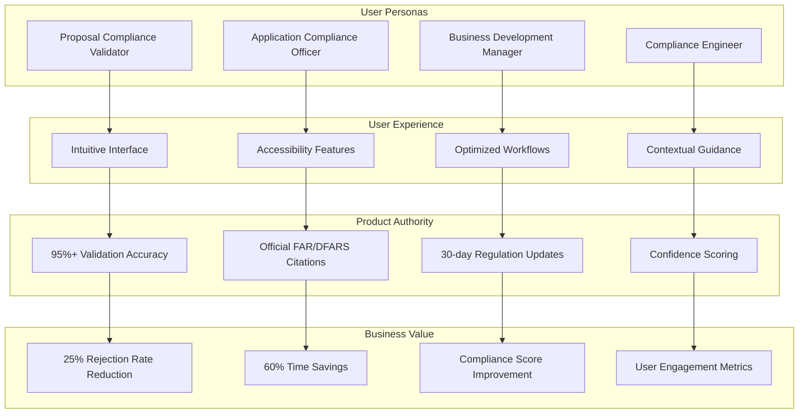

<!--
SPDX-License-Identifier: PolyForm-Perimeter-1.0.0
SPDX-FileCopyrightText: 2025 Seventeen Sierra LLC
-->

# Product Component Design Document

## Overview

The Product component defines the strategic vision, user experience goals, and business objectives for the Proposal Prepper base application. It establishes clear user personas, intuitive interfaces, and product accuracy requirements that serve federal contractors across all business sectors while maintaining trust and credibility in compliance validation.

## Architecture

### Product Architecture



## Components and Interfaces

### User Persona Management

#### Persona Definitions
```typescript
interface UserPersona {
  id: string;
  name: string;
  role: string;
  description: string;
  goals: string[];
  painPoints: string[];
  workflows: WorkflowPattern[];
  skillLevel: 'novice' | 'intermediate' | 'expert';
  organizationType: 'small_business' | 'large_enterprise' | 'government';
}

interface WorkflowPattern {
  name: string;
  steps: WorkflowStep[];
  frequency: 'daily' | 'weekly' | 'monthly' | 'occasional';
  priority: 'high' | 'medium' | 'low';
  timeToComplete: number; // minutes
}

interface WorkflowStep {
  id: string;
  name: string;
  description: string;
  userActions: string[];
  systemResponses: string[];
  successCriteria: string[];
}

// Primary personas for the base application
const PRIMARY_PERSONAS: UserPersona[] = [
  {
    id: 'proposal-compliance-validator',
    name: 'Proposal Compliance Validator',
    role: 'Primary application user',
    description: 'Federal contractor responsible for ensuring proposal compliance with FAR/DFARS requirements',
    goals: [
      'Validate proposals against current regulations',
      'Identify compliance issues before submission',
      'Reduce proposal rejection rates',
      'Save time on manual compliance checking'
    ],
    painPoints: [
      'Complex and changing regulations',
      'Time-consuming manual review process',
      'Risk of missing critical compliance issues',
      'Difficulty interpreting regulatory language'
    ],
    workflows: [
      {
        name: 'Proposal Validation',
        steps: [
          { id: '1', name: 'Upload Proposal', description: 'Upload proposal document for analysis' },
          { id: '2', name: 'Configure Analysis', description: 'Select validation type and options' },
          { id: '3', name: 'Review Results', description: 'Analyze compliance findings and recommendations' },
          { id: '4', name: 'Address Issues', description: 'Implement recommended changes' }
        ],
        frequency: 'weekly',
        priority: 'high',
        timeToComplete: 45
      }
    ],
    skillLevel: 'intermediate',
    organizationType: 'large_enterprise'
  }
];
```

### User Experience Design

#### Interface Design Patterns
```typescript
interface UIComponent {
  name: string;
  type: 'input' | 'display' | 'navigation' | 'feedback';
  accessibility: AccessibilityFeatures;
  usability: UsabilityFeatures;
  responsiveness: ResponsiveBreakpoints;
}

interface AccessibilityFeatures {
  wcagLevel: 'A' | 'AA' | 'AAA';
  keyboardNavigation: boolean;
  screenReaderSupport: boolean;
  colorContrastRatio: number;
  alternativeText: boolean;
  focusManagement: boolean;
}

interface UsabilityFeatures {
  cognitiveLoad: 'low' | 'medium' | 'high';
  clicksToComplete: number;
  errorPrevention: boolean;
  contextualHelp: boolean;
  progressIndicators: boolean;
}

interface ResponsiveBreakpoints {
  mobile: string; // e.g., "320px"
  tablet: string; // e.g., "768px"
  desktop: string; // e.g., "1024px"
  largeDesktop: string; // e.g., "1440px"
}
```

### Product Accuracy and Authority

#### Validation Accuracy Tracking
```typescript
interface AccuracyMetrics {
  overallAccuracy: number; // percentage
  validationResults: ValidationAccuracy[];
  expertComparisons: ExpertComparison[];
  confidenceCalibration: ConfidenceCalibration;
  lastUpdated: Date;
}

interface ValidationAccuracy {
  ruleCategory: string; // e.g., "FAR Part 15", "DFARS 252.225"
  accuracy: number; // percentage
  sampleSize: number;
  falsePositives: number;
  falseNegatives: number;
  truePositives: number;
  trueNegatives: number;
}

interface ExpertComparison {
  proposalId: string;
  expertFindings: ComplianceFinding[];
  aiFindings: ComplianceFinding[];
  agreement: number; // percentage
  discrepancies: Discrepancy[];
  reviewDate: Date;
  expertId: string;
}

interface ConfidenceCalibration {
  confidenceRanges: ConfidenceRange[];
  calibrationScore: number; // how well confidence matches actual accuracy
  overconfidenceRate: number;
  underconfidenceRate: number;
}

interface ConfidenceRange {
  min: number; // 0-100
  max: number; // 0-100
  actualAccuracy: number; // percentage
  sampleSize: number;
}
```

#### Regulatory Currency Management
```typescript
interface RegulatoryUpdate {
  id: string;
  regulation: 'FAR' | 'DFARS';
  section: string;
  changeType: 'addition' | 'modification' | 'deletion';
  effectiveDate: Date;
  description: string;
  impact: 'high' | 'medium' | 'low';
  implementationStatus: 'pending' | 'in_progress' | 'completed';
  implementationDate?: Date;
}

interface RegulatoryCurrency {
  lastUpdateCheck: Date;
  currentVersions: {
    far: string;
    dfars: string;
  };
  pendingUpdates: RegulatoryUpdate[];
  implementationTimeline: Date;
  complianceStatus: 'current' | 'updating' | 'outdated';
}
```

## Data Models

### Product Analytics Models

```typescript
interface ProductMetrics {
  userEngagement: UserEngagementMetrics;
  businessValue: BusinessValueMetrics;
  productQuality: ProductQualityMetrics;
  userSatisfaction: UserSatisfactionMetrics;
}

interface UserEngagementMetrics {
  activeUsers: {
    daily: number;
    weekly: number;
    monthly: number;
  };
  sessionMetrics: {
    averageSessionDuration: number; // minutes
    pagesPerSession: number;
    bounceRate: number; // percentage
  };
  featureUsage: FeatureUsageMetric[];
  retentionRates: {
    day1: number;
    day7: number;
    day30: number;
  };
}

interface BusinessValueMetrics {
  proposalRejectionReduction: number; // percentage
  timeToValidation: number; // minutes
  complianceScoreImprovement: number; // percentage
  costSavings: number; // dollars
  roi: number; // percentage
}

interface ProductQualityMetrics {
  validationAccuracy: number; // percentage
  systemUptime: number; // percentage
  responseTime: number; // milliseconds
  errorRate: number; // percentage
  bugReports: number;
}

interface UserSatisfactionMetrics {
  npsScore: number; // Net Promoter Score
  satisfactionRating: number; // 1-5 scale
  supportTickets: number;
  featureRequests: number;
  userFeedback: UserFeedback[];
}
```

## Correctness Properties

### Acceptance Criteria Testing Prework

1.1 Clear user personas and use cases
  Thoughts: This is about product design and user experience, which involves subjective elements. However, we can test that persona data is properly structured and workflows are defined.
  Testable: yes - example

1.3 Intuitive and accessible interfaces
  Thoughts: We can test accessibility compliance programmatically (WCAG 2.1 AA), but "intuitive" is subjective. We can test accessibility features.
  Testable: yes - property (for accessibility)

1.6 Product accuracy and authority
  Thoughts: This is about validation accuracy and regulatory compliance. We can test accuracy metrics and citation validity.
  Testable: yes - property

### Correctness Properties

**Property 1: Accessibility compliance consistency**
*For any* UI component, it should meet WCAG 2.1 AA accessibility standards with proper ARIA labels, keyboard navigation, and color contrast
**Validates: Requirements 1.3**

**Property 2: Validation accuracy reliability**
*For any* compliance validation, the system should maintain 95%+ accuracy compared to expert review with proper confidence scoring
**Validates: Requirements 1.6**

**Property 3: Regulatory currency maintenance**
*For any* regulatory update, the system should implement changes within 30 days and maintain current FAR/DFARS references
**Validates: Requirements 1.6**

## Error Handling

### Product Error Categories

1. **User Experience Errors**
   - Accessibility violations
   - Usability issues
   - Interface responsiveness problems
   - Navigation difficulties

2. **Accuracy Errors**
   - Validation inaccuracies
   - Outdated regulatory references
   - Confidence miscalibration
   - Citation errors

3. **Business Value Errors**
   - Metrics collection failures
   - ROI calculation errors
   - User engagement tracking issues
   - Satisfaction measurement problems

## Testing Strategy

### Property-Based Testing
- Test accessibility compliance across different UI components
- Validate accuracy metrics with various validation scenarios
- Test regulatory currency with different update patterns
- Minimum 100 iterations per property test

### User Experience Testing
- Conduct usability testing with target personas
- Test accessibility with assistive technologies
- Validate workflows with real user scenarios
- Measure task completion rates and satisfaction

### A/B Testing
- Test interface variations for usability improvements
- Compare different workflow patterns for efficiency
- Test messaging and guidance effectiveness
- Measure impact on user engagement and satisfaction

## Product Success Metrics

### Key Performance Indicators

#### User Adoption and Engagement
```typescript
interface AdoptionMetrics {
  signupRate: number; // new users per month
  activationRate: number; // percentage of users who complete first validation
  retentionRate: number; // percentage of users active after 30 days
  featureAdoption: Map<string, number>; // feature usage rates
}
```

#### Business Impact
```typescript
interface BusinessImpactMetrics {
  proposalRejectionReduction: number; // target: 25%
  timeToValidation: number; // target: 60% reduction
  complianceScoreImprovement: number; // average improvement
  customerSatisfaction: number; // NPS score
  revenueImpact: number; // customer-reported value
}
```

#### Product Quality
```typescript
interface QualityMetrics {
  validationAccuracy: number; // target: 95%+
  systemReliability: number; // uptime percentage
  performanceMetrics: {
    responseTime: number; // milliseconds
    throughput: number; // validations per hour
  };
  userSatisfaction: {
    usabilityScore: number; // 1-5 scale
    accessibilityCompliance: number; // percentage
  };
}
```

## Continuous Improvement

### Feedback Collection
- In-app feedback forms and surveys
- User interview programs
- Usage analytics and behavior tracking
- Support ticket analysis

### Product Iteration
- Regular user research and validation
- Feature prioritization based on user value
- Continuous accessibility and usability testing
- Performance monitoring and optimization

### Regulatory Compliance
- Automated monitoring of FAR/DFARS updates
- Expert review of regulatory changes
- Impact assessment and implementation planning
- Compliance validation and testing