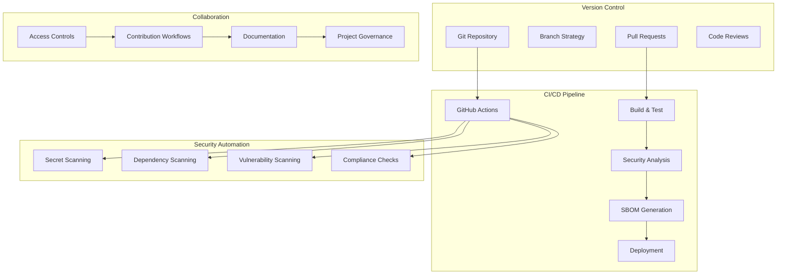

<!--
SPDX-License-Identifier: PolyForm-Perimeter-1.0.0
SPDX-FileCopyrightText: 2025 Seventeen Sierra LLC
-->

# Repository Component Design Document

## Overview

The Repository component establishes version control, code management, and CI/CD automation patterns for the Proposal Prepper base application. It provides automated security scanning, SBOM generation, and collaborative development workflows that support OpenSSF Baseline Level 1 compliance while enabling multi-stakeholder collaboration between vendors, consultants, and government personnel.

## Architecture

### Repository Architecture



## Components and Interfaces

### CI/CD Automation

#### GitHub Actions Workflow
```yaml
# .github/workflows/ci.yml
name: CI/CD Pipeline

on:
  push:
    branches: [main, develop]
  pull_request:
    branches: [main, develop]

jobs:
  security-scan:
    runs-on: ubuntu-latest
    steps:
      - uses: actions/checkout@v4
      
      - name: Run Secret Scanning
        uses: gitleaks/gitleaks-action@v2
        env:
          GITHUB_TOKEN: ${{ secrets.GITHUB_TOKEN }}
      
      - name: Run SAST with Semgrep
        uses: returntocorp/semgrep-action@v1
        with:
          config: >-
            p/security-audit
            p/secrets
            p/owasp-top-ten
      
      - name: Dependency Vulnerability Scan
        run: |
          npm audit --audit-level=moderate
          npm audit fix --dry-run
  
  build-and-test:
    runs-on: ubuntu-latest
    needs: security-scan
    steps:
      - uses: actions/checkout@v4
      
      - name: Setup Node.js
        uses: actions/setup-node@v4
        with:
          node-version: '18'
          cache: 'npm'
      
      - name: Install dependencies
        run: npm ci
      
      - name: Run tests
        run: npm test -- --coverage
      
      - name: Run E2E tests
        run: npm run test:e2e
  
  generate-sbom:
    runs-on: ubuntu-latest
    needs: build-and-test
    steps:
      - uses: actions/checkout@v4
      
      - name: Generate SBOM
        uses: anchore/sbom-action@v0
        with:
          format: spdx-json
          output-file: sbom.spdx.json
      
      - name: Upload SBOM
        uses: actions/upload-artifact@v4
        with:
          name: sbom
          path: sbom.spdx.json
```

#### Security Automation
```typescript
interface SecurityAutomation {
  scanSecrets(): Promise<SecretScanResult>;
  scanDependencies(): Promise<DependencyScanResult>;
  generateSBOM(): Promise<SBOM>;
  validateCompliance(): Promise<ComplianceResult>;
}

interface SecretScanResult {
  scanDate: Date;
  secretsFound: SecretFinding[];
  riskLevel: 'low' | 'medium' | 'high' | 'critical';
  recommendations: string[];
}

interface SecretFinding {
  file: string;
  line: number;
  type: string; // e.g., "AWS Access Key", "API Key"
  entropy: number;
  confidence: number;
}

interface DependencyScanResult {
  scanDate: Date;
  totalDependencies: number;
  vulnerabilities: DependencyVulnerability[];
  outdatedPackages: OutdatedPackage[];
  licenseIssues: LicenseIssue[];
}

interface DependencyVulnerability {
  package: string;
  version: string;
  cve: string;
  severity: 'low' | 'moderate' | 'high' | 'critical';
  description: string;
  fixedVersion?: string;
  patchAvailable: boolean;
}
```

### Code Quality and Standards

#### Code Quality Enforcement
```typescript
interface CodeQualityConfig {
  linting: {
    eslint: ESLintConfig;
    prettier: PrettierConfig;
    typescript: TypeScriptConfig;
  };
  testing: {
    coverage: {
      threshold: number; // percentage
      statements: number;
      branches: number;
      functions: number;
      lines: number;
    };
    frameworks: string[]; // ['vitest', 'playwright']
  };
  security: {
    sast: SASTConfig;
    secrets: SecretScanConfig;
    dependencies: DependencyScanConfig;
  };
}

interface ESLintConfig {
  extends: string[];
  rules: Record<string, any>;
  plugins: string[];
  env: Record<string, boolean>;
}

interface SASTConfig {
  tools: string[]; // ['semgrep', 'codeql']
  rulesets: string[];
  severity: 'error' | 'warning' | 'info';
  failOnFindings: boolean;
}
```

### Collaboration Workflows

#### Multi-Stakeholder Access Control
```typescript
interface AccessControlConfig {
  roles: Role[];
  permissions: Permission[];
  workflows: CollaborationWorkflow[];
  auditLogging: AuditConfig;
}

interface Role {
  name: string;
  description: string;
  permissions: string[];
  organizationType: 'vendor' | 'consultant' | 'government' | 'contractor';
  clearanceLevel?: 'public' | 'confidential' | 'secret';
}

interface Permission {
  name: string;
  resource: string;
  actions: string[]; // ['read', 'write', 'delete', 'admin']
  conditions?: AccessCondition[];
}

interface CollaborationWorkflow {
  name: string;
  triggerEvent: string;
  steps: WorkflowStep[];
  approvers: ApprovalConfig[];
  notifications: NotificationConfig[];
}

interface ApprovalConfig {
  role: string;
  required: boolean;
  timeout?: number; // hours
  escalation?: string;
}
```

## Data Models

### Repository Management Models

```typescript
interface RepositoryConfig {
  name: string;
  description: string;
  visibility: 'public' | 'private' | 'internal';
  defaultBranch: string;
  branchProtection: BranchProtectionConfig;
  collaborators: Collaborator[];
  integrations: Integration[];
  settings: RepositorySettings;
}

interface BranchProtectionConfig {
  branch: string;
  requiredReviews: {
    count: number;
    dismissStaleReviews: boolean;
    requireCodeOwnerReviews: boolean;
    restrictPushes: boolean;
  };
  requiredStatusChecks: string[];
  enforceAdmins: boolean;
  allowForcePushes: boolean;
  allowDeletions: boolean;
}

interface Collaborator {
  username: string;
  role: 'read' | 'triage' | 'write' | 'maintain' | 'admin';
  organization?: string;
  clearanceLevel?: string;
  accessExpiry?: Date;
}

interface Integration {
  name: string;
  type: 'ci_cd' | 'security' | 'quality' | 'deployment';
  config: Record<string, any>;
  enabled: boolean;
}
```

### CI/CD Pipeline Models

```typescript
interface PipelineExecution {
  id: string;
  trigger: 'push' | 'pull_request' | 'schedule' | 'manual';
  branch: string;
  commit: string;
  status: 'pending' | 'running' | 'success' | 'failure' | 'cancelled';
  startTime: Date;
  endTime?: Date;
  jobs: JobExecution[];
  artifacts: Artifact[];
}

interface JobExecution {
  name: string;
  status: 'pending' | 'running' | 'success' | 'failure' | 'skipped';
  startTime: Date;
  endTime?: Date;
  logs: string[];
  artifacts: string[];
}

interface Artifact {
  name: string;
  type: 'sbom' | 'test_results' | 'coverage' | 'security_report';
  path: string;
  size: number;
  checksum: string;
  expiryDate: Date;
}
```

## Correctness Properties

### Acceptance Criteria Testing Prework

8.1 CI/CD automation for OpenSSF Baseline SAST and security scanning
  Thoughts: This is about the CI/CD pipeline executing correctly and performing all required security checks. We can test pipeline execution and security tool integration.
  Testable: yes - property

### Correctness Properties

**Property 1: CI/CD pipeline reliability**
*For any* code change, the CI/CD pipeline should execute all security scans (SAST, secret scanning, dependency scanning) and generate SBOM successfully
**Validates: Requirements 8.1**

**Property 2: Security automation completeness**
*For any* security scan execution, the system should detect known vulnerabilities, secrets, and compliance violations with appropriate reporting
**Validates: Requirements 8.1**

**Property 3: SBOM generation consistency**
*For any* project state, the CI/CD pipeline should generate complete and accurate SBOM in SPDX format with all dependencies tracked
**Validates: Requirements 8.1**

## Error Handling

### Repository Error Categories

1. **CI/CD Pipeline Errors**
   - Build failures
   - Test execution errors
   - Security scan failures
   - Deployment issues

2. **Security Automation Errors**
   - Secret detection failures
   - Vulnerability scan errors
   - SBOM generation failures
   - Compliance check errors

3. **Collaboration Errors**
   - Access control violations
   - Workflow approval failures
   - Notification delivery issues
   - Audit logging failures

## Testing Strategy

### Property-Based Testing
- Test CI/CD pipeline execution across different code changes
- Validate security automation with various vulnerability scenarios
- Test SBOM generation with different dependency configurations
- Minimum 100 iterations per property test

### Integration Testing
- Test complete CI/CD workflow from commit to deployment
- Validate security tool integration and reporting
- Test collaboration workflows and access controls
- Validate artifact generation and storage

## Security Implementation

### OpenSSF Baseline Level 1 Implementation

#### Automated Security Scanning
```bash
#!/bin/bash
# Security scanning script

echo "Running security scans..."

# Secret scanning with gitleaks
echo "Scanning for secrets..."
gitleaks detect --source . --verbose --report-format json --report-path gitleaks-report.json

# SAST with Semgrep
echo "Running SAST analysis..."
semgrep --config=p/security-audit --config=p/secrets --json --output semgrep-report.json .

# Dependency scanning
echo "Scanning dependencies..."
npm audit --json > npm-audit-report.json

# SBOM generation
echo "Generating SBOM..."
syft packages . -o spdx-json > sbom.spdx.json

echo "Security scans completed"
```

#### Compliance Validation
```typescript
interface ComplianceValidator {
  validateOpenSSFBaseline(): Promise<ComplianceResult>;
  checkSecurityControls(): Promise<SecurityControlResult[]>;
  validateSBOM(sbom: SBOM): Promise<SBOMValidationResult>;
  generateComplianceReport(): Promise<ComplianceReport>;
}

interface ComplianceResult {
  framework: 'openssf-baseline-l1';
  status: 'compliant' | 'non-compliant' | 'partial';
  score: number; // 0-100
  requirements: RequirementResult[];
  recommendations: string[];
  lastAssessed: Date;
}

interface RequirementResult {
  id: string;
  title: string;
  status: 'met' | 'not-met' | 'partial' | 'not-applicable';
  evidence: string[];
  automatedCheck: boolean;
}
```

## Performance Considerations

### CI/CD Optimization
- Parallel job execution for faster builds
- Caching strategies for dependencies and build artifacts
- Incremental testing and analysis
- Resource optimization for pipeline efficiency

### Security Scan Optimization
- Incremental security scanning for changed files
- Cached vulnerability databases
- Parallel security tool execution
- Smart scheduling based on change impact

## Monitoring and Reporting

### Pipeline Monitoring
- Build success/failure rates
- Security scan results and trends
- Performance metrics and optimization
- Compliance status tracking

### Security Reporting
- Vulnerability trend analysis
- SBOM completeness metrics
- Compliance dashboard
- Security incident tracking