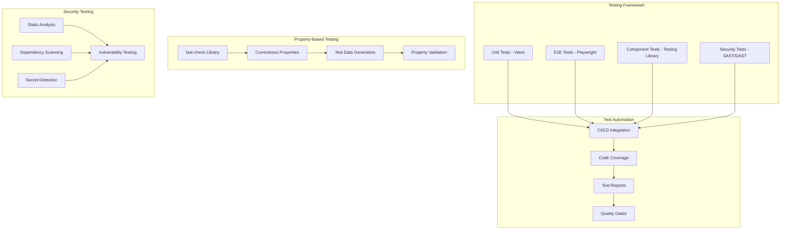

<!--
SPDX-License-Identifier: PolyForm-Perimeter-1.0.0
SPDX-FileCopyrightText: 2025 Seventeen Sierra LLC
-->

# Testing Component Design Document

## Overview

The Testing component establishes comprehensive testing strategies, quality assurance procedures, and validation frameworks for the Proposal Prepper base application. It implements unit testing, end-to-end testing, component testing, and security testing to ensure reliability, accuracy, and performance of compliance validation capabilities while supporting OpenSSF Baseline Level 1 requirements.

## Architecture

### Testing Architecture



## Components and Interfaces

### Testing Framework Configuration

#### Vitest Configuration
```typescript
// vitest.config.ts
import { defineConfig } from 'vitest/config';
import { resolve } from 'path';

export default defineConfig({
  test: {
    globals: true,
    environment: 'node',
    setupFiles: ['./vitest.setup.ts'],
    coverage: {
      provider: 'v8',
      reporter: ['text', 'json', 'html'],
      thresholds: {
        global: {
          branches: 80,
          functions: 80,
          lines: 80,
          statements: 80
        }
      },
      exclude: [
        'node_modules/',
        'dist/',
        '**/*.d.ts',
        '**/*.test.ts',
        '**/*.spec.ts'
      ]
    }
  },
  resolve: {
    alias: {
      '@': resolve(__dirname, './src')
    }
  }
});
```

#### Playwright Configuration
```typescript
// playwright.config.ts
import { defineConfig, devices } from '@playwright/test';

export default defineConfig({
  testDir: './e2e',
  fullyParallel: true,
  forbidOnly: !!process.env.CI,
  retries: process.env.CI ? 2 : 0,
  workers: process.env.CI ? 1 : undefined,
  reporter: [
    ['html'],
    ['json', { outputFile: 'test-results/results.json' }],
    ['junit', { outputFile: 'test-results/results.xml' }]
  ],
  use: {
    baseURL: 'http://localhost:3000',
    trace: 'on-first-retry',
    screenshot: 'only-on-failure'
  },
  projects: [
    {
      name: 'chromium',
      use: { ...devices['Desktop Chrome'] }
    },
    {
      name: 'firefox',
      use: { ...devices['Desktop Firefox'] }
    },
    {
      name: 'webkit',
      use: { ...devices['Desktop Safari'] }
    }
  ],
  webServer: {
    command: 'npm run dev',
    url: 'http://localhost:3000',
    reuseExistingServer: !process.env.CI
  }
});
```

### Property-Based Testing Framework

#### Property Test Configuration
```typescript
import fc from 'fast-check';

interface PropertyTestConfig {
  numRuns: number; // minimum 100 iterations
  timeout: number; // milliseconds
  seed: number;
  path: string[];
  examples: any[];
}

const DEFAULT_PROPERTY_CONFIG: PropertyTestConfig = {
  numRuns: 100,
  timeout: 5000,
  seed: Date.now(),
  path: [],
  examples: []
};

// Property test wrapper with required tagging
function propertyTest(
  name: string,
  property: fc.Property<any>,
  config: Partial<PropertyTestConfig> = {}
) {
  const fullConfig = { ...DEFAULT_PROPERTY_CONFIG, ...config };
  
  test(name, () => {
    fc.assert(property, fullConfig);
  });
}

// Example property test for proposal processing
propertyTest(
  'Property 1: Proposal processing completeness - For any valid proposal document, the system should successfully process it and return compliance findings with confidence scores',
  fc.property(
    fc.record({
      filename: fc.string({ minLength: 1, maxLength: 255 }),
      content: fc.string({ minLength: 100, maxLength: 10000 }),
      contentType: fc.constantFrom('application/pdf', 'text/plain')
    }),
    async (proposal) => {
      // **Feature: base-app, Property 1: Proposal processing completeness**
      const result = await processProposal(proposal);
      
      expect(result).toBeDefined();
      expect(result.findings).toBeInstanceOf(Array);
      expect(result.confidence).toBeGreaterThanOrEqual(0);
      expect(result.confidence).toBeLessThanOrEqual(100);
      expect(result.status).toMatch(/^(completed|processing|error)$/);
    }
  )
);
```

### Test Data Generators

#### Proposal Document Generators
```typescript
// Test data generators for property-based testing
const proposalDocumentArb = fc.record({
  id: fc.uuid(),
  filename: fc.string({ minLength: 1, maxLength: 255 }),
  content: fc.string({ minLength: 100, maxLength: 50000 }),
  contentType: fc.constantFrom('application/pdf', 'text/plain', 'application/msword'),
  size: fc.integer({ min: 1000, max: 10000000 }),
  metadata: fc.record({
    pageCount: fc.integer({ min: 1, max: 500 }),
    language: fc.constantFrom('en', 'es', 'fr'),
    author: fc.string({ minLength: 1, maxLength: 100 })
  })
});

const complianceFindingArb = fc.record({
  ruleId: fc.string({ minLength: 1, maxLength: 50 }),
  severity: fc.constantFrom('critical', 'major', 'minor', 'info'),
  title: fc.string({ minLength: 1, maxLength: 255 }),
  confidence: fc.integer({ min: 0, max: 100 }),
  citation: fc.string({ minLength: 1, max: 255 })
});

const sbomComponentArb = fc.record({
  name: fc.string({ minLength: 1, maxLength: 255 }),
  version: fc.string({ minLength: 1, maxLength: 100 }),
  license: fc.string({ minLength: 1, maxLength: 255 }),
  supplier: fc.string({ minLength: 1, maxLength: 255 })
});
```

## Data Models

### Test Execution Models

```typescript
interface TestExecution {
  id: string;
  type: 'unit' | 'integration' | 'e2e' | 'component' | 'security' | 'property';
  status: 'pending' | 'running' | 'passed' | 'failed' | 'skipped';
  startTime: Date;
  endTime?: Date;
  duration: number; // milliseconds
  results: TestResult[];
  coverage?: CoverageReport;
  artifacts: string[];
}

interface TestResult {
  name: string;
  status: 'passed' | 'failed' | 'skipped';
  duration: number;
  error?: TestError;
  assertions: number;
  retries: number;
}

interface TestError {
  message: string;
  stack: string;
  type: string;
  expected?: any;
  actual?: any;
}

interface CoverageReport {
  statements: CoverageMetric;
  branches: CoverageMetric;
  functions: CoverageMetric;
  lines: CoverageMetric;
  files: FileCoverage[];
}

interface CoverageMetric {
  total: number;
  covered: number;
  percentage: number;
}
```

### Security Testing Models

```typescript
interface SecurityTestResult {
  testType: 'sast' | 'dependency' | 'secret' | 'vulnerability';
  status: 'passed' | 'failed' | 'warning';
  findings: SecurityFinding[];
  riskScore: number;
  recommendations: string[];
  scanDate: Date;
}

interface SecurityFinding {
  id: string;
  type: string;
  severity: 'critical' | 'high' | 'medium' | 'low' | 'info';
  title: string;
  description: string;
  file?: string;
  line?: number;
  cwe?: string;
  cve?: string;
  remediation: string;
}
```

## Correctness Properties

### Acceptance Criteria Testing Prework

1.1 Comprehensive unit testing (essential code quality)
  Thoughts: This is about test coverage and quality across all code components. We can test that tests exist, pass, and provide adequate coverage.
  Testable: yes - property

1.2 End-to-end testing (essential user workflow validation)
  Thoughts: This is about complete user workflows being tested successfully. We can test that E2E tests cover critical paths and pass consistently.
  Testable: yes - property

1.3 Component testing (essential UI component validation)
  Thoughts: This is about UI components being tested for rendering and behavior. We can test that components render correctly and handle interactions.
  Testable: yes - property

1.7 Security testing (essential for OpenSSF Baseline SAST and vulnerability scanning)
  Thoughts: This is about security tests running and detecting issues appropriately. We can test that security scans execute and report findings.
  Testable: yes - property

### Correctness Properties

**Property 1: Unit test coverage completeness**
*For any* code module, the system should have corresponding unit tests that achieve minimum coverage thresholds and pass consistently
**Validates: Requirements 1.1**

**Property 2: End-to-end workflow reliability**
*For any* critical user workflow, the E2E tests should validate the complete flow from start to finish and pass consistently across browsers
**Validates: Requirements 1.2**

**Property 3: Component testing consistency**
*For any* UI component, the tests should validate rendering, props, and user interactions with proper accessibility checks
**Validates: Requirements 1.3**

**Property 4: Security testing effectiveness**
*For any* security scan execution, the system should detect known vulnerabilities and security issues with appropriate reporting
**Validates: Requirements 1.7**

## Error Handling

### Testing Error Categories

1. **Test Execution Errors**
   - Test framework failures
   - Environment setup issues
   - Timeout errors
   - Resource allocation problems

2. **Test Quality Errors**
   - Insufficient coverage
   - Flaky tests
   - False positives/negatives
   - Test data issues

3. **Security Testing Errors**
   - SAST tool failures
   - Vulnerability scan errors
   - False security alerts
   - Compliance check failures

## Testing Strategy

### Dual Testing Approach

The system implements both unit testing and property-based testing as complementary approaches:

- **Unit tests** verify specific examples, edge cases, and error conditions
- **Property tests** verify universal properties that should hold across all inputs
- Together they provide comprehensive coverage: unit tests catch concrete bugs, property tests verify general correctness

### Test Categories

#### Unit Testing
```typescript
// Example unit test
describe('ProposalValidator', () => {
  test('should validate FAR compliance for valid proposal', async () => {
    const proposal = createMockProposal();
    const validator = new ProposalValidator();
    
    const result = await validator.validateFAR(proposal);
    
    expect(result.isValid).toBe(true);
    expect(result.findings).toHaveLength(0);
    expect(result.confidence).toBeGreaterThan(90);
  });
  
  test('should detect compliance violations', async () => {
    const proposal = createNonCompliantProposal();
    const validator = new ProposalValidator();
    
    const result = await validator.validateFAR(proposal);
    
    expect(result.isValid).toBe(false);
    expect(result.findings.length).toBeGreaterThan(0);
    expect(result.findings[0].severity).toBe('critical');
  });
});
```

#### Property-Based Testing
```typescript
// Example property test with required tagging
propertyTest(
  'Property 2: End-to-end workflow reliability',
  fc.property(
    proposalDocumentArb,
    async (proposal) => {
      // **Feature: base-app, Property 2: End-to-end workflow reliability**
      
      // Upload proposal
      const uploadResult = await uploadProposal(proposal);
      expect(uploadResult.success).toBe(true);
      
      // Start validation
      const validationResult = await startValidation(uploadResult.proposalId);
      expect(validationResult.jobId).toBeDefined();
      
      // Wait for completion and get results
      const results = await waitForValidationResults(validationResult.jobId);
      expect(results.status).toBe('completed');
      expect(results.findings).toBeInstanceOf(Array);
    }
  )
);
```

## Security Testing Implementation

### SAST Integration
```typescript
interface SASTConfig {
  tools: SASTTool[];
  rulesets: string[];
  excludePaths: string[];
  failOnSeverity: 'critical' | 'high' | 'medium' | 'low';
}

interface SASTTool {
  name: 'semgrep' | 'codeql' | 'eslint-security';
  config: Record<string, any>;
  enabled: boolean;
}

class SecurityTestRunner {
  async runSAST(config: SASTConfig): Promise<SecurityTestResult> {
    const findings: SecurityFinding[] = [];
    
    for (const tool of config.tools) {
      if (tool.enabled) {
        const toolFindings = await this.runSASTTool(tool);
        findings.push(...toolFindings);
      }
    }
    
    return {
      testType: 'sast',
      status: this.determineStatus(findings, config.failOnSeverity),
      findings,
      riskScore: this.calculateRiskScore(findings),
      recommendations: this.generateRecommendations(findings),
      scanDate: new Date()
    };
  }
}
```

## Performance Considerations

### Test Optimization
- Parallel test execution for faster feedback
- Smart test selection based on code changes
- Caching of test dependencies and fixtures
- Resource optimization for CI/CD environments

### Coverage Optimization
- Incremental coverage reporting
- Coverage-guided test generation
- Performance impact monitoring
- Test result caching and reuse

## Monitoring and Reporting

### Test Metrics
- Test execution time trends
- Coverage percentage tracking
- Flaky test identification
- Security finding trends

### Quality Gates
- Minimum coverage thresholds
- Security vulnerability limits
- Performance regression detection
- Accessibility compliance validation