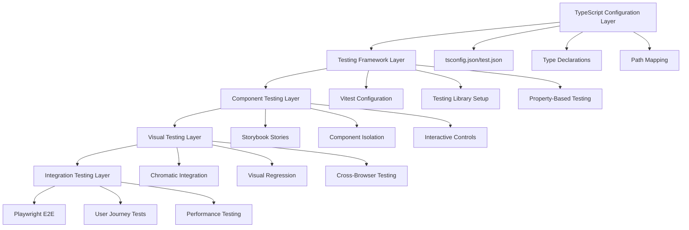
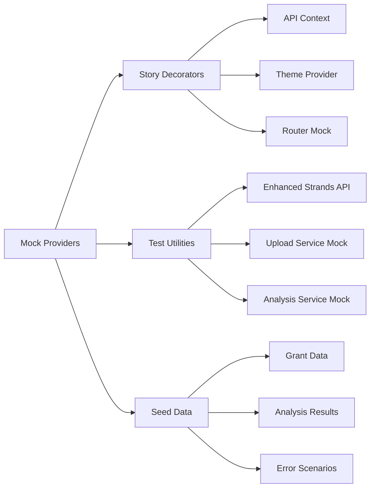

# Comprehensive Testing Infrastructure Design

## Overview

This design consolidates test infrastructure fixes and Storybook coverage into a unified testing strategy. The system provides a robust foundation for component isolation testing, visual regression detection, property-based validation, and end-to-end workflow testing.

## Architecture

### Testing Infrastructure Layers



### Mock Infrastructure Architecture



## Components and Interfaces

### Core Testing Infrastructure

#### TypeScript Configuration
- **tsconfig.json**: Main TypeScript configuration with path mapping
- **tsconfig.test.json**: Test-specific configuration with relaxed strictness
- **vitest-env.d.ts**: Global type declarations for Testing Library matchers
- **vitest-dom.d.ts**: Comprehensive DOM matcher type extensions

#### Testing Framework Setup
- **vitest.config.ts**: Vitest configuration with jsdom environment
- **vitest.setup.ts**: Global test setup with Testing Library imports
- **Property-Based Testing**: fast-check integration for property validation

### Storybook Infrastructure

#### Core Configuration
- **Storybook 10.x**: Latest version with React, TypeScript, and Vite support
- **Essential Addons**: Controls, Actions, Docs, Viewport, A11y, Test
- **Playwright Integration**: Deep e2e testing capabilities

#### Story Organization
- **Component Stories**: Isolated component testing with all states
- **Interaction Stories**: User interaction testing with @storybook/test
- **Accessibility Stories**: WCAG compliance validation
- **Responsive Stories**: Multi-viewport testing

### Visual Testing Infrastructure

#### Chromatic Integration
- **Visual Regression**: Automated screenshot comparison
- **Cross-Browser Testing**: Chrome, Firefox, Safari, Edge support
- **Responsive Testing**: Multiple viewport sizes and orientations
- **Approval Workflow**: Review and approve visual changes

### Mock Infrastructure

#### API Mocking
- **MockStrandsAPIEnhanced**: Comprehensive API response simulation
- **Error Scenario Mocks**: Realistic failure condition simulation
- **State Management Mocks**: Consistent state across test scenarios

#### Test Data Generation
- **Seed Data**: Realistic grant and analysis data
- **Property-Based Generators**: Random but valid test data
- **Error Condition Data**: Comprehensive failure scenarios

## Data Models

### Test Configuration Types
```typescript
interface TestInfrastructureConfig {
  typescript: {
    mainConfig: string;
    testConfig: string;
    typeDeclarations: string[];
  };
  vitest: {
    environment: 'jsdom';
    setupFiles: string[];
    globals: boolean;
  };
  storybook: {
    framework: '@storybook/react-vite';
    addons: string[];
    features: {
      interactionTesting: boolean;
      visualTesting: boolean;
    };
  };
}
```

### Story Configuration Types
```typescript
interface StoryConfig {
  component: React.ComponentType;
  title: string;
  parameters: {
    docs: { description: string };
    chromatic: { viewports: number[] };
    a11y: { config: object };
  };
  argTypes: Record<string, object>;
}
```

### Mock Data Types
```typescript
interface MockDataProvider {
  api: MockStrandsAPI;
  seedData: {
    grants: GrantData[];
    analysisResults: AnalysisResult[];
    errorScenarios: ErrorScenario[];
  };
  generators: {
    randomGrant: () => GrantData;
    randomAnalysis: () => AnalysisResult;
    randomError: () => ErrorScenario;
  };
}
```

## Correctness Properties

*A property is a characteristic or behavior that should hold true across all valid executions of a system-essentially, a formal statement about what the system should do. Properties serve as the bridge between human-readable specifications and machine-verifiable correctness guarantees.*

### Property 1: TypeScript Configuration Consistency
*For any* test file in the project, TypeScript compilation should succeed with zero errors when using the configured path mappings and type declarations
**Validates: Requirements 1.1, 1.2, 1.3**

### Property 2: DOM Matcher Availability
*For any* test file using Testing Library, all DOM matchers (toBeInTheDocument, toHaveValue, etc.) should be available and properly typed
**Validates: Requirements 1.3, 1.4**

### Property 3: Story Rendering Consistency
*For any* component story, the story should render without errors and display all expected interactive controls
**Validates: Requirements 2.1, 2.2, 2.3**

### Property 4: Visual Regression Detection
*For any* visual change in a component, Chromatic should detect the difference and flag it for review
**Validates: Requirements 3.1, 3.2**

### Property 5: Mock Data Consistency
*For any* mock API response, the data should conform to the expected interface and provide realistic values
**Validates: Requirements 6.1, 6.2, 6.3**

### Property 6: Property Test Execution
*For any* property-based test, the test should execute successfully across generated input ranges without configuration errors
**Validates: Requirements 5.1, 5.2, 5.3**

### Property 7: E2E Workflow Validation
*For any* complete user workflow, the e2e test should validate state transitions and data persistence correctly
**Validates: Requirements 4.1, 4.3**

### Property 8: Cross-Browser Compatibility
*For any* component story, the visual appearance should be consistent across all target browsers
**Validates: Requirements 3.5, 4.5**

### Property 9: Accessibility Compliance
*For any* component story, accessibility tests should validate WCAG compliance without violations
**Validates: Requirements 2.5, 4.4**

### Property 10: Mock Infrastructure Round-Trip
*For any* mock data transformation, serializing and deserializing should produce equivalent data structures
**Validates: Requirements 6.4, 6.5**

## Error Handling

### TypeScript Configuration Errors
- **Path Resolution Failures**: Clear error messages for import resolution issues
- **Type Declaration Conflicts**: Graceful handling of conflicting type definitions
- **Configuration Validation**: Early detection of invalid tsconfig settings

### Storybook Runtime Errors
- **Story Loading Failures**: Graceful degradation when stories fail to load
- **Addon Compatibility**: Clear error messages for addon conflicts
- **Mock Provider Errors**: Fallback behavior when mock data is invalid

### Visual Testing Errors
- **Chromatic API Failures**: Retry logic and fallback for service outages
- **Screenshot Comparison Errors**: Clear diff reporting for visual changes
- **Cross-Browser Failures**: Isolated error reporting per browser

### Property-Based Testing Errors
- **Generator Failures**: Clear reporting of invalid generated inputs
- **Property Violations**: Detailed counterexample reporting
- **Shrinking Failures**: Minimal failing case identification

## Testing Strategy

### Dual Testing Approach
The system implements both unit testing and property-based testing:
- **Unit Tests**: Verify specific examples, edge cases, and error conditions
- **Property Tests**: Verify universal properties across all inputs
- **Integration**: Both approaches provide comprehensive coverage

### Property-Based Testing Framework
- **Library**: fast-check for TypeScript/JavaScript property-based testing
- **Configuration**: Minimum 100 iterations per property test
- **Tagging**: Each property test tagged with design document reference
- **Format**: `**Feature: {feature_name}, Property {number}: {property_text}**`

### Visual Regression Strategy
- **Baseline Management**: Systematic baseline creation and approval workflow
- **Change Detection**: Automated detection with human review process
- **Cross-Browser**: Consistent testing across all target browsers
- **Responsive**: Multi-viewport testing for responsive design validation

### Mock Infrastructure Strategy
- **Realistic Data**: Mock responses that match production data patterns
- **Error Scenarios**: Comprehensive failure condition simulation
- **State Consistency**: Maintained state across test scenarios
- **Performance**: Optimized mock responses for test execution speed