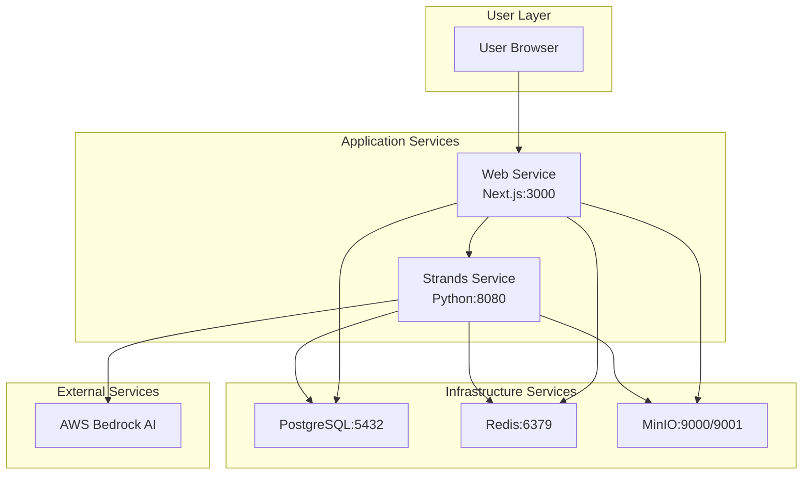

# Design Document

## Overview

The Docker Integration feature completes the Proposal Prepper application by implementing a fully containerized deployment system. This design enables users to run the entire application stack with a single `docker-compose up` command, integrating the Next.js web frontend with a new Python Strands service for real AI-powered compliance analysis.

The system architecture follows a microservices pattern with clear separation of concerns: the web service handles user interface and file management, while the Strands service provides AI-powered document analysis using AWS Bedrock. Supporting infrastructure services (PostgreSQL, Redis, MinIO) provide data persistence, caching, and object storage.

## Architecture

### Service Architecture



### Container Orchestration

The system uses Docker Compose to orchestrate five containers:
- **web**: Next.js application with hot reload for development
- **strands**: Python FastAPI service with AI integration
- **postgres**: PostgreSQL database with initialization scripts
- **redis**: Redis cache for session and performance optimization
- **minio**: S3-compatible object storage for document files

### Network Architecture

All services communicate through a dedicated Docker network (`proposal-prepper-network`) with service discovery via container names. The web service acts as the primary entry point, proxying AI analysis requests to the Strands service while handling file uploads and user interface.

## Components and Interfaces

### Web Service (Next.js)

**Responsibilities:**
- User interface and experience
- File upload handling and validation
- Session management and caching
- API routing and request proxying
- Real-time progress updates via WebSocket

**Key Interfaces:**
- HTTP REST API for document operations
- WebSocket for real-time updates
- Database connections for metadata storage
- Object storage for file persistence

### Strands Service (Python FastAPI)

**Responsibilities:**
- AI-powered document analysis using AWS Bedrock
- Compliance checking against FAR/DFARS regulations
- Structured result generation with regulatory references
- Error handling and fallback to mock responses
- Concurrent request processing

**Key Interfaces:**
- REST API endpoints for analysis operations
- AWS Bedrock integration for AI processing
- Database connections for result storage
- WebSocket for progress notifications

**API Endpoints:**
```
POST /api/analysis/start
GET /api/analysis/{sessionId}
GET /api/analysis/{sessionId}/results
GET /api/health
```

### Infrastructure Services

**PostgreSQL Database:**
- Document metadata and analysis results
- User sessions and system state
- Initialization with seed data (30 real PDFs)
- Health checks and automatic recovery

**Redis Cache:**
- API response caching for performance
- Session data storage
- Real-time progress tracking
- WebSocket connection management

**MinIO Object Storage:**
- PDF document file storage
- Analysis artifacts and logs
- S3-compatible API for easy integration
- Web console for administration

## Data Models

### Document Model
```typescript
interface Document {
  id: string;
  filename: string;
  fileSize: number;
  mimeType: string;
  uploadedAt: Date;
  status: 'uploaded' | 'processing' | 'analyzed' | 'failed';
  s3Key: string;
  metadata: DocumentMetadata;
}
```

### Analysis Session Model
```typescript
interface AnalysisSession {
  id: string;
  documentId: string;
  status: 'queued' | 'extracting' | 'analyzing' | 'completed' | 'failed';
  progress: number;
  startedAt: Date;
  completedAt?: Date;
  currentStep: string;
  estimatedCompletion?: Date;
}
```

### Compliance Results Model
```typescript
interface ComplianceResults {
  id: string;
  sessionId: string;
  status: 'pass' | 'fail' | 'warning';
  issues: ComplianceIssue[];
  summary: ComplianceSummary;
  generatedAt: Date;
  aiModel: string;
  processingTime: number;
}
```

### Compliance Issue Model
```typescript
interface ComplianceIssue {
  id: string;
  severity: 'critical' | 'warning' | 'info';
  title: string;
  description: string;
  regulation: RegulatoryReference;
  location?: DocumentLocation;
  remediation?: string;
  confidence: number;
}
```

## Correctness Properties

*A property is a characteristic or behavior that should hold true across all valid executions of a system-essentially, a formal statement about what the system should do. Properties serve as the bridge between human-readable specifications and machine-verifiable correctness guarantees.*

### Property Reflection

After reviewing all properties identified in the prework, I've identified several areas for consolidation:

- Properties 1.2, 1.3 can be combined into a comprehensive service connectivity property
- Properties 2.1, 2.2, 2.3 can be consolidated into a comprehensive AI analysis property
- Properties 3.2, 3.3, 3.5 can be combined into an end-to-end workflow property
- Properties 4.1, 4.2 can be consolidated into a comprehensive error handling property
- Properties 5.1, 5.3, 5.5 can be combined into a configuration and security property

**Property 1: Service orchestration completeness**
*For any* Docker Compose deployment, when all services start successfully, then all required services (web, strands, postgres, redis, minio) should be running and the web application should be accessible at localhost:3000
**Validates: Requirements 1.1**

**Property 2: Inter-service communication reliability**
*For any* running system configuration, all services should be able to communicate with their required dependencies and health checks should pass consistently
**Validates: Requirements 1.2, 1.3**

**Property 3: End-to-end workflow integrity**
*For any* valid PDF document upload, the complete workflow from upload through AI analysis to result display should execute successfully and return structured compliance findings
**Validates: Requirements 1.4, 3.2, 3.3, 3.5**

**Property 4: Data persistence across restarts**
*For any* data stored in the system, stopping and restarting containers should preserve all data and restore normal system operation
**Validates: Requirements 1.5, 5.4**

**Property 5: Real AI analysis integration**
*For any* document analysis request, the Strands service should process documents using AWS Bedrock AI services and return structured compliance findings with regulatory references
**Validates: Requirements 2.1, 2.2**

**Property 6: Concurrent processing capability**
*For any* set of simultaneous analysis requests, the Strands service should handle concurrent processing efficiently without data corruption or resource conflicts
**Validates: Requirements 2.4**

**Property 7: Error handling and fallback behavior**
*For any* error condition encountered by services, the system should provide meaningful error messages, implement graceful fallback behavior, and maintain system stability
**Validates: Requirements 2.3, 4.1, 4.2, 4.4**

**Property 8: Database seeding consistency**
*For any* system initialization, the database should be seeded with exactly 30 real PDF proposal documents from the seed-data directory and they should be accessible for analysis
**Validates: Requirements 3.1**

**Property 9: Document persistence and retrieval**
*For any* document uploaded by users, the system should store it persistently in object storage and make it available for future analysis sessions
**Validates: Requirements 3.4**

**Property 10: Health monitoring and recovery**
*For any* service health check failure, Docker Compose should automatically restart unhealthy services and the system should provide real-time status indicators
**Validates: Requirements 4.3, 4.5**

**Property 11: Configuration management**
*For any* deployment environment, all services should use environment variables for configuration without hardcoded values and implement proper security protocols
**Validates: Requirements 5.1, 5.3, 5.5**

## Error Handling

### Service-Level Error Handling

**Web Service Errors:**
- File upload validation and size limits
- Network connectivity to Strands service
- Database connection failures
- Object storage unavailability

**Strands Service Errors:**
- AWS Bedrock API failures with fallback to mock responses
- Document processing errors with detailed logging
- Concurrent request handling with proper queuing
- Resource exhaustion with graceful degradation

**Infrastructure Errors:**
- Database connection pooling and retry logic
- Redis cache failures with direct database fallback
- MinIO storage errors with local filesystem backup
- Network partition handling with circuit breakers

### Error Response Format

All services implement consistent error response format:
```typescript
interface ErrorResponse {
  success: false;
  error: string;
  code: string;
  timestamp: string;
  service: string;
  requestId: string;
  details?: Record<string, unknown>;
}
```

## Testing Strategy

### Dual Testing Approach

The system implements both unit testing and property-based testing to ensure comprehensive coverage:

**Unit Tests:**
- Service startup and configuration validation
- API endpoint functionality with mock data
- Database operations and migrations
- File upload and storage operations
- Error handling for specific failure scenarios

**Property-Based Tests:**
- Service communication reliability across random configurations
- End-to-end workflow integrity with generated document sets
- Concurrent processing with random request patterns
- Data persistence across random restart sequences
- Error handling with randomly generated failure conditions

### Property-Based Testing Configuration

The system uses **fast-check** for JavaScript/TypeScript property-based testing and **Hypothesis** for Python property-based testing. Each property-based test runs a minimum of 100 iterations to ensure statistical confidence in the results.

Property-based tests are tagged with comments explicitly referencing the correctness properties:
- Format: `**Feature: docker-integration, Property {number}: {property_text}**`
- Each correctness property is implemented by a single property-based test
- Tests are placed close to implementation to catch errors early

### Integration Testing

**Docker Compose Testing:**
- Automated container orchestration validation
- Service dependency verification
- Health check monitoring
- Volume persistence testing

**End-to-End Testing:**
- Complete workflow testing with real PDF documents
- AI analysis integration with AWS Bedrock
- WebSocket real-time update verification
- Multi-user concurrent access testing

### Performance Testing

**Load Testing:**
- Concurrent document upload handling
- AI analysis throughput measurement
- Database query performance under load
- Memory and CPU usage monitoring

**Startup Performance:**
- Container build time optimization
- Service initialization time measurement
- Health check response time validation
- Resource usage during startup