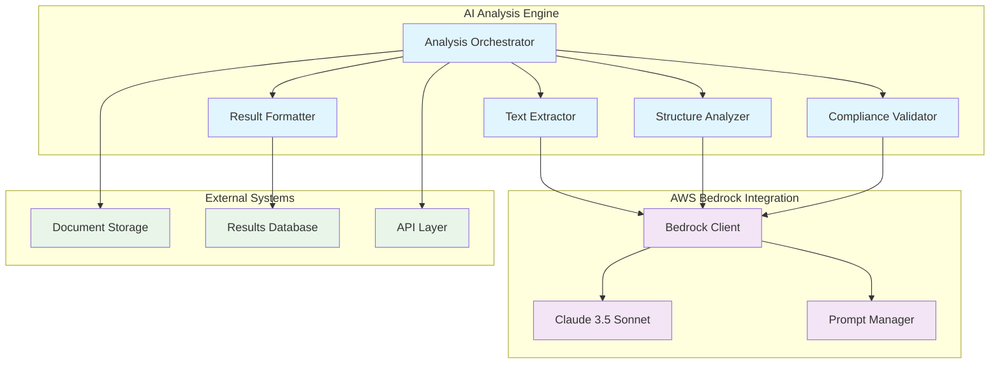

<!--
SPDX-License-Identifier: PolyForm-Perimeter-1.0.0
SPDX-FileCopyrightText: 2025 Seventeen Sierra LLC
-->

# Threshold AI Design Document

## Overview

The AI component provides intelligent document analysis capabilities using AWS Bedrock with Claude 3.5 Sonnet. This system extracts text from proposal documents, identifies document structure, validates compliance against FAR/DFARS requirements, and generates detailed analysis results with actionable recommendations.

## Architecture

### AI System Architecture



## Components and Interfaces

### Analysis Orchestrator
- **Purpose**: Coordinates the multi-step AI analysis workflow
- **Responsibilities**:
  - Manage analysis pipeline execution
  - Handle progress tracking and status updates
  - Coordinate between different analysis components
  - Manage error handling and retry logic
- **Key Features**:
  - Asynchronous workflow management
  - Progress reporting
  - Error recovery mechanisms

### Text Extractor
- **Purpose**: Extracts text content from PDF proposals with high accuracy
- **Responsibilities**:
  - Process PDF documents using Claude 3.5 Sonnet
  - Achieve 99% text extraction accuracy
  - Handle various PDF formats and layouts
  - Provide structured text output
- **Technology**: AWS Bedrock Claude 3.5 Sonnet with specialized PDF processing prompts

### Structure Analyzer
- **Purpose**: Identifies and classifies document sections
- **Responsibilities**:
  - Identify proposal sections (executive summary, technical approach, management)
  - Classify content by section type
  - Provide confidence scores for classifications
  - Handle various document structures
- **Key Features**:
  - Section boundary detection
  - Content classification
  - Confidence scoring

### Compliance Validator
- **Purpose**: Validates proposals against FAR/DFARS requirements
- **Responsibilities**:
  - Process FAR/DFARS requirements and identify key compliance points
  - Apply compliance rules to proposal content
  - Generate compliance determinations with citations
  - Flag unclear content for human review
- **Key Features**:
  - Rule-based validation
  - Citation generation
  - Ambiguity detection

### Result Formatter
- **Purpose**: Formats analysis results for presentation
- **Responsibilities**:
  - Generate pass/fail/warning status
  - Create detailed explanations
  - Format findings with section references
  - Provide actionable recommendations
- **Output Format**: Structured JSON with compliance findings and recommendations

## AWS Bedrock Integration

### Bedrock Client
- **Authentication**: Secure API authentication with AWS credentials
- **Communication**: Encrypted communications using TLS 1.3
- **Rate Limiting**: Intelligent handling of API quotas and rate limits
- **Error Handling**: Comprehensive error handling and retry mechanisms
- **Cleanup**: Secure deletion of temporary processing artifacts

### Prompt Management
```typescript
interface PromptTemplate {
  id: string;
  name: string;
  version: string;
  template: string;
  parameters: PromptParameter[];
  validationRules: ValidationRule[];
}

interface PromptParameter {
  name: string;
  type: 'string' | 'number' | 'boolean' | 'object';
  required: boolean;
  description: string;
}
```

### Model Configuration
- **Model**: Claude 3.5 Sonnet via AWS Bedrock
- **Temperature**: 0.1 for consistent, deterministic results
- **Max Tokens**: Configurable based on document size
- **Stop Sequences**: Defined for structured output parsing

## Data Models

### Analysis Request
```typescript
interface AnalysisRequest {
  id: string;
  proposalId: string;
  documentPath: string;
  analysisType: AnalysisType[];
  priority: Priority;
  requestedAt: Date;
  requester: string;
}

enum AnalysisType {
  TEXT_EXTRACTION = 'text_extraction',
  STRUCTURE_ANALYSIS = 'structure_analysis',
  COMPLIANCE_VALIDATION = 'compliance_validation'
}
```

### Analysis Result
```typescript
interface AnalysisResult {
  id: string;
  requestId: string;
  status: AnalysisStatus;
  extractedText?: ExtractedText;
  documentStructure?: DocumentStructure;
  complianceFindings?: ComplianceFinding[];
  processingMetrics: ProcessingMetrics;
  completedAt: Date;
}

interface ExtractedText {
  content: string;
  accuracy: number;
  confidence: number;
  extractionMethod: string;
  pageCount: number;
}

interface DocumentStructure {
  sections: DocumentSection[];
  overallConfidence: number;
  structureType: string;
}

interface ComplianceFinding {
  id: string;
  ruleId: string;
  status: ComplianceStatus;
  description: string;
  documentSection: string;
  pageNumber?: number;
  regulation: RegulationReference;
  severity: FindingSeverity;
  recommendation?: string;
}
```

### Processing Metrics
```typescript
interface ProcessingMetrics {
  totalProcessingTime: number;
  extractionTime: number;
  analysisTime: number;
  validationTime: number;
  tokensUsed: number;
  apiCalls: number;
  errorCount: number;
}
```

## Security and Privacy

### Data Protection
- **No Persistent Storage**: Proposal content not stored in AI service logs
- **Temporary Processing**: Content processed without permanent retention
- **Encrypted Channels**: All AI communications use encrypted channels
- **Artifact Cleanup**: Automatic clearing of temporary data and processing caches
- **Activity Logging**: Processing events logged without exposing document content

### Access Control
- **IAM Roles**: Least privilege access for Bedrock API calls
- **Credential Management**: Secure AWS credential handling
- **Request Validation**: Input validation and sanitization
- **Rate Limiting**: Protection against abuse and resource exhaustion

## Error Handling

### AI Service Errors
- **Rate Limiting**: Exponential backoff and queue management
- **Timeout Handling**: Configurable timeouts with graceful degradation
- **Model Unavailability**: Fallback mechanisms and user notification
- **Invalid Responses**: Response validation and error recovery

### Processing Errors
- **Document Format Issues**: Clear error messages and fallback options
- **Extraction Failures**: Alternative processing methods
- **Analysis Errors**: Partial result handling and user guidance
- **Validation Errors**: Rule-specific error handling

## Performance Requirements

### Response Time Targets
- **Text Extraction**: < 2 minutes for typical documents
- **Structure Analysis**: < 1 minute for section identification
- **Compliance Validation**: < 3 minutes for full validation
- **Overall Analysis**: < 5 minutes end-to-end

### Accuracy Targets
- **Text Extraction**: 99% accuracy for PDF content
- **Section Identification**: 95% accuracy for standard proposal formats
- **Compliance Detection**: 90% accuracy for clear violations

### Scalability
- **Concurrent Processing**: Support for multiple simultaneous analyses
- **Queue Management**: Intelligent job scheduling and prioritization
- **Resource Optimization**: Efficient token usage and API call optimization

## Testing Strategy

### Unit Testing
- **Component Testing**: Individual AI component functionality
- **Prompt Testing**: Validation of prompt templates and parameters
- **Response Parsing**: AI response processing and validation
- **Error Handling**: Error scenario testing and recovery

### Integration Testing
- **Bedrock Integration**: AWS Bedrock API communication
- **End-to-End Workflows**: Complete analysis pipeline testing
- **Performance Testing**: Response time and accuracy validation

### Property-Based Testing
- **Text Extraction Accuracy**: Test with various document types and formats
- **Structure Analysis**: Test with different document layouts and structures
- **Compliance Validation**: Test with known compliant and non-compliant content