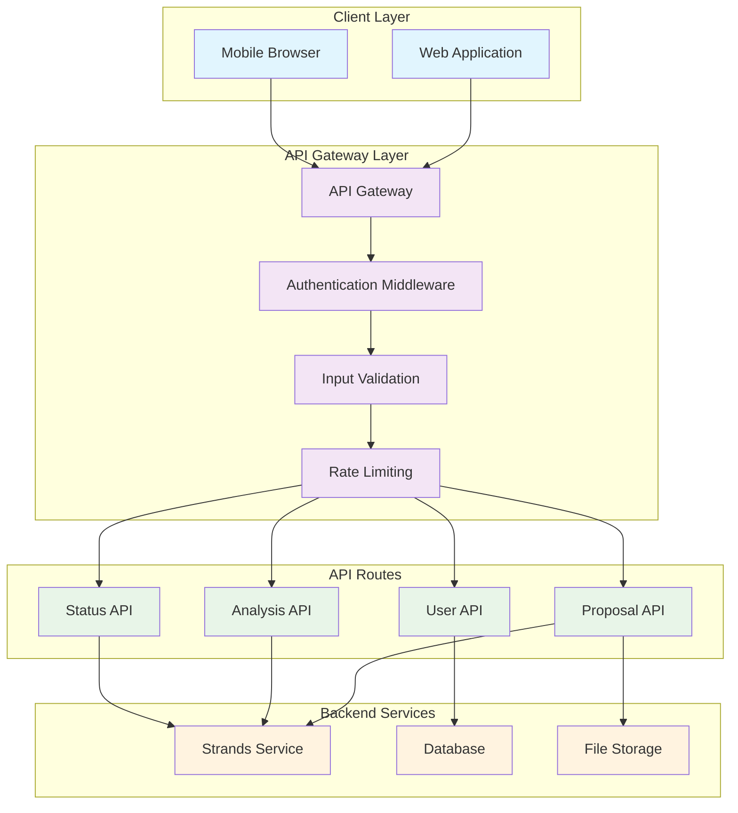

<!--
SPDX-License-Identifier: PolyForm-Perimeter-1.0.0
SPDX-FileCopyrightText: 2025 Seventeen Sierra LLC
-->

# Threshold API Design Document

## Overview

The API Layer provides secure, reliable REST endpoints for the Proposal Prepper application, enabling communication between the web frontend and backend services. The design focuses on RESTful principles, comprehensive error handling, and robust security measures to support proposal operations and service coordination.

## Architecture

### API Architecture



## API Endpoints

### Proposal Management Endpoints

#### POST /api/proposals
- **Purpose**: Upload and create new proposal documents
- **Authentication**: Required
- **Request**: Multipart form data with file upload
- **Response**: Proposal metadata and upload confirmation

```typescript
interface CreateProposalRequest {
  file: File;
  metadata?: {
    title?: string;
    description?: string;
    tags?: string[];
  };
}

interface CreateProposalResponse {
  id: string;
  filename: string;
  fileSize: number;
  mimeType: string;
  uploadedAt: string;
  status: 'uploaded';
  uploadUrl?: string;
}
```

#### GET /api/proposals/{id}
- **Purpose**: Retrieve proposal metadata and details
- **Authentication**: Required
- **Response**: Complete proposal information

```typescript
interface GetProposalResponse {
  id: string;
  userId: string;
  filename: string;
  originalName: string;
  fileSize: number;
  mimeType: string;
  uploadedAt: string;
  status: ProposalStatus;
  metadata: ProposalMetadata;
  analysisHistory: AnalysisHistoryItem[];
}
```

#### GET /api/proposals
- **Purpose**: List user's proposals with pagination
- **Authentication**: Required
- **Query Parameters**: page, limit, status, sortBy, sortOrder

```typescript
interface ListProposalsResponse {
  proposals: ProposalSummary[];
  pagination: {
    page: number;
    limit: number;
    total: number;
    totalPages: number;
  };
  filters: {
    status?: ProposalStatus[];
    dateRange?: DateRange;
  };
}
```

### Analysis Endpoints

#### POST /api/proposals/{id}/analyze
- **Purpose**: Initiate compliance analysis for a proposal
- **Authentication**: Required
- **Request**: Analysis configuration options

```typescript
interface StartAnalysisRequest {
  analysisType: AnalysisType[];
  priority?: 'low' | 'normal' | 'high';
  options?: {
    includeRecommendations: boolean;
    detailedCitations: boolean;
    customRules?: string[];
  };
}

interface StartAnalysisResponse {
  analysisId: string;
  proposalId: string;
  status: 'queued';
  estimatedCompletion: string;
  queuePosition?: number;
}
```

#### GET /api/proposals/{id}/status
- **Purpose**: Get real-time analysis progress and status
- **Authentication**: Required
- **Response**: Current analysis state and progress

```typescript
interface AnalysisStatusResponse {
  analysisId: string;
  proposalId: string;
  status: AnalysisStatus;
  progress: number;
  currentStep: string;
  startedAt: string;
  estimatedCompletion?: string;
  completedAt?: string;
  error?: ErrorDetails;
}
```

#### GET /api/proposals/{id}/results
- **Purpose**: Retrieve completed analysis results
- **Authentication**: Required
- **Response**: Comprehensive analysis findings

```typescript
interface AnalysisResultsResponse {
  analysisId: string;
  proposalId: string;
  completedAt: string;
  overallStatus: ComplianceStatus;
  summary: {
    totalFindings: number;
    passCount: number;
    failCount: number;
    warningCount: number;
  };
  findings: ComplianceFinding[];
  recommendations: Recommendation[];
  documentStructure: DocumentStructure;
  processingMetrics: ProcessingMetrics;
}
```

### User Management Endpoints

#### GET /api/user/profile
- **Purpose**: Get current user profile information
- **Authentication**: Required

#### PUT /api/user/profile
- **Purpose**: Update user profile and preferences
- **Authentication**: Required

#### GET /api/user/preferences
- **Purpose**: Get user application preferences
- **Authentication**: Required

#### PUT /api/user/preferences
- **Purpose**: Update user preferences
- **Authentication**: Required

## Service Communication

### Internal Service Endpoints

#### Strands Service Communication
```typescript
// Internal API for communicating with Strands service
interface StrandsServiceAPI {
  uploadDocument(file: File, metadata: DocumentMetadata): Promise<UploadResult>;
  getDocumentStatus(documentId: string): Promise<DocumentStatus>;
  initiateAnalysis(request: AnalysisRequest): Promise<AnalysisJob>;
  getAnalysisResults(analysisId: string): Promise<AnalysisResult>;
}
```


### Request/Response Patterns

#### Standard Request Headers
```typescript
interface StandardHeaders {
  'Authorization': string;
  'Content-Type': string;
  'X-Request-ID': string;
  'X-Client-Version': string;
  'Accept': string;
}
```

#### Standard Response Format
```typescript
interface APIResponse<T> {
  success: boolean;
  data?: T;
  error?: APIError;
  metadata: {
    requestId: string;
    timestamp: string;
    version: string;
  };
}
```

## Security Implementation

### Authentication and Authorization

#### JWT Token Structure
```typescript
interface JWTPayload {
  sub: string; // User ID
  email: string;
  name: string;
  role: UserRole;
  permissions: Permission[];
  iat: number;
  exp: number;
  iss: string;
}
```

#### Authentication Middleware
```typescript
interface AuthenticationMiddleware {
  validateToken(token: string): Promise<JWTPayload>;
  refreshToken(refreshToken: string): Promise<TokenPair>;
  revokeToken(token: string): Promise<void>;
  checkPermissions(user: JWTPayload, resource: string, action: string): boolean;
}
```

### Input Validation and Sanitization

#### File Upload Validation
```typescript
interface FileValidationRules {
  allowedMimeTypes: string[];
  maxFileSize: number;
  allowedExtensions: string[];
  virusScanRequired: boolean;
  contentValidation: boolean;
}

const proposalFileValidation: FileValidationRules = {
  allowedMimeTypes: [
    'application/pdf',
    'application/msword',
    'application/vnd.openxmlformats-officedocument.wordprocessingml.document',
    'application/rtf'
  ],
  maxFileSize: 50 * 1024 * 1024, // 50MB
  allowedExtensions: ['.pdf', '.doc', '.docx', '.rtf'],
  virusScanRequired: true,
  contentValidation: true
};
```

#### Request Validation Schemas
```typescript
// Using Zod for runtime validation
const createProposalSchema = z.object({
  file: z.instanceof(File),
  metadata: z.object({
    title: z.string().max(255).optional(),
    description: z.string().max(1000).optional(),
    tags: z.array(z.string()).max(10).optional()
  }).optional()
});

const startAnalysisSchema = z.object({
  analysisType: z.array(z.enum(['text_extraction', 'structure_analysis', 'compliance_validation'])),
  priority: z.enum(['low', 'normal', 'high']).default('normal'),
  options: z.object({
    includeRecommendations: z.boolean().default(true),
    detailedCitations: z.boolean().default(true),
    customRules: z.array(z.string()).optional()
  }).optional()
});
```

### Rate Limiting and Throttling

#### Rate Limiting Configuration
```typescript
interface RateLimitConfig {
  windowMs: number;
  maxRequests: number;
  skipSuccessfulRequests: boolean;
  skipFailedRequests: boolean;
  keyGenerator: (req: Request) => string;
}

const rateLimits = {
  upload: {
    windowMs: 15 * 60 * 1000, // 15 minutes
    maxRequests: 10, // 10 uploads per 15 minutes
    skipSuccessfulRequests: false,
    skipFailedRequests: true,
    keyGenerator: (req) => req.user.id
  },
  analysis: {
    windowMs: 60 * 60 * 1000, // 1 hour
    maxRequests: 50, // 50 analysis requests per hour
    skipSuccessfulRequests: false,
    skipFailedRequests: true,
    keyGenerator: (req) => req.user.id
  }
};
```

## Error Handling

### Error Response Format

#### Standard Error Structure
```typescript
interface APIError {
  code: string;
  message: string;
  details?: Record<string, any>;
  timestamp: string;
  requestId: string;
  path: string;
  method: string;
}
```

#### Error Categories and Codes
```typescript
enum ErrorCode {
  // Client Errors (4xx)
  VALIDATION_ERROR = 'VALIDATION_ERROR',
  AUTHENTICATION_REQUIRED = 'AUTHENTICATION_REQUIRED',
  AUTHORIZATION_FAILED = 'AUTHORIZATION_FAILED',
  RESOURCE_NOT_FOUND = 'RESOURCE_NOT_FOUND',
  RATE_LIMIT_EXCEEDED = 'RATE_LIMIT_EXCEEDED',
  FILE_TOO_LARGE = 'FILE_TOO_LARGE',
  INVALID_FILE_TYPE = 'INVALID_FILE_TYPE',
  
  // Server Errors (5xx)
  INTERNAL_SERVER_ERROR = 'INTERNAL_SERVER_ERROR',
  SERVICE_UNAVAILABLE = 'SERVICE_UNAVAILABLE',
  ANALYSIS_FAILED = 'ANALYSIS_FAILED',
  STORAGE_ERROR = 'STORAGE_ERROR',
  EXTERNAL_SERVICE_ERROR = 'EXTERNAL_SERVICE_ERROR'
}
```

#### Error Response Examples
```typescript
// Validation Error (400)
{
  "success": false,
  "error": {
    "code": "VALIDATION_ERROR",
    "message": "Invalid file format. Only PDF, DOC, DOCX, and RTF files are allowed.",
    "details": {
      "field": "file",
      "receivedType": "image/jpeg",
      "allowedTypes": ["application/pdf", "application/msword", "application/vnd.openxmlformats-officedocument.wordprocessingml.document", "application/rtf"]
    },
    "timestamp": "2025-01-11T10:30:00Z",
    "requestId": "req_123456789",
    "path": "/api/proposals",
    "method": "POST"
  }
}

// Service Unavailable Error (503)
{
  "success": false,
  "error": {
    "code": "SERVICE_UNAVAILABLE",
    "message": "Analysis service is temporarily unavailable. Please try again later.",
    "details": {
      "service": "strands-service",
      "retryAfter": 300
    },
    "timestamp": "2025-01-11T10:30:00Z",
    "requestId": "req_123456789",
    "path": "/api/proposals/123/analyze",
    "method": "POST"
  }
}
```

### Error Recovery Mechanisms

#### Retry Logic
```typescript
interface RetryConfig {
  maxRetries: number;
  baseDelay: number;
  maxDelay: number;
  backoffMultiplier: number;
  retryableErrors: ErrorCode[];
}

const defaultRetryConfig: RetryConfig = {
  maxRetries: 3,
  baseDelay: 1000,
  maxDelay: 10000,
  backoffMultiplier: 2,
  retryableErrors: [
    ErrorCode.SERVICE_UNAVAILABLE,
    ErrorCode.EXTERNAL_SERVICE_ERROR
  ]
};
```

#### Circuit Breaker Pattern
```typescript
interface CircuitBreakerConfig {
  failureThreshold: number;
  recoveryTimeout: number;
  monitoringPeriod: number;
}

const circuitBreakerConfig: CircuitBreakerConfig = {
  failureThreshold: 5, // Open circuit after 5 failures
  recoveryTimeout: 60000, // Try to close after 60 seconds
  monitoringPeriod: 10000 // Monitor for 10 seconds
};
```

## Performance and Monitoring

### Response Time Targets
- **File Upload**: < 100ms initial response, streaming for large files
- **Proposal Retrieval**: < 200ms for metadata, < 500ms for full details
- **Analysis Initiation**: < 300ms to queue analysis
- **Status Updates**: < 100ms for real-time status
- **Results Retrieval**: < 1 second for complete results

### Caching Strategy
```typescript
interface CacheConfig {
  proposals: {
    ttl: number; // 5 minutes
    maxSize: number; // 1000 entries
  };
  analysisResults: {
    ttl: number; // 1 hour
    maxSize: number; // 500 entries
  };
  userProfiles: {
    ttl: number; // 15 minutes
    maxSize: number; // 10000 entries
  };
}
```

### Monitoring and Logging
```typescript
interface APIMetrics {
  requestCount: number;
  responseTime: number;
  errorRate: number;
  throughput: number;
  activeConnections: number;
}

interface LogEntry {
  timestamp: string;
  level: 'info' | 'warn' | 'error';
  requestId: string;
  userId?: string;
  method: string;
  path: string;
  statusCode: number;
  responseTime: number;
  userAgent?: string;
  ip?: string;
  error?: ErrorDetails;
}
```

## Testing Strategy

### Unit Testing
- **Endpoint Testing**: Individual API endpoint functionality
- **Middleware Testing**: Authentication, validation, and rate limiting
- **Error Handling**: Error response formatting and recovery
- **Service Communication**: Internal service integration

### Integration Testing
- **End-to-End Workflows**: Complete API workflows from request to response
- **Service Integration**: Communication with backend services
- **Database Integration**: Data persistence and retrieval
- **External Service Integration**: Third-party service communication

### Load Testing
- **Concurrent Users**: Test with multiple simultaneous users
- **File Upload Performance**: Large file upload handling
- **Analysis Queue Management**: Multiple analysis requests
- **Rate Limiting Validation**: Rate limit enforcement under load