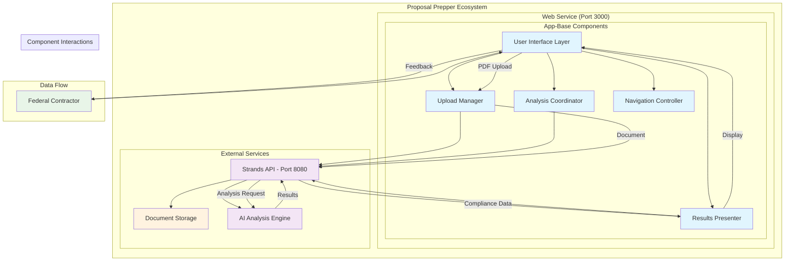
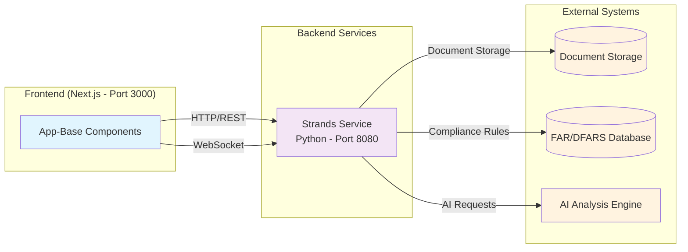

<!--
SPDX-License-Identifier: PolyForm-Perimeter-1.0.0
SPDX-FileCopyrightText: 2025 Seventeen Sierra LLC
-->

# Threshold App-Base Design Document

## Overview

The App-Base component provides the threshold (must-have) core application functionality for the Proposal Prepper system. This includes the basic web interface, document upload capabilities, analysis orchestration, and results presentation. The design focuses on creating a clean, functional user experience that enables federal contractors to efficiently upload and analyze proposal documents with basic compliance checking against FAR/DFARS requirements.

## Architecture

### System Architecture Overview

The Threshold App-Base follows a layered architecture pattern designed for the Proposal Prepper federated mesh system. The architecture emphasizes separation of concerns, maintainability, and integration with the broader microservice ecosystem.

**Key Architectural Decisions:**
- **Federated Mesh Integration**: Designed to work within the existing microservice architecture (web, strands services)
- **Threshold-First Approach**: Focuses on minimum viable functionality with clear upgrade paths
- **Component-Based Design**: Modular components that can be independently developed and tested
- **API-First Integration**: Clean separation between frontend and backend services through well-defined APIs

### Component Architecture Principles

**1. Separation of Concerns**
- Each component has a single, well-defined responsibility
- Clear boundaries between UI, business logic, and data access layers
- Minimal coupling between components to enable independent development

**2. Progressive Enhancement**
- Threshold functionality provides the foundation for future enhancements
- Components designed with extension points for additional features
- Graceful degradation when advanced features are unavailable

**3. Error Resilience**
- Each component handles its own error states
- Graceful fallbacks when dependencies are unavailable
- Clear error propagation and user feedback mechanisms

**4. Performance-First Design**
- Lazy loading of non-critical components
- Efficient state management to minimize re-renders
- Optimized for the 5-second load time requirement

### Component Structure



### Service Integration Architecture



## Components and Interfaces

### User Interface Layer
- **Purpose**: Provides the basic web interface for user interactions
- **Responsibilities**: 
  - Render clean, functional web interface
  - Handle user navigation and workflow
  - Provide basic form validation and feedback
  - Display information in readable format
  - Support desktop and mobile browsers
  - Show loading states and progress indicators
- **Technology**: Next.js React components with @17sierra/ui

### Upload Manager
- **Purpose**: Handles basic document upload functionality
- **Responsibilities**:
  - Accept PDF format files (threshold requirement)
  - Validate file format and size limits
  - Display upload progress and status
  - Confirm successful file receipt
  - Show clear error messages on failure
- **Key Features**:
  - PDF format support (minimum viable)
  - Real-time progress tracking
  - File validation and sanitization
  - Error handling and recovery

### Analysis Coordinator
- **Purpose**: Orchestrates the basic compliance analysis process
- **Responsibilities**:
  - Initiate analysis requests for FAR/DFARS compliance
  - Extract text content from proposal documents
  - Monitor analysis progress
  - Flag critical compliance violations
  - Generate basic compliance status
  - Handle analysis errors and recovery
- **Key Features**:
  - Core FAR/DFARS validation
  - Text extraction capabilities
  - Asynchronous processing
  - Progress tracking
  - Error handling and retry logic

### Results Presenter
- **Purpose**: Displays basic compliance analysis results
- **Responsibilities**:
  - Show compliance status (pass/fail/warning)
  - List identified compliance issues
  - Provide basic remediation recommendations
  - Reference specific FAR/DFARS sections
  - Allow viewing of specific issue locations
- **Key Features**:
  - Clear visual status indicators
  - Basic findings presentation
  - Regulatory section references
  - Issue location details

### Navigation Controller
- **Purpose**: Manages application navigation and user flow
- **Responsibilities**:
  - Provide clear navigation paths
  - Handle routing and state management
  - Ensure intuitive user flows
- **Key Features**:
  - Breadcrumb navigation
  - Progress indicators
  - Context-aware navigation

## Data Models

### Upload Session
```typescript
interface UploadSession {
  id: string;
  filename: string;
  fileSize: number;
  mimeType: string;
  status: UploadStatus;
  progress: number;
  startedAt: Date;
  completedAt?: Date;
  errorMessage?: string;
}

enum UploadStatus {
  PENDING = 'pending',
  UPLOADING = 'uploading',
  PROCESSING = 'processing',
  COMPLETED = 'completed',
  FAILED = 'failed'
}
```

### Analysis Session
```typescript
interface AnalysisSession {
  id: string;
  proposalId: string;
  status: AnalysisStatus;
  progress: number;
  startedAt: Date;
  completedAt?: Date;
  estimatedCompletion?: Date;
  currentStep: string;
}

enum AnalysisStatus {
  QUEUED = 'queued',
  EXTRACTING = 'extracting',
  ANALYZING = 'analyzing',
  VALIDATING = 'validating',
  COMPLETED = 'completed',
  FAILED = 'failed'
}
```

### User Interface State
```typescript
interface UIState {
  currentView: ViewType;
  navigationHistory: string[];
  activeUpload?: UploadSession;
  activeAnalysis?: AnalysisSession;
  notifications: Notification[];
  preferences: UserPreferences;
}

enum ViewType {
  DASHBOARD = 'dashboard',
  UPLOAD = 'upload',
  ANALYSIS = 'analysis',
  RESULTS = 'results',
  SETTINGS = 'settings'
}
```

## Correctness Properties

*A property is a characteristic or behavior that should hold true across all valid executions of a system-essentially, a formal statement about what the system should do. Properties serve as the bridge between human-readable specifications and machine-verifiable correctness guarantees.*

### Property 1: PDF Upload Acceptance
*For any* valid PDF file, the upload system should accept the file and initiate processing
**Validates: Requirements 1.1**

### Property 2: File Validation Consistency
*For any* file input, the validation system should consistently apply format and size limit rules
**Validates: Requirements 1.2**

### Property 3: Upload Confirmation
*For any* successful upload operation, the system should provide confirmation of file receipt
**Validates: Requirements 1.3**

### Property 4: Upload Error Messaging
*For any* failed upload operation, the system should display clear and specific error messages
**Validates: Requirements 1.4**

### Property 5: Progress Indication
*For any* upload operation in progress, the system should display progress and status information
**Validates: Requirements 1.5**

### Property 6: FAR/DFARS Validation
*For any* proposal document, the analysis system should validate against core FAR/DFARS requirements
**Validates: Requirements 2.1**

### Property 7: Text Extraction
*For any* document processed, the analysis system should extract text content for compliance checking
**Validates: Requirements 2.2**

### Property 8: Compliance Issue Detection
*For any* document containing compliance violations, the analysis system should flag critical issues
**Validates: Requirements 2.3**

### Property 9: Analysis Status Generation
*For any* completed analysis, the system should generate a basic compliance status result
**Validates: Requirements 2.4**

### Property 10: Analysis Error Handling
*For any* analysis error condition, the system should provide clear error messages and recovery options
**Validates: Requirements 2.5**

### Property 11: Results Status Display
*For any* analysis results, the display should include compliance status (pass/fail/warning)
**Validates: Requirements 3.1**

### Property 12: Issue Listing
*For any* identified compliance issues, the results should list all findings
**Validates: Requirements 3.2**

### Property 13: Remediation Guidance
*For any* compliance issues found, the results should include basic remediation recommendations
**Validates: Requirements 3.3**

### Property 14: Regulatory References
*For any* compliance issue, the results should reference specific FAR/DFARS sections
**Validates: Requirements 3.4**

### Property 15: Issue Location Access
*For any* compliance issue, users should be able to view specific issue locations in the document
**Validates: Requirements 3.5**

### Property 16: Navigation Functionality
*For any* user navigation action, the interface should provide clear navigation and workflow
**Validates: Requirements 4.2**

### Property 17: Form Validation
*For any* form interaction, the interface should provide basic validation and feedback
**Validates: Requirements 4.3**

### Property 18: Cross-Platform Compatibility
*For any* supported browser environment, the interface should function correctly on desktop and mobile
**Validates: Requirements 4.5**

### Property 19: Load Time Performance
*For any* application load request, the interface should load within 5 seconds on standard connections
**Validates: Requirements 5.1**

### Property 20: Error Recovery
*For any* common error condition, the interface should recover gracefully
**Validates: Requirements 5.3**

### Property 21: Session State Management
*For any* user session, the interface should maintain session state appropriately
**Validates: Requirements 5.4**

### Property 22: Loading State Feedback
*For any* operation in progress, the interface should show loading states and progress indicators
**Validates: Requirements 5.5**

## Error Handling

### Upload Errors
- **File Format Errors**: Clear messaging for unsupported formats
- **Size Limit Errors**: Specific guidance on file size limits
- **Network Errors**: Retry mechanisms with exponential backoff
- **Validation Errors**: Detailed feedback on validation failures

### Analysis Errors
- **Processing Errors**: Clear error messages with recovery options
- **Timeout Errors**: Graceful handling with retry options
- **Service Unavailable**: Fallback messaging and retry scheduling

### User Interface Errors
- **Form Validation**: Real-time validation with helpful messages
- **Navigation Errors**: Graceful fallbacks and error boundaries
- **State Management**: Consistent error state handling

## Performance Requirements

### Response Time Targets
- **Page Load**: < 5 seconds on standard connections
- **Upload Initiation**: < 100ms response time
- **Progress Updates**: Real-time updates every 500ms
- **Navigation**: < 200ms transition times

### User Experience Optimizations
- **Loading States**: Clear progress indicators for all operations
- **Responsive Design**: Optimized for desktop browsers
- **Caching**: Intelligent caching of static assets and user data
- **Error Recovery**: Automatic retry mechanisms where appropriate

## Security Considerations

### Input Validation
- **File Upload Security**: Comprehensive file type and content validation
- **Form Input Sanitization**: Protection against XSS and injection attacks
- **Size Limits**: Enforcement of file size and request limits

### Session Management
- **Secure Sessions**: Proper session handling and timeout management
- **State Protection**: Secure client-side state management
- **CSRF Protection**: Cross-site request forgery protection

## Testing Strategy

### Dual Testing Approach
The testing strategy employs both unit testing and property-based testing approaches:
- **Unit tests** verify specific examples, edge cases, and error conditions
- **Property tests** verify universal properties that should hold across all inputs
- Together they provide comprehensive coverage: unit tests catch concrete bugs, property tests verify general correctness

### Unit Testing
- **Component Testing**: Individual component functionality and specific examples
- **Upload Logic**: File validation and upload mechanisms with concrete test cases
- **Error Handling**: Error state management and recovery with specific scenarios
- **Navigation**: Routing and state transitions with example workflows
- **Integration Points**: Communication between components with known inputs

### Property-Based Testing
The property-based testing will use **fast-check** for JavaScript/TypeScript and be configured to run a minimum of **100 iterations** per test to ensure thorough coverage.

Each property-based test must:
- Be tagged with a comment explicitly referencing the correctness property from this design document
- Use the format: `**Feature: threshold-app-base, Property {number}: {property_text}**`
- Implement exactly one correctness property from the design document
- Run at least 100 iterations to validate the property across diverse inputs

**Property Test Coverage**:
- **Upload Validation**: Test PDF acceptance and file validation across various inputs
- **Analysis Processing**: Test FAR/DFARS validation and text extraction with diverse documents
- **Results Display**: Test compliance status and issue presentation with various analysis outcomes
- **Error Handling**: Test error scenarios and recovery mechanisms across different failure modes
- **Performance**: Test load times and response requirements with various conditions
- **Cross-Platform**: Test interface functionality across different browser environments

### Integration Testing
- **API Integration**: Communication with backend services
- **File Processing**: End-to-end upload and processing flows
- **User Workflows**: Complete user journey testing from upload to results