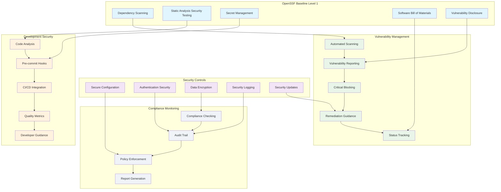

<!--
SPDX-License-Identifier: PolyForm-Perimeter-1.0.0
SPDX-FileCopyrightText: 2025 Seventeen Sierra LLC
-->

# Threshold Compliance Design Document

## Overview

The Compliance component ensures the Proposal Prepper application meets OpenSSF Baseline Level 1 security standards and fundamental regulatory requirements. The design implements automated security scanning, vulnerability management, and secure development practices to maintain compliance throughout the development lifecycle.

## Architecture

### Compliance Architecture



## OpenSSF Baseline Level 1 Implementation

### Dependency Vulnerability Scanning
```typescript
interface DependencyScanner {
  scanDependencies(): Promise<ScanResult>;
  checkVulnerabilities(dependencies: Dependency[]): Promise<VulnerabilityReport>;
  generateSBOM(): Promise<SBOM>;
  updateVulnerabilityDatabase(): Promise<void>;
}

interface ScanResult {
  scanId: string;
  timestamp: Date;
  dependencies: Dependency[];
  vulnerabilities: Vulnerability[];
  summary: ScanSummary;
  sbom: SBOM;
}

interface Dependency {
  name: string;
  version: string;
  type: 'direct' | 'transitive';
  ecosystem: 'npm' | 'pip' | 'docker';
  license: string;
  source: string;
  integrity?: string;
}

interface Vulnerability {
  id: string;
  cve?: string;
  severity: VulnerabilitySeverity;
  score: number;
  package: string;
  version: string;
  fixedVersion?: string;
  description: string;
  references: string[];
  publishedDate: Date;
  modifiedDate: Date;
}

enum VulnerabilitySeverity {
  CRITICAL = 'critical',
  HIGH = 'high',
  MEDIUM = 'medium',
  LOW = 'low',
  INFO = 'info'
}

interface SBOM {
  bomFormat: 'SPDX' | 'CycloneDX';
  specVersion: string;
  serialNumber: string;
  version: number;
  metadata: SBOMMetadata;
  components: SBOMComponent[];
  dependencies: SBOMDependency[];
}

interface SBOMComponent {
  type: 'library' | 'framework' | 'application';
  bomRef: string;
  name: string;
  version: string;
  licenses: License[];
  hashes: Hash[];
  supplier?: string;
  author?: string;
}
```

### Static Analysis Security Testing (SAST)
```typescript
interface SASTEngine {
  analyzeCode(codebase: string): Promise<SASTResult>;
  configureRules(rules: SASTRule[]): void;
  generateReport(results: SASTResult[]): Promise<SASTReport>;
  integrateWithCI(): Promise<CIIntegration>;
}

interface SASTResult {
  scanId: string;
  timestamp: Date;
  findings: SecurityFinding[];
  summary: SASTSummary;
  metrics: CodeQualityMetrics;
}

interface SecurityFinding {
  id: string;
  ruleId: string;
  severity: VulnerabilitySeverity;
  category: SecurityCategory;
  title: string;
  description: string;
  file: string;
  line: number;
  column: number;
  codeSnippet: string;
  recommendation: string;
  cwe?: string;
  owasp?: string;
}

enum SecurityCategory {
  INJECTION = 'injection',
  AUTHENTICATION = 'authentication',
  AUTHORIZATION = 'authorization',
  CRYPTOGRAPHY = 'cryptography',
  INPUT_VALIDATION = 'input_validation',
  ERROR_HANDLING = 'error_handling',
  LOGGING = 'logging',
  SECRETS = 'secrets'
}

interface SASTRule {
  id: string;
  name: string;
  description: string;
  category: SecurityCategory;
  severity: VulnerabilitySeverity;
  pattern: string;
  enabled: boolean;
  customMessage?: string;
}

// SAST Configuration
const sastRules: SASTRule[] = [
  {
    id: 'hardcoded-secrets',
    name: 'Hardcoded Secrets Detection',
    description: 'Detects hardcoded passwords, API keys, and secrets',
    category: SecurityCategory.SECRETS,
    severity: VulnerabilitySeverity.CRITICAL,
    pattern: '(password|api[_-]?key|secret|token)\\s*[=:]\\s*["\'][^"\'\\s]{8,}["\']',
    enabled: true
  },
  {
    id: 'sql-injection',
    name: 'SQL Injection Detection',
    description: 'Detects potential SQL injection vulnerabilities',
    category: SecurityCategory.INJECTION,
    severity: VulnerabilitySeverity.HIGH,
    pattern: 'query\\s*\\+\\s*["\'].*["\']|execute\\s*\\([^)]*\\+',
    enabled: true
  },
  {
    id: 'xss-vulnerability',
    name: 'Cross-Site Scripting Detection',
    description: 'Detects potential XSS vulnerabilities',
    category: SecurityCategory.INPUT_VALIDATION,
    severity: VulnerabilitySeverity.MEDIUM,
    pattern: 'innerHTML\\s*=|document\\.write\\s*\\(',
    enabled: true
  }
];
```

### Secret Management
```typescript
interface SecretManager {
  scanForSecrets(codebase: string): Promise<SecretScanResult>;
  validateSecretPatterns(): Promise<ValidationResult>;
  setupPreCommitHooks(): Promise<void>;
  generateSecretPolicy(): Promise<SecretPolicy>;
}

interface SecretScanResult {
  scanId: string;
  timestamp: Date;
  findings: SecretFinding[];
  summary: SecretScanSummary;
}

interface SecretFinding {
  id: string;
  type: SecretType;
  file: string;
  line: number;
  pattern: string;
  entropy: number;
  confidence: number;
  description: string;
}

enum SecretType {
  API_KEY = 'api_key',
  PASSWORD = 'password',
  TOKEN = 'token',
  CERTIFICATE = 'certificate',
  PRIVATE_KEY = 'private_key',
  DATABASE_URL = 'database_url',
  AWS_CREDENTIALS = 'aws_credentials'
}

interface SecretPolicy {
  allowedPatterns: string[];
  blockedPatterns: string[];
  exemptions: SecretExemption[];
  scanFrequency: string;
  alertThreshold: number;
}

interface SecretExemption {
  file: string;
  pattern: string;
  reason: string;
  approver: string;
  expiryDate: Date;
}

// Pre-commit hook configuration
const preCommitConfig = {
  repos: [
    {
      repo: 'https://github.com/pre-commit/pre-commit-hooks',
      rev: 'v4.4.0',
      hooks: [
        { id: 'trailing-whitespace' },
        { id: 'end-of-file-fixer' },
        { id: 'check-yaml' },
        { id: 'check-json' },
        { id: 'detect-private-key' }
      ]
    },
    {
      repo: 'https://github.com/Yelp/detect-secrets',
      rev: 'v1.4.0',
      hooks: [
        {
          id: 'detect-secrets',
          args: ['--baseline', '.secrets.baseline'],
          exclude: '^(package-lock\\.json|pnpm-lock\\.yaml)$'
        }
      ]
    }
  ]
};
```

## Vulnerability Management System

### Automated Vulnerability Scanning
```typescript
interface VulnerabilityManager {
  performAutomatedScan(): Promise<VulnerabilityScanResult>;
  generateVulnerabilityReport(): Promise<VulnerabilityReport>;
  blockCriticalDeployments(): Promise<DeploymentBlockResult>;
  provideRemediationGuidance(vulnerability: Vulnerability): Promise<RemediationGuidance>;
  trackVulnerabilityStatus(): Promise<VulnerabilityStatus[]>;
}

interface VulnerabilityScanResult {
  scanId: string;
  timestamp: Date;
  scanType: 'dependency' | 'container' | 'code';
  vulnerabilities: Vulnerability[];
  summary: VulnerabilitySummary;
  recommendations: Recommendation[];
}

interface VulnerabilitySummary {
  total: number;
  critical: number;
  high: number;
  medium: number;
  low: number;
  info: number;
  fixed: number;
  unfixed: number;
}

interface RemediationGuidance {
  vulnerabilityId: string;
  priority: 'immediate' | 'high' | 'medium' | 'low';
  steps: RemediationStep[];
  estimatedEffort: string;
  riskAssessment: string;
  alternativeSolutions: string[];
}

interface RemediationStep {
  order: number;
  action: string;
  description: string;
  command?: string;
  verification: string;
}

interface VulnerabilityStatus {
  vulnerabilityId: string;
  status: 'open' | 'in_progress' | 'resolved' | 'accepted_risk' | 'false_positive';
  assignee?: string;
  dueDate?: Date;
  resolution?: string;
  lastUpdated: Date;
}
```

### Critical Vulnerability Blocking
```typescript
interface DeploymentGate {
  evaluateVulnerabilities(scanResult: VulnerabilityScanResult): Promise<GateDecision>;
  configureCriticalThresholds(): Promise<VulnerabilityThresholds>;
  generateBlockingReport(): Promise<BlockingReport>;
  requestExemption(vulnerability: Vulnerability, justification: string): Promise<ExemptionRequest>;
}

interface GateDecision {
  allowed: boolean;
  reason: string;
  blockingVulnerabilities: Vulnerability[];
  warnings: string[];
  recommendations: string[];
}

interface VulnerabilityThresholds {
  critical: { max: number; block: boolean };
  high: { max: number; block: boolean };
  medium: { max: number; block: boolean };
  totalScore: { max: number; block: boolean };
}

const defaultThresholds: VulnerabilityThresholds = {
  critical: { max: 0, block: true },
  high: { max: 2, block: true },
  medium: { max: 10, block: false },
  totalScore: { max: 50, block: true }
};

interface BlockingReport {
  deploymentId: string;
  timestamp: Date;
  blocked: boolean;
  reason: string;
  vulnerabilities: Vulnerability[];
  requiredActions: string[];
  exemptions: ExemptionRequest[];
}
```

## Security Controls Implementation

### Secure Configuration Management
```typescript
interface SecureConfiguration {
  validateConfiguration(): Promise<ConfigurationValidation>;
  enforceSecurityPolicies(): Promise<PolicyEnforcement>;
  auditConfigurationChanges(): Promise<ConfigurationAudit>;
  generateSecurityBaseline(): Promise<SecurityBaseline>;
}

interface ConfigurationValidation {
  valid: boolean;
  findings: ConfigurationFinding[];
  recommendations: string[];
  complianceScore: number;
}

interface ConfigurationFinding {
  category: 'security' | 'performance' | 'reliability';
  severity: VulnerabilitySeverity;
  setting: string;
  currentValue: any;
  recommendedValue: any;
  description: string;
  impact: string;
}

interface SecurityBaseline {
  version: string;
  timestamp: Date;
  configurations: BaselineConfiguration[];
  policies: SecurityPolicy[];
  controls: SecurityControl[];
}

interface BaselineConfiguration {
  component: string;
  setting: string;
  value: any;
  justification: string;
  lastReviewed: Date;
}

interface SecurityPolicy {
  id: string;
  name: string;
  description: string;
  requirements: PolicyRequirement[];
  enforcement: 'mandatory' | 'recommended' | 'optional';
}

interface SecurityControl {
  id: string;
  name: string;
  description: string;
  implementation: string;
  testing: string;
  responsible: string;
}
```

### Authentication and Session Security
```typescript
interface AuthenticationSecurity {
  validateSessionManagement(): Promise<SessionValidation>;
  enforcePasswordPolicies(): Promise<PasswordPolicyEnforcement>;
  auditAuthenticationEvents(): Promise<AuthenticationAudit>;
  configureSecureDefaults(): Promise<SecurityConfiguration>;
}

interface SessionValidation {
  sessionTimeout: number;
  secureFlags: boolean;
  httpOnlyFlags: boolean;
  sameSitePolicy: string;
  sessionRotation: boolean;
  findings: SessionFinding[];
}

interface SessionFinding {
  type: 'configuration' | 'vulnerability' | 'best_practice';
  severity: VulnerabilitySeverity;
  description: string;
  recommendation: string;
  reference: string;
}

interface PasswordPolicyEnforcement {
  minLength: number;
  complexity: boolean;
  history: number;
  expiration: number;
  lockout: LockoutPolicy;
  findings: PolicyViolation[];
}

interface LockoutPolicy {
  maxAttempts: number;
  lockoutDuration: number;
  progressiveDelay: boolean;
}
```

## Compliance Monitoring and Reporting

### Compliance Dashboard
```typescript
interface ComplianceDashboard {
  generateComplianceReport(): Promise<ComplianceReport>;
  trackComplianceMetrics(): Promise<ComplianceMetrics>;
  monitorPolicyViolations(): Promise<PolicyViolation[]>;
  scheduleComplianceChecks(): Promise<void>;
}

interface ComplianceReport {
  reportId: string;
  timestamp: Date;
  period: { start: Date; end: Date };
  overallScore: number;
  frameworks: FrameworkCompliance[];
  findings: ComplianceFinding[];
  recommendations: ComplianceRecommendation[];
  trends: ComplianceTrend[];
}

interface FrameworkCompliance {
  framework: 'OpenSSF' | 'NIST' | 'SOC2' | 'Custom';
  version: string;
  score: number;
  controls: ControlCompliance[];
  status: 'compliant' | 'non_compliant' | 'partial';
}

interface ControlCompliance {
  controlId: string;
  name: string;
  status: 'pass' | 'fail' | 'not_applicable';
  evidence: string[];
  lastTested: Date;
  nextReview: Date;
}

interface ComplianceMetrics {
  vulnerabilityTrends: VulnerabilityTrend[];
  securityScores: SecurityScore[];
  policyViolations: PolicyViolationMetrics;
  remediationTimes: RemediationMetrics;
}

interface VulnerabilityTrend {
  date: Date;
  critical: number;
  high: number;
  medium: number;
  low: number;
  total: number;
}
```

### Audit Trail Management
```typescript
interface AuditTrailManager {
  logComplianceEvent(event: ComplianceEvent): Promise<void>;
  queryAuditTrail(query: AuditQuery): Promise<AuditEntry[]>;
  generateAuditReport(period: DateRange): Promise<AuditReport>;
  validateAuditIntegrity(): Promise<IntegrityValidation>;
}

interface ComplianceEvent {
  eventId: string;
  timestamp: Date;
  eventType: ComplianceEventType;
  actor: string;
  resource: string;
  action: string;
  outcome: 'success' | 'failure' | 'warning';
  details: Record<string, any>;
  riskLevel: 'low' | 'medium' | 'high' | 'critical';
}

enum ComplianceEventType {
  VULNERABILITY_SCAN = 'vulnerability_scan',
  POLICY_VIOLATION = 'policy_violation',
  SECURITY_CONTROL_TEST = 'security_control_test',
  CONFIGURATION_CHANGE = 'configuration_change',
  ACCESS_CONTROL_CHANGE = 'access_control_change',
  INCIDENT_RESPONSE = 'incident_response'
}

interface AuditEntry {
  entryId: string;
  timestamp: Date;
  event: ComplianceEvent;
  hash: string;
  previousHash?: string;
  signature?: string;
}

interface AuditReport {
  reportId: string;
  period: DateRange;
  summary: AuditSummary;
  events: ComplianceEvent[];
  violations: PolicyViolation[];
  recommendations: string[];
}
```

## CI/CD Integration

### Pipeline Security Integration
```typescript
interface CIPipelineSecurity {
  integrateSecurityScanning(): Promise<PipelineIntegration>;
  configureQualityGates(): Promise<QualityGateConfiguration>;
  generateSecurityReports(): Promise<SecurityReport>;
  enforceCompliancePolicies(): Promise<PolicyEnforcement>;
}

interface PipelineIntegration {
  stages: PipelineStage[];
  securityChecks: SecurityCheck[];
  qualityGates: QualityGate[];
  notifications: NotificationConfiguration;
}

interface PipelineStage {
  name: string;
  order: number;
  securityChecks: string[];
  failureAction: 'block' | 'warn' | 'continue';
  timeout: number;
}

interface SecurityCheck {
  id: string;
  name: string;
  type: 'sast' | 'dependency' | 'secret' | 'container' | 'license';
  tool: string;
  configuration: Record<string, any>;
  thresholds: SecurityThresholds;
}

interface QualityGate {
  id: string;
  name: string;
  conditions: GateCondition[];
  action: 'block' | 'warn';
}

interface GateCondition {
  metric: string;
  operator: 'gt' | 'lt' | 'eq' | 'gte' | 'lte';
  threshold: number;
  severity: VulnerabilitySeverity;
}

// Example CI/CD configuration
const ciSecurityConfig = {
  stages: [
    {
      name: 'security-scan',
      order: 1,
      securityChecks: ['sast', 'secret-scan', 'dependency-scan'],
      failureAction: 'block',
      timeout: 600
    },
    {
      name: 'quality-gate',
      order: 2,
      securityChecks: ['vulnerability-threshold'],
      failureAction: 'block',
      timeout: 60
    }
  ],
  qualityGates: [
    {
      id: 'security-gate',
      name: 'Security Quality Gate',
      conditions: [
        { metric: 'critical_vulnerabilities', operator: 'eq', threshold: 0, severity: VulnerabilitySeverity.CRITICAL },
        { metric: 'high_vulnerabilities', operator: 'lte', threshold: 2, severity: VulnerabilitySeverity.HIGH }
      ],
      action: 'block'
    }
  ]
};
```

## Testing and Validation

### Compliance Testing
```typescript
interface ComplianceTesting {
  testSecurityControls(): Promise<ControlTestResult[]>;
  validatePolicyCompliance(): Promise<PolicyValidationResult>;
  performComplianceAudit(): Promise<ComplianceAuditResult>;
  generateComplianceEvidence(): Promise<ComplianceEvidence>;
}

interface ControlTestResult {
  controlId: string;
  testDate: Date;
  status: 'pass' | 'fail' | 'not_tested';
  evidence: TestEvidence[];
  findings: ControlFinding[];
  recommendations: string[];
}

interface TestEvidence {
  type: 'screenshot' | 'log' | 'configuration' | 'report';
  description: string;
  data: string;
  timestamp: Date;
}

interface ComplianceEvidence {
  framework: string;
  controls: ControlEvidence[];
  artifacts: EvidenceArtifact[];
  attestations: ComplianceAttestation[];
}

interface ControlEvidence {
  controlId: string;
  implementation: string;
  testing: TestEvidence[];
  documentation: string[];
  lastReview: Date;
}
```

## Performance and Monitoring

### Compliance Performance Metrics
- **Scan Performance**: Dependency scans < 2 minutes, SAST scans < 5 minutes
- **Vulnerability Detection**: 99% detection rate for known vulnerabilities
- **False Positive Rate**: < 5% for security findings
- **Remediation Time**: Critical vulnerabilities resolved within 24 hours
- **Compliance Score**: Maintain > 95% compliance score

### Monitoring and Alerting
```typescript
interface ComplianceMonitoring {
  monitorVulnerabilityTrends(): Promise<void>;
  alertOnCriticalFindings(): Promise<void>;
  trackRemediationProgress(): Promise<void>;
  generateComplianceMetrics(): Promise<ComplianceMetrics>;
}

const alertingConfig = {
  criticalVulnerability: {
    threshold: 1,
    channels: ['email', 'slack'],
    escalation: '15m'
  },
  policyViolation: {
    threshold: 1,
    channels: ['email'],
    escalation: '1h'
  },
  complianceScore: {
    threshold: 90,
    channels: ['email', 'dashboard'],
    escalation: '24h'
  }
};
```