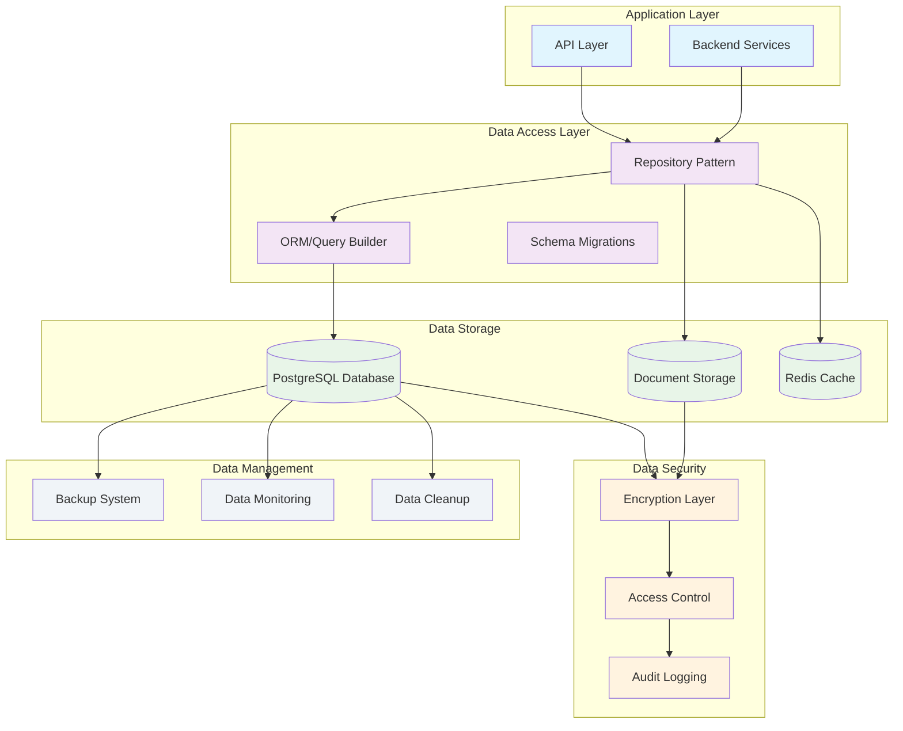

<!--
SPDX-License-Identifier: PolyForm-Perimeter-1.0.0
SPDX-FileCopyrightText: 2025 Seventeen Sierra LLC
-->

# Threshold Data Design Document

## Overview

The Data Layer provides comprehensive data management capabilities for the Proposal Prepper application, including structured schemas, secure document storage, user data management, and validation results storage. The design emphasizes data integrity, security, and scalability while supporting the application's core functionality.

## Architecture

### Data Architecture



## Data Models

### Core Entity Schemas

#### User Schema
```sql
CREATE TABLE users (
    id UUID PRIMARY KEY DEFAULT gen_random_uuid(),
    email VARCHAR(255) UNIQUE NOT NULL,
    name VARCHAR(255) NOT NULL,
    organization VARCHAR(255),
    password_hash VARCHAR(255) NOT NULL,
    email_verified BOOLEAN DEFAULT FALSE,
    created_at TIMESTAMP WITH TIME ZONE DEFAULT NOW(),
    updated_at TIMESTAMP WITH TIME ZONE DEFAULT NOW(),
    last_login_at TIMESTAMP WITH TIME ZONE,
    status VARCHAR(50) DEFAULT 'active',
    preferences JSONB DEFAULT '{}',
    
    CONSTRAINT users_email_check CHECK (email ~* '^[A-Za-z0-9._%+-]+@[A-Za-z0-9.-]+\.[A-Za-z]{2,}$'),
    CONSTRAINT users_status_check CHECK (status IN ('active', 'inactive', 'suspended'))
);

CREATE INDEX idx_users_email ON users(email);
CREATE INDEX idx_users_organization ON users(organization);
CREATE INDEX idx_users_status ON users(status);
```

#### Proposal Schema
```sql
CREATE TABLE proposals (
    id UUID PRIMARY KEY DEFAULT gen_random_uuid(),
    user_id UUID NOT NULL REFERENCES users(id) ON DELETE CASCADE,
    filename VARCHAR(255) NOT NULL,
    original_name VARCHAR(255) NOT NULL,
    file_size BIGINT NOT NULL,
    mime_type VARCHAR(100) NOT NULL,
    file_path VARCHAR(500) NOT NULL,
    file_hash VARCHAR(64) NOT NULL,
    status VARCHAR(50) DEFAULT 'uploaded',
    uploaded_at TIMESTAMP WITH TIME ZONE DEFAULT NOW(),
    processed_at TIMESTAMP WITH TIME ZONE,
    metadata JSONB DEFAULT '{}',
    
    CONSTRAINT proposals_file_size_check CHECK (file_size > 0 AND file_size <= 52428800), -- 50MB
    CONSTRAINT proposals_status_check CHECK (status IN ('uploaded', 'processing', 'analyzed', 'error')),
    CONSTRAINT proposals_mime_type_check CHECK (mime_type IN (
        'application/pdf',
        'application/msword',
        'application/vnd.openxmlformats-officedocument.wordprocessingml.document',
        'application/rtf'
    ))
);

CREATE INDEX idx_proposals_user_id ON proposals(user_id);
CREATE INDEX idx_proposals_status ON proposals(status);
CREATE INDEX idx_proposals_uploaded_at ON proposals(uploaded_at);
CREATE INDEX idx_proposals_file_hash ON proposals(file_hash);
```

#### Analysis Schema
```sql
CREATE TABLE analyses (
    id UUID PRIMARY KEY DEFAULT gen_random_uuid(),
    proposal_id UUID NOT NULL REFERENCES proposals(id) ON DELETE CASCADE,
    analysis_type VARCHAR(100)[] NOT NULL,
    status VARCHAR(50) DEFAULT 'queued',
    priority VARCHAR(20) DEFAULT 'normal',
    progress INTEGER DEFAULT 0,
    current_step VARCHAR(100),
    started_at TIMESTAMP WITH TIME ZONE,
    completed_at TIMESTAMP WITH TIME ZONE,
    estimated_completion TIMESTAMP WITH TIME ZONE,
    error_message TEXT,
    configuration JSONB DEFAULT '{}',
    
    CONSTRAINT analyses_status_check CHECK (status IN ('queued', 'running', 'completed', 'failed', 'cancelled')),
    CONSTRAINT analyses_priority_check CHECK (priority IN ('low', 'normal', 'high')),
    CONSTRAINT analyses_progress_check CHECK (progress >= 0 AND progress <= 100)
);

CREATE INDEX idx_analyses_proposal_id ON analyses(proposal_id);
CREATE INDEX idx_analyses_status ON analyses(status);
CREATE INDEX idx_analyses_priority ON analyses(priority);
CREATE INDEX idx_analyses_started_at ON analyses(started_at);
```

#### Analysis Results Schema
```sql
CREATE TABLE analysis_results (
    id UUID PRIMARY KEY DEFAULT gen_random_uuid(),
    analysis_id UUID NOT NULL REFERENCES analyses(id) ON DELETE CASCADE,
    overall_status VARCHAR(20) NOT NULL,
    summary JSONB NOT NULL,
    findings JSONB NOT NULL DEFAULT '[]',
    recommendations JSONB NOT NULL DEFAULT '[]',
    document_structure JSONB,
    processing_metrics JSONB,
    created_at TIMESTAMP WITH TIME ZONE DEFAULT NOW(),
    
    CONSTRAINT analysis_results_status_check CHECK (overall_status IN ('pass', 'fail', 'warning'))
);

CREATE INDEX idx_analysis_results_analysis_id ON analysis_results(analysis_id);
CREATE INDEX idx_analysis_results_overall_status ON analysis_results(overall_status);
CREATE INDEX idx_analysis_results_created_at ON analysis_results(created_at);
```

#### Compliance Findings Schema
```sql
CREATE TABLE compliance_findings (
    id UUID PRIMARY KEY DEFAULT gen_random_uuid(),
    analysis_result_id UUID NOT NULL REFERENCES analysis_results(id) ON DELETE CASCADE,
    rule_id VARCHAR(100) NOT NULL,
    status VARCHAR(20) NOT NULL,
    severity VARCHAR(20) NOT NULL,
    description TEXT NOT NULL,
    document_section VARCHAR(255),
    page_number INTEGER,
    regulation_reference JSONB NOT NULL,
    recommendation TEXT,
    created_at TIMESTAMP WITH TIME ZONE DEFAULT NOW(),
    
    CONSTRAINT compliance_findings_status_check CHECK (status IN ('pass', 'fail', 'warning')),
    CONSTRAINT compliance_findings_severity_check CHECK (severity IN ('low', 'medium', 'high', 'critical'))
);

CREATE INDEX idx_compliance_findings_analysis_result_id ON compliance_findings(analysis_result_id);
CREATE INDEX idx_compliance_findings_rule_id ON compliance_findings(rule_id);
CREATE INDEX idx_compliance_findings_status ON compliance_findings(status);
CREATE INDEX idx_compliance_findings_severity ON compliance_findings(severity);
```

### TypeScript Interfaces

#### User Data Models
```typescript
interface User {
  id: string;
  email: string;
  name: string;
  organization?: string;
  emailVerified: boolean;
  createdAt: Date;
  updatedAt: Date;
  lastLoginAt?: Date;
  status: UserStatus;
  preferences: UserPreferences;
}

enum UserStatus {
  ACTIVE = 'active',
  INACTIVE = 'inactive',
  SUSPENDED = 'suspended'
}

interface UserPreferences {
  theme: 'light' | 'dark' | 'system';
  notifications: {
    email: boolean;
    analysisComplete: boolean;
    weeklyDigest: boolean;
  };
  defaultAnalysisSettings: {
    includeRecommendations: boolean;
    detailedCitations: boolean;
    priority: 'low' | 'normal' | 'high';
  };
}
```

#### Proposal Data Models
```typescript
interface Proposal {
  id: string;
  userId: string;
  filename: string;
  originalName: string;
  fileSize: number;
  mimeType: string;
  filePath: string;
  fileHash: string;
  status: ProposalStatus;
  uploadedAt: Date;
  processedAt?: Date;
  metadata: ProposalMetadata;
}

enum ProposalStatus {
  UPLOADED = 'uploaded',
  PROCESSING = 'processing',
  ANALYZED = 'analyzed',
  ERROR = 'error'
}

interface ProposalMetadata {
  title?: string;
  description?: string;
  tags: string[];
  documentType?: string;
  pageCount?: number;
  extractedText?: string;
  sections?: DocumentSection[];
}

interface DocumentSection {
  id: string;
  title: string;
  content: string;
  startPage: number;
  endPage: number;
  sectionType: SectionType;
  confidence: number;
}

enum SectionType {
  EXECUTIVE_SUMMARY = 'executive_summary',
  TECHNICAL_APPROACH = 'technical_approach',
  MANAGEMENT_PLAN = 'management_plan',
  COST_PROPOSAL = 'cost_proposal',
  APPENDIX = 'appendix',
  OTHER = 'other'
}
```

#### Analysis Data Models
```typescript
interface Analysis {
  id: string;
  proposalId: string;
  analysisType: AnalysisType[];
  status: AnalysisStatus;
  priority: Priority;
  progress: number;
  currentStep?: string;
  startedAt?: Date;
  completedAt?: Date;
  estimatedCompletion?: Date;
  errorMessage?: string;
  configuration: AnalysisConfiguration;
}

enum AnalysisType {
  TEXT_EXTRACTION = 'text_extraction',
  STRUCTURE_ANALYSIS = 'structure_analysis',
  COMPLIANCE_VALIDATION = 'compliance_validation'
}

enum AnalysisStatus {
  QUEUED = 'queued',
  RUNNING = 'running',
  COMPLETED = 'completed',
  FAILED = 'failed',
  CANCELLED = 'cancelled'
}

enum Priority {
  LOW = 'low',
  NORMAL = 'normal',
  HIGH = 'high'
}

interface AnalysisConfiguration {
  includeRecommendations: boolean;
  detailedCitations: boolean;
  customRules?: string[];
  timeoutMinutes: number;
}
```

#### Results Data Models
```typescript
interface AnalysisResult {
  id: string;
  analysisId: string;
  overallStatus: ComplianceStatus;
  summary: AnalysisSummary;
  findings: ComplianceFinding[];
  recommendations: Recommendation[];
  documentStructure?: DocumentStructure;
  processingMetrics: ProcessingMetrics;
  createdAt: Date;
}

enum ComplianceStatus {
  PASS = 'pass',
  FAIL = 'fail',
  WARNING = 'warning'
}

interface AnalysisSummary {
  totalFindings: number;
  passCount: number;
  failCount: number;
  warningCount: number;
  criticalIssues: number;
  processingTime: number;
}

interface ComplianceFinding {
  id: string;
  ruleId: string;
  status: ComplianceStatus;
  severity: FindingSeverity;
  description: string;
  documentSection?: string;
  pageNumber?: number;
  regulationReference: RegulationReference;
  recommendation?: string;
  createdAt: Date;
}

enum FindingSeverity {
  LOW = 'low',
  MEDIUM = 'medium',
  HIGH = 'high',
  CRITICAL = 'critical'
}

interface RegulationReference {
  source: 'FAR' | 'DFARS' | 'CUSTOM';
  section: string;
  title: string;
  url?: string;
  description: string;
}

interface Recommendation {
  id: string;
  type: 'fix' | 'improve' | 'consider';
  title: string;
  description: string;
  priority: Priority;
  estimatedEffort: 'low' | 'medium' | 'high';
  relatedFindings: string[];
}

interface ProcessingMetrics {
  totalProcessingTime: number;
  extractionTime: number;
  analysisTime: number;
  validationTime: number;
  tokensUsed: number;
  apiCalls: number;
  errorCount: number;
  retryCount: number;
}
```

## Document Storage

### File Storage Architecture
```typescript
interface DocumentStorage {
  uploadDocument(file: File, metadata: DocumentMetadata): Promise<StorageResult>;
  getDocument(documentId: string): Promise<Document>;
  deleteDocument(documentId: string): Promise<void>;
  getDocumentUrl(documentId: string, expiresIn?: number): Promise<string>;
  validateDocument(file: File): Promise<ValidationResult>;
}

interface StorageResult {
  documentId: string;
  filePath: string;
  fileHash: string;
  uploadedAt: Date;
  metadata: DocumentMetadata;
}

interface ValidationResult {
  isValid: boolean;
  errors: ValidationError[];
  warnings: ValidationWarning[];
  metadata: FileMetadata;
}
```

### File Organization Structure
```
documents/
├── users/
│   └── {user-id}/
│       └── proposals/
│           └── {proposal-id}/
│               ├── original/
│               │   └── {filename}
│               ├── processed/
│               │   ├── text-extracted.txt
│               │   └── sections.json
│               └── thumbnails/
│                   └── preview.png
└── temp/
    └── uploads/
        └── {upload-session-id}/
```

### File Security and Encryption
```typescript
interface EncryptionConfig {
  algorithm: 'AES-256-GCM';
  keyDerivation: 'PBKDF2';
  iterations: 100000;
  saltLength: 32;
  ivLength: 16;
}

interface FileEncryption {
  encryptFile(filePath: string, key: Buffer): Promise<EncryptedFile>;
  decryptFile(encryptedFile: EncryptedFile, key: Buffer): Promise<Buffer>;
  generateKey(): Buffer;
  deriveKey(password: string, salt: Buffer): Buffer;
}

interface EncryptedFile {
  encryptedData: Buffer;
  iv: Buffer;
  authTag: Buffer;
  salt: Buffer;
}
```

## Data Validation and Integrity

### Schema Validation
```typescript
// Zod schemas for runtime validation
const userSchema = z.object({
  id: z.string().uuid(),
  email: z.string().email(),
  name: z.string().min(1).max(255),
  organization: z.string().max(255).optional(),
  emailVerified: z.boolean(),
  status: z.enum(['active', 'inactive', 'suspended']),
  preferences: z.object({
    theme: z.enum(['light', 'dark', 'system']),
    notifications: z.object({
      email: z.boolean(),
      analysisComplete: z.boolean(),
      weeklyDigest: z.boolean()
    })
  })
});

const proposalSchema = z.object({
  id: z.string().uuid(),
  userId: z.string().uuid(),
  filename: z.string().min(1).max(255),
  originalName: z.string().min(1).max(255),
  fileSize: z.number().positive().max(52428800), // 50MB
  mimeType: z.enum([
    'application/pdf',
    'application/msword',
    'application/vnd.openxmlformats-officedocument.wordprocessingml.document',
    'application/rtf'
  ]),
  status: z.enum(['uploaded', 'processing', 'analyzed', 'error'])
});
```

### Data Integrity Constraints
```sql
-- Foreign key constraints
ALTER TABLE proposals ADD CONSTRAINT fk_proposals_user_id 
    FOREIGN KEY (user_id) REFERENCES users(id) ON DELETE CASCADE;

ALTER TABLE analyses ADD CONSTRAINT fk_analyses_proposal_id 
    FOREIGN KEY (proposal_id) REFERENCES proposals(id) ON DELETE CASCADE;

-- Check constraints
ALTER TABLE proposals ADD CONSTRAINT chk_proposals_file_size 
    CHECK (file_size > 0 AND file_size <= 52428800);

ALTER TABLE analyses ADD CONSTRAINT chk_analyses_progress 
    CHECK (progress >= 0 AND progress <= 100);

-- Unique constraints
ALTER TABLE users ADD CONSTRAINT uk_users_email UNIQUE (email);
ALTER TABLE proposals ADD CONSTRAINT uk_proposals_file_hash UNIQUE (file_hash);
```

## Data Migration and Versioning

### Migration System
```typescript
interface Migration {
  version: string;
  description: string;
  up: (db: Database) => Promise<void>;
  down: (db: Database) => Promise<void>;
}

class MigrationManager {
  async runMigrations(): Promise<void>;
  async rollbackMigration(version: string): Promise<void>;
  async getCurrentVersion(): Promise<string>;
  async getPendingMigrations(): Promise<Migration[]>;
}
```

### Sample Migration
```typescript
const migration_001_initial_schema: Migration = {
  version: '001',
  description: 'Create initial database schema',
  up: async (db) => {
    await db.query(`
      CREATE TABLE users (
        id UUID PRIMARY KEY DEFAULT gen_random_uuid(),
        email VARCHAR(255) UNIQUE NOT NULL,
        name VARCHAR(255) NOT NULL,
        created_at TIMESTAMP WITH TIME ZONE DEFAULT NOW()
      );
    `);
  },
  down: async (db) => {
    await db.query('DROP TABLE IF EXISTS users;');
  }
};
```

## Data Security and Access Control

### Row-Level Security (RLS)
```sql
-- Enable RLS on sensitive tables
ALTER TABLE proposals ENABLE ROW LEVEL SECURITY;
ALTER TABLE analyses ENABLE ROW LEVEL SECURITY;
ALTER TABLE analysis_results ENABLE ROW LEVEL SECURITY;

-- Create policies for user data isolation
CREATE POLICY user_proposals_policy ON proposals
    FOR ALL TO authenticated_users
    USING (user_id = current_user_id());

CREATE POLICY user_analyses_policy ON analyses
    FOR ALL TO authenticated_users
    USING (proposal_id IN (
        SELECT id FROM proposals WHERE user_id = current_user_id()
    ));
```

### Data Encryption
```typescript
interface DataEncryption {
  encryptSensitiveFields(data: Record<string, any>): Record<string, any>;
  decryptSensitiveFields(data: Record<string, any>): Record<string, any>;
  hashPassword(password: string): Promise<string>;
  verifyPassword(password: string, hash: string): Promise<boolean>;
}

// Sensitive fields configuration
const encryptedFields = {
  users: ['email'],
  proposals: ['original_name'],
  analysis_results: ['findings', 'recommendations']
};
```

### Audit Logging
```sql
CREATE TABLE audit_logs (
    id UUID PRIMARY KEY DEFAULT gen_random_uuid(),
    table_name VARCHAR(100) NOT NULL,
    record_id UUID NOT NULL,
    action VARCHAR(20) NOT NULL,
    old_values JSONB,
    new_values JSONB,
    user_id UUID,
    ip_address INET,
    user_agent TEXT,
    created_at TIMESTAMP WITH TIME ZONE DEFAULT NOW(),
    
    CONSTRAINT audit_logs_action_check CHECK (action IN ('INSERT', 'UPDATE', 'DELETE'))
);

CREATE INDEX idx_audit_logs_table_name ON audit_logs(table_name);
CREATE INDEX idx_audit_logs_record_id ON audit_logs(record_id);
CREATE INDEX idx_audit_logs_user_id ON audit_logs(user_id);
CREATE INDEX idx_audit_logs_created_at ON audit_logs(created_at);
```

## Performance Optimization

### Database Indexing Strategy
```sql
-- Performance indexes
CREATE INDEX CONCURRENTLY idx_proposals_user_status ON proposals(user_id, status);
CREATE INDEX CONCURRENTLY idx_analyses_proposal_status ON analyses(proposal_id, status);
CREATE INDEX CONCURRENTLY idx_findings_result_severity ON compliance_findings(analysis_result_id, severity);

-- Partial indexes for common queries
CREATE INDEX CONCURRENTLY idx_active_analyses ON analyses(proposal_id) 
    WHERE status IN ('queued', 'running');

CREATE INDEX CONCURRENTLY idx_recent_proposals ON proposals(user_id, uploaded_at) 
    WHERE uploaded_at > NOW() - INTERVAL '30 days';
```

### Query Optimization
```typescript
interface QueryOptimization {
  // Use prepared statements
  getProposalsByUser: PreparedStatement<{userId: string}, Proposal[]>;
  getAnalysisResults: PreparedStatement<{analysisId: string}, AnalysisResult>;
  
  // Implement pagination
  getProposalsPaginated(userId: string, page: number, limit: number): Promise<PaginatedResult<Proposal>>;
  
  // Use connection pooling
  connectionPool: {
    min: 5,
    max: 20,
    acquireTimeoutMillis: 30000,
    idleTimeoutMillis: 600000
  };
}
```

### Caching Strategy
```typescript
interface CacheStrategy {
  // User data caching
  getUserProfile(userId: string): Promise<User>;
  setUserProfile(userId: string, user: User, ttl?: number): Promise<void>;
  
  // Analysis results caching
  getAnalysisResult(analysisId: string): Promise<AnalysisResult | null>;
  setAnalysisResult(analysisId: string, result: AnalysisResult): Promise<void>;
  
  // Cache invalidation
  invalidateUserCache(userId: string): Promise<void>;
  invalidateAnalysisCache(proposalId: string): Promise<void>;
}
```

## Data Backup and Recovery

### Backup Strategy
```typescript
interface BackupConfig {
  schedule: {
    full: 'daily at 2:00 AM UTC';
    incremental: 'every 4 hours';
    transaction_log: 'every 15 minutes';
  };
  retention: {
    daily: 30; // days
    weekly: 12; // weeks
    monthly: 12; // months
  };
  encryption: {
    enabled: true;
    algorithm: 'AES-256';
  };
  compression: {
    enabled: true;
    level: 6;
  };
}
```

### Disaster Recovery
```typescript
interface DisasterRecovery {
  // Recovery point objective (RPO): 15 minutes
  // Recovery time objective (RTO): 4 hours
  
  performPointInTimeRecovery(timestamp: Date): Promise<void>;
  validateBackupIntegrity(backupId: string): Promise<boolean>;
  testRecoveryProcedure(): Promise<RecoveryTestResult>;
}
```

## Testing Strategy

### Data Testing
```typescript
// Database testing with test containers
describe('Database Operations', () => {
  let testDb: TestDatabase;
  
  beforeEach(async () => {
    testDb = await createTestDatabase();
    await testDb.migrate();
    await testDb.seed();
  });
  
  afterEach(async () => {
    await testDb.cleanup();
  });
  
  it('should create user with valid data', async () => {
    const user = await testDb.users.create(validUserData);
    expect(user.id).toBeDefined();
    expect(user.email).toBe(validUserData.email);
  });
});
```

### Property-Based Testing
```typescript
// Test data integrity with property-based testing
describe('Data Integrity Properties', () => {
  it('should maintain referential integrity', () => {
    fc.assert(fc.property(
      fc.record({
        user: userGenerator,
        proposal: proposalGenerator
      }),
      async ({user, proposal}) => {
        const createdUser = await db.users.create(user);
        proposal.userId = createdUser.id;
        const createdProposal = await db.proposals.create(proposal);
        
        // Verify relationship exists
        const foundProposal = await db.proposals.findById(createdProposal.id);
        expect(foundProposal.userId).toBe(createdUser.id);
      }
    ));
  });
});
```