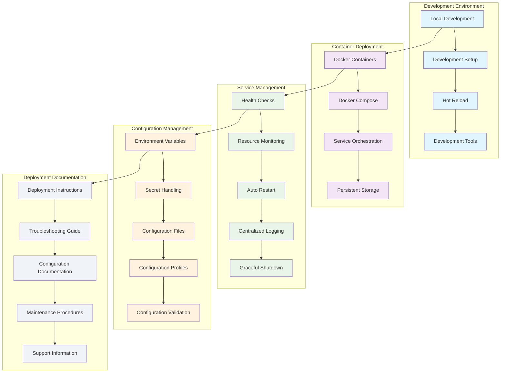

<!--
SPDX-License-Identifier: PolyForm-Perimeter-1.0.0
SPDX-FileCopyrightText: 2025 Seventeen Sierra LLC
-->

# Threshold Deployment Design Document

## Overview

The Deployment component provides comprehensive deployment capabilities for the Proposal Prepper application, focusing on containerized deployment, local development environment setup, and basic service management. The design emphasizes simplicity, reliability, and ease of use for development and basic production scenarios.

## Architecture

### Deployment Architecture



## Local Development Environment

### Development Setup System
```typescript
interface DevelopmentSetup {
  initializeEnvironment(): Promise<SetupResult>;
  validatePrerequisites(): Promise<PrerequisiteCheck>;
  installDependencies(): Promise<DependencyInstallation>;
  configureServices(): Promise<ServiceConfiguration>;
  startDevelopmentServer(): Promise<ServerStartResult>;
}

interface SetupResult {
  success: boolean;
  steps: SetupStep[];
  duration: number;
  errors: SetupError[];
  nextSteps: string[];
}

interface SetupStep {
  name: string;
  status: 'pending' | 'running' | 'completed' | 'failed';
  duration?: number;
  output?: string;
  error?: string;
}

interface PrerequisiteCheck {
  docker: { installed: boolean; version: string; compatible: boolean };
  dockerCompose: { installed: boolean; version: string; compatible: boolean };
  node: { installed: boolean; version: string; compatible: boolean };
  python: { installed: boolean; version: string; compatible: boolean };
  git: { installed: boolean; version: string };
  diskSpace: { available: number; required: number; sufficient: boolean };
  memory: { available: number; required: number; sufficient: boolean };
}

interface DependencyInstallation {
  nodeModules: InstallationResult;
  pythonPackages: InstallationResult;
  dockerImages: InstallationResult;
  systemPackages: InstallationResult;
}

interface InstallationResult {
  success: boolean;
  duration: number;
  packagesInstalled: number;
  errors: string[];
  warnings: string[];
}
```

### Development Server Management
```typescript
interface DevelopmentServer {
  start(): Promise<ServerStartResult>;
  stop(): Promise<ServerStopResult>;
  restart(): Promise<ServerRestartResult>;
  getStatus(): Promise<ServerStatus>;
  enableHotReload(): Promise<void>;
  configureProxy(): Promise<ProxyConfiguration>;
}

interface ServerStartResult {
  success: boolean;
  services: ServiceStatus[];
  urls: ServiceURL[];
  startupTime: number;
  errors: string[];
}

interface ServiceStatus {
  name: string;
  status: 'starting' | 'running' | 'stopped' | 'error';
  port: number;
  pid?: number;
  uptime?: number;
  healthCheck: HealthCheckResult;
}

interface ServiceURL {
  service: string;
  url: string;
  description: string;
  primary: boolean;
}

interface HotReloadConfiguration {
  enabled: boolean;
  watchPaths: string[];
  ignorePaths: string[];
  debounceMs: number;
  reloadStrategy: 'full' | 'partial' | 'hmr';
}

const hotReloadConfig: HotReloadConfiguration = {
  enabled: true,
  watchPaths: ['src/**/*', 'services/**/*'],
  ignorePaths: ['node_modules/**/*', 'dist/**/*', '**/*.test.*'],
  debounceMs: 300,
  reloadStrategy: 'hmr'
};
```

### Development Tools Integration
```typescript
interface DevelopmentTools {
  setupDebugger(): Promise<DebuggerConfiguration>;
  configureLinting(): Promise<LintingConfiguration>;
  setupTesting(): Promise<TestingConfiguration>;
  enableProfiling(): Promise<ProfilingConfiguration>;
}

interface DebuggerConfiguration {
  webService: {
    port: number;
    sourceMaps: boolean;
    breakpoints: boolean;
  };
  strandsService: {
    port: number;
    debugger: 'pdb' | 'debugpy';
    remoteDebugging: boolean;
  };
  vscodeConfig: VSCodeDebugConfig;
}

interface VSCodeDebugConfig {
  configurations: DebugConfiguration[];
  compounds: DebugCompound[];
}

interface DebugConfiguration {
  name: string;
  type: string;
  request: 'launch' | 'attach';
  port?: number;
  program?: string;
  args?: string[];
  env?: Record<string, string>;
}

const vscodeDebugConfig: VSCodeDebugConfig = {
  configurations: [
    {
      name: 'Debug Web Service',
      type: 'node',
      request: 'attach',
      port: 9229,
      env: { NODE_ENV: 'development' }
    },
    {
      name: 'Debug Strands Service',
      type: 'python',
      request: 'attach',
      port: 5678,
      pathMappings: [{ localRoot: '${workspaceFolder}/services/strands', remoteRoot: '/app' }]
    }
  ],
  compounds: [
    {
      name: 'Debug All Services',
      configurations: ['Debug Web Service', 'Debug Strands Service']
    }
  ]
};
```

## Container Deployment System

### Docker Container Management
```typescript
interface ContainerManager {
  buildContainers(): Promise<BuildResult>;
  startServices(): Promise<StartResult>;
  stopServices(): Promise<StopResult>;
  updateServices(): Promise<UpdateResult>;
  manageVolumes(): Promise<VolumeManagement>;
  configureNetworking(): Promise<NetworkConfiguration>;
}

interface BuildResult {
  success: boolean;
  containers: ContainerBuildResult[];
  totalTime: number;
  cacheHits: number;
  errors: BuildError[];
}

interface ContainerBuildResult {
  name: string;
  imageId: string;
  size: number;
  buildTime: number;
  layers: number;
  cached: boolean;
}

interface DockerComposeConfiguration {
  version: string;
  services: ServiceDefinition[];
  networks: NetworkDefinition[];
  volumes: VolumeDefinition[];
  secrets?: SecretDefinition[];
}

interface ServiceDefinition {
  name: string;
  image?: string;
  build?: BuildConfiguration;
  ports: PortMapping[];
  environment: EnvironmentVariable[];
  volumes: VolumeMount[];
  dependsOn: ServiceDependency[];
  healthCheck: HealthCheckConfiguration;
  restart: RestartPolicy;
  resources: ResourceLimits;
}

interface BuildConfiguration {
  context: string;
  dockerfile: string;
  target?: string;
  args?: Record<string, string>;
  cacheFrom?: string[];
}

interface PortMapping {
  host: number;
  container: number;
  protocol: 'tcp' | 'udp';
}

interface VolumeMount {
  source: string;
  target: string;
  type: 'bind' | 'volume' | 'tmpfs';
  readOnly?: boolean;
}
```

### Service Orchestration
```typescript
interface ServiceOrchestrator {
  orchestrateStartup(): Promise<OrchestrationResult>;
  manageDependencies(): Promise<DependencyManagement>;
  handleFailures(): Promise<FailureHandling>;
  scaleServices(): Promise<ScalingResult>;
}

interface OrchestrationResult {
  success: boolean;
  startupSequence: StartupStep[];
  totalTime: number;
  servicesStarted: number;
  failures: ServiceFailure[];
}

interface StartupStep {
  service: string;
  order: number;
  startTime: Date;
  duration: number;
  dependencies: string[];
  status: 'waiting' | 'starting' | 'ready' | 'failed';
}

interface ServiceDependency {
  service: string;
  condition: 'service_started' | 'service_healthy' | 'service_completed_successfully';
  timeout?: number;
}

interface DependencyManagement {
  dependencyGraph: ServiceDependencyGraph;
  startupOrder: string[];
  criticalPath: string[];
  parallelGroups: string[][];
}

interface ServiceDependencyGraph {
  nodes: ServiceNode[];
  edges: DependencyEdge[];
}

interface ServiceNode {
  name: string;
  startupTime: number;
  healthCheckTime: number;
  critical: boolean;
}

interface DependencyEdge {
  from: string;
  to: string;
  type: 'hard' | 'soft';
  timeout: number;
}
```

### Persistent Storage Management
```typescript
interface StorageManager {
  createVolumes(): Promise<VolumeCreationResult>;
  backupData(): Promise<BackupResult>;
  restoreData(backupId: string): Promise<RestoreResult>;
  cleanupStorage(): Promise<CleanupResult>;
  monitorUsage(): Promise<StorageUsage>;
}

interface VolumeCreationResult {
  volumes: VolumeInfo[];
  totalSize: number;
  errors: VolumeError[];
}

interface VolumeInfo {
  name: string;
  driver: string;
  mountpoint: string;
  size: number;
  created: Date;
  labels: Record<string, string>;
}

interface BackupResult {
  backupId: string;
  timestamp: Date;
  volumes: VolumeBackup[];
  totalSize: number;
  duration: number;
  compression: number;
}

interface VolumeBackup {
  volumeName: string;
  backupPath: string;
  size: number;
  checksum: string;
  compressed: boolean;
}

interface StorageUsage {
  volumes: VolumeUsage[];
  totalUsed: number;
  totalAvailable: number;
  warnings: StorageWarning[];
}

interface VolumeUsage {
  name: string;
  used: number;
  available: number;
  percentage: number;
  trend: 'increasing' | 'decreasing' | 'stable';
}
```

## Service Management System

### Health Monitoring
```typescript
interface HealthMonitor {
  performHealthChecks(): Promise<HealthCheckResults>;
  monitorServiceHealth(): Promise<void>;
  configureHealthChecks(): Promise<HealthCheckConfiguration>;
  generateHealthReport(): Promise<HealthReport>;
}

interface HealthCheckResults {
  timestamp: Date;
  overallStatus: 'healthy' | 'degraded' | 'unhealthy';
  services: ServiceHealthStatus[];
  summary: HealthSummary;
}

interface ServiceHealthStatus {
  name: string;
  status: 'healthy' | 'unhealthy' | 'starting' | 'unknown';
  lastCheck: Date;
  responseTime: number;
  uptime: number;
  checks: IndividualHealthCheck[];
}

interface IndividualHealthCheck {
  name: string;
  status: 'pass' | 'fail' | 'warn';
  message: string;
  duration: number;
  details?: Record<string, any>;
}

interface HealthCheckConfiguration {
  interval: number;
  timeout: number;
  retries: number;
  startPeriod: number;
  checks: HealthCheckDefinition[];
}

interface HealthCheckDefinition {
  name: string;
  type: 'http' | 'tcp' | 'exec' | 'grpc';
  target: string;
  expectedResponse?: any;
  headers?: Record<string, string>;
  command?: string[];
}

const healthCheckConfig: HealthCheckConfiguration = {
  interval: 30,
  timeout: 10,
  retries: 3,
  startPeriod: 60,
  checks: [
    {
      name: 'web-service-http',
      type: 'http',
      target: 'http://web:3000/api/health',
      expectedResponse: { status: 'ok' }
    },
    {
      name: 'strands-service-http',
      type: 'http',
      target: 'http://strands:8080/health',
      expectedResponse: { status: 'healthy' }
    },
    {
      name: 'postgres-connection',
      type: 'tcp',
      target: 'postgres:5432'
    }
  ]
};
```

### Resource Monitoring
```typescript
interface ResourceMonitor {
  monitorSystemResources(): Promise<SystemResourceUsage>;
  monitorServiceResources(): Promise<ServiceResourceUsage[]>;
  configureResourceLimits(): Promise<ResourceLimitConfiguration>;
  generateResourceReport(): Promise<ResourceReport>;
}

interface SystemResourceUsage {
  timestamp: Date;
  cpu: CPUUsage;
  memory: MemoryUsage;
  disk: DiskUsage;
  network: NetworkUsage;
}

interface CPUUsage {
  percentage: number;
  cores: number;
  loadAverage: number[];
  processes: number;
}

interface MemoryUsage {
  used: number;
  available: number;
  total: number;
  percentage: number;
  swap: SwapUsage;
}

interface DiskUsage {
  used: number;
  available: number;
  total: number;
  percentage: number;
  iops: IOPSMetrics;
}

interface NetworkUsage {
  bytesIn: number;
  bytesOut: number;
  packetsIn: number;
  packetsOut: number;
  connections: number;
}

interface ServiceResourceUsage {
  serviceName: string;
  containerId: string;
  cpu: {
    percentage: number;
    throttling: number;
  };
  memory: {
    used: number;
    limit: number;
    percentage: number;
  };
  network: {
    rxBytes: number;
    txBytes: number;
  };
  disk: {
    readBytes: number;
    writeBytes: number;
  };
}
```

### Auto-Restart and Recovery
```typescript
interface ServiceRecovery {
  configureRestartPolicies(): Promise<RestartPolicyConfiguration>;
  handleServiceFailures(): Promise<FailureHandlingResult>;
  performGracefulShutdown(): Promise<ShutdownResult>;
  executeRecoveryProcedures(): Promise<RecoveryResult>;
}

interface RestartPolicyConfiguration {
  policies: ServiceRestartPolicy[];
  globalSettings: GlobalRestartSettings;
}

interface ServiceRestartPolicy {
  serviceName: string;
  policy: 'no' | 'always' | 'unless-stopped' | 'on-failure';
  maxRetries?: number;
  delay?: number;
  backoff?: 'linear' | 'exponential';
  conditions: RestartCondition[];
}

interface RestartCondition {
  type: 'exit_code' | 'health_check' | 'resource_threshold';
  value: any;
  action: 'restart' | 'stop' | 'alert';
}

interface FailureHandlingResult {
  failures: ServiceFailure[];
  actions: RecoveryAction[];
  success: boolean;
  duration: number;
}

interface ServiceFailure {
  serviceName: string;
  timestamp: Date;
  type: 'crash' | 'health_check' | 'resource_limit' | 'dependency';
  exitCode?: number;
  signal?: string;
  logs: string[];
  context: FailureContext;
}

interface RecoveryAction {
  type: 'restart' | 'recreate' | 'scale' | 'alert';
  serviceName: string;
  timestamp: Date;
  success: boolean;
  duration: number;
  details: string;
}

interface ShutdownResult {
  graceful: boolean;
  services: ServiceShutdownResult[];
  totalTime: number;
  errors: ShutdownError[];
}

interface ServiceShutdownResult {
  name: string;
  graceful: boolean;
  duration: number;
  signal: string;
  exitCode: number;
}
```

## Configuration Management

### Environment Configuration
```typescript
interface ConfigurationManager {
  loadConfiguration(): Promise<ConfigurationResult>;
  validateConfiguration(): Promise<ValidationResult>;
  manageSecrets(): Promise<SecretManagementResult>;
  switchProfiles(): Promise<ProfileSwitchResult>;
}

interface ConfigurationResult {
  environment: string;
  configuration: EnvironmentConfiguration;
  secrets: SecretConfiguration;
  validation: ConfigurationValidation;
}

interface EnvironmentConfiguration {
  database: DatabaseConfig;
  redis: RedisConfig;
  storage: StorageConfig;
  services: ServiceConfig[];
  security: SecurityConfig;
  logging: LoggingConfig;
}

interface DatabaseConfig {
  host: string;
  port: number;
  database: string;
  username: string;
  password: string;
  ssl: boolean;
  poolSize: number;
  timeout: number;
}

interface RedisConfig {
  host: string;
  port: number;
  password?: string;
  database: number;
  maxConnections: number;
  timeout: number;
}

interface StorageConfig {
  type: 'local' | 's3' | 'minio';
  endpoint?: string;
  bucket: string;
  accessKey: string;
  secretKey: string;
  region?: string;
}

interface ServiceConfig {
  name: string;
  host: string;
  port: number;
  protocol: 'http' | 'https';
  timeout: number;
  retries: number;
}
```

### Secret Management
```typescript
interface SecretManager {
  loadSecrets(): Promise<SecretLoadResult>;
  rotateSecrets(): Promise<SecretRotationResult>;
  validateSecrets(): Promise<SecretValidationResult>;
  auditSecretAccess(): Promise<SecretAuditResult>;
}

interface SecretLoadResult {
  secrets: LoadedSecret[];
  sources: SecretSource[];
  errors: SecretError[];
}

interface LoadedSecret {
  name: string;
  source: string;
  loaded: boolean;
  lastRotated?: Date;
  expiresAt?: Date;
}

interface SecretSource {
  type: 'file' | 'env' | 'vault' | 'k8s';
  path: string;
  accessible: boolean;
  permissions: string;
}

interface SecretRotationResult {
  rotated: RotatedSecret[];
  failed: FailedRotation[];
  nextRotation: Date;
}

interface RotatedSecret {
  name: string;
  oldVersion: string;
  newVersion: string;
  rotatedAt: Date;
  services: string[];
}

const secretConfiguration = {
  sources: [
    {
      type: 'file',
      path: './secrets',
      secrets: ['jwt_secret', 'encryption_key']
    },
    {
      type: 'env',
      prefix: 'SECRET_',
      secrets: ['aws_access_key', 'aws_secret_key']
    }
  ],
  rotation: {
    enabled: true,
    schedule: '0 2 * * 0', // Weekly on Sunday at 2 AM
    gracePeriod: 86400 // 24 hours
  },
  validation: {
    checkExpiry: true,
    checkStrength: true,
    alertThreshold: 604800 // 7 days
  }
};
```

### Configuration Profiles
```typescript
interface ConfigurationProfile {
  name: string;
  description: string;
  environment: EnvironmentType;
  configuration: ProfileConfiguration;
  overrides: ConfigurationOverride[];
}

enum EnvironmentType {
  DEVELOPMENT = 'development',
  TESTING = 'testing',
  STAGING = 'staging',
  PRODUCTION = 'production'
}

interface ProfileConfiguration {
  services: ServiceProfileConfig[];
  database: DatabaseProfileConfig;
  logging: LoggingProfileConfig;
  security: SecurityProfileConfig;
}

interface ServiceProfileConfig {
  name: string;
  replicas: number;
  resources: ResourceAllocation;
  environment: Record<string, string>;
}

interface ResourceAllocation {
  cpu: string;
  memory: string;
  storage?: string;
}

const configurationProfiles: ConfigurationProfile[] = [
  {
    name: 'development',
    description: 'Local development environment',
    environment: EnvironmentType.DEVELOPMENT,
    configuration: {
      services: [
        {
          name: 'web',
          replicas: 1,
          resources: { cpu: '0.5', memory: '512Mi' },
          environment: { NODE_ENV: 'development', DEBUG: 'true' }
        },
        {
          name: 'strands',
          replicas: 1,
          resources: { cpu: '1.0', memory: '1Gi' },
          environment: { PYTHON_ENV: 'development', DEBUG: 'true' }
        }
      ],
      database: {
        host: 'postgres',
        port: 5432,
        database: 'proposal_prepper_dev',
        poolSize: 5
      },
      logging: {
        level: 'debug',
        format: 'pretty',
        outputs: ['console']
      },
      security: {
        encryption: 'basic',
        authentication: 'development',
        cors: 'permissive'
      }
    },
    overrides: []
  }
];
```

## Deployment Documentation System

### Documentation Generator
```typescript
interface DocumentationGenerator {
  generateDeploymentGuide(): Promise<DeploymentGuide>;
  createTroubleshootingGuide(): Promise<TroubleshootingGuide>;
  generateConfigurationDocs(): Promise<ConfigurationDocumentation>;
  createMaintenanceGuide(): Promise<MaintenanceGuide>;
}

interface DeploymentGuide {
  sections: DocumentationSection[];
  prerequisites: Prerequisite[];
  steps: DeploymentStep[];
  verification: VerificationStep[];
  troubleshooting: TroubleshootingReference[];
}

interface DocumentationSection {
  title: string;
  content: string;
  codeExamples: CodeExample[];
  images: ImageReference[];
  links: LinkReference[];
}

interface DeploymentStep {
  order: number;
  title: string;
  description: string;
  commands: Command[];
  expectedOutput: string;
  troubleshooting: string[];
}

interface Command {
  description: string;
  command: string;
  platform: 'linux' | 'macos' | 'windows' | 'all';
  workingDirectory?: string;
  environment?: Record<string, string>;
}

interface TroubleshootingGuide {
  commonIssues: TroubleshootingIssue[];
  diagnosticCommands: DiagnosticCommand[];
  logAnalysis: LogAnalysisGuide[];
  escalationProcedures: EscalationProcedure[];
}

interface TroubleshootingIssue {
  title: string;
  symptoms: string[];
  causes: string[];
  solutions: Solution[];
  prevention: string[];
}

interface Solution {
  description: string;
  steps: string[];
  commands: Command[];
  verification: string;
  riskLevel: 'low' | 'medium' | 'high';
}
```

### Interactive Setup Assistant
```typescript
interface SetupAssistant {
  startInteractiveSetup(): Promise<InteractiveSetupResult>;
  validateEnvironment(): Promise<EnvironmentValidation>;
  guideConfiguration(): Promise<ConfigurationGuidance>;
  performSetup(): Promise<SetupExecution>;
}

interface InteractiveSetupResult {
  completed: boolean;
  configuration: GeneratedConfiguration;
  steps: CompletedStep[];
  duration: number;
  nextSteps: string[];
}

interface EnvironmentValidation {
  platform: PlatformInfo;
  prerequisites: PrerequisiteValidation[];
  recommendations: Recommendation[];
  warnings: Warning[];
}

interface PlatformInfo {
  os: string;
  version: string;
  architecture: string;
  shell: string;
  packageManager: string;
}

interface ConfigurationGuidance {
  questions: ConfigurationQuestion[];
  recommendations: ConfigurationRecommendation[];
  templates: ConfigurationTemplate[];
}

interface ConfigurationQuestion {
  id: string;
  question: string;
  type: 'text' | 'number' | 'boolean' | 'select' | 'multiselect';
  options?: string[];
  default?: any;
  validation?: ValidationRule;
  help?: string;
}

interface SetupExecution {
  steps: ExecutionStep[];
  success: boolean;
  duration: number;
  artifacts: GeneratedArtifact[];
  errors: ExecutionError[];
}

interface ExecutionStep {
  name: string;
  status: 'pending' | 'running' | 'completed' | 'failed' | 'skipped';
  startTime?: Date;
  endTime?: Date;
  output?: string;
  error?: string;
}
```

## Performance and Monitoring

### Deployment Performance Metrics
- **Startup Time**: Complete environment startup < 3 minutes
- **Service Availability**: 99.9% uptime during development
- **Resource Efficiency**: < 4GB RAM, < 2 CPU cores for full stack
- **Build Time**: Container builds < 5 minutes
- **Hot Reload**: Code changes reflected < 2 seconds

### Deployment Monitoring
```typescript
interface DeploymentMonitoring {
  monitorDeploymentHealth(): Promise<DeploymentHealth>;
  trackPerformanceMetrics(): Promise<PerformanceMetrics>;
  generateDeploymentReport(): Promise<DeploymentReport>;
  alertOnIssues(): Promise<void>;
}

interface DeploymentHealth {
  overall: 'healthy' | 'degraded' | 'unhealthy';
  services: ServiceHealth[];
  infrastructure: InfrastructureHealth;
  dependencies: DependencyHealth[];
}

interface PerformanceMetrics {
  startupTime: number;
  resourceUsage: ResourceUsageMetrics;
  throughput: ThroughputMetrics;
  availability: AvailabilityMetrics;
}

interface DeploymentReport {
  timestamp: Date;
  environment: string;
  version: string;
  health: DeploymentHealth;
  performance: PerformanceMetrics;
  issues: DeploymentIssue[];
  recommendations: string[];
}

const monitoringConfig = {
  healthChecks: {
    interval: 30,
    timeout: 10,
    retries: 3
  },
  performance: {
    metricsInterval: 60,
    retentionPeriod: 86400 // 24 hours
  },
  alerting: {
    enabled: true,
    channels: ['console', 'file'],
    thresholds: {
      cpu: 80,
      memory: 85,
      disk: 90,
      responseTime: 5000
    }
  }
};
```