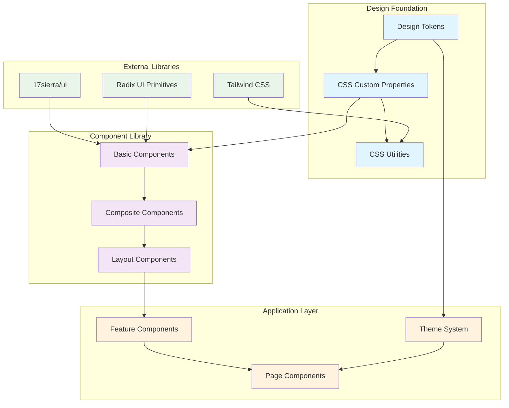

<!--
SPDX-License-Identifier: PolyForm-Perimeter-1.0.0
SPDX-FileCopyrightText: 2025 Seventeen Sierra LLC
-->

# Threshold Design System Design Document

## Overview

The Design System provides a comprehensive foundation for building consistent, accessible, and maintainable user interfaces across the Proposal Prepper application. Built on @17sierra/ui and modern CSS practices, it ensures visual consistency while leveraging the latest CSS features and design tokens for maintainability.

## Architecture

### Design System Architecture



## Components and Interfaces

### Design Tokens
- **Purpose**: Centralized design values for consistent theming
- **Implementation**: CSS custom properties with semantic naming
- **Categories**:
  - Colors (primary, secondary, neutral, semantic)
  - Typography (font families, sizes, weights, line heights)
  - Spacing (margins, padding, gaps)
  - Borders (radius, width, style)
  - Shadows and effects
  - Animation and transitions

### Basic Components
- **Foundation**: @17sierra/ui component library
- **Essential Components**:
  - Buttons (primary, secondary, ghost, destructive)
  - Form inputs (text, email, password, file)
  - Cards and containers
  - Navigation elements
  - Feedback components (alerts, toasts, progress)

### Composite Components
- **Purpose**: Complex components built from basic components
- **Examples**:
  - Upload interface with progress tracking
  - Analysis dashboard with status indicators
  - Results viewer with filtering and sorting
  - Navigation breadcrumbs with state management

### Layout Components
- **Purpose**: Structural components for page layout
- **Components**:
  - Grid systems using CSS Grid
  - Flexbox utilities
  - Container components
  - Responsive breakpoint management

## Design Token System

### Color Palette
```css
:root {
  /* Primary Colors */
  --color-primary-50: #eff6ff;
  --color-primary-100: #dbeafe;
  --color-primary-500: #3b82f6;
  --color-primary-600: #2563eb;
  --color-primary-900: #1e3a8a;
  
  /* Semantic Colors */
  --color-success: #10b981;
  --color-warning: #f59e0b;
  --color-error: #ef4444;
  --color-info: #06b6d4;
  
  /* Neutral Colors */
  --color-gray-50: #f9fafb;
  --color-gray-100: #f3f4f6;
  --color-gray-500: #6b7280;
  --color-gray-900: #111827;
}
```

### Typography Scale
```css
:root {
  /* Font Families */
  --font-sans: 'Inter', system-ui, sans-serif;
  --font-mono: 'JetBrains Mono', monospace;
  
  /* Font Sizes */
  --text-xs: 0.75rem;
  --text-sm: 0.875rem;
  --text-base: 1rem;
  --text-lg: 1.125rem;
  --text-xl: 1.25rem;
  --text-2xl: 1.5rem;
  --text-3xl: 1.875rem;
  
  /* Font Weights */
  --font-normal: 400;
  --font-medium: 500;
  --font-semibold: 600;
  --font-bold: 700;
  
  /* Line Heights */
  --leading-tight: 1.25;
  --leading-normal: 1.5;
  --leading-relaxed: 1.625;
}
```

### Spacing Scale
```css
:root {
  /* Spacing Scale */
  --space-1: 0.25rem;
  --space-2: 0.5rem;
  --space-3: 0.75rem;
  --space-4: 1rem;
  --space-6: 1.5rem;
  --space-8: 2rem;
  --space-12: 3rem;
  --space-16: 4rem;
  --space-24: 6rem;
  
  /* Component Spacing */
  --spacing-component-padding: var(--space-4);
  --spacing-section-gap: var(--space-8);
  --spacing-page-margin: var(--space-6);
}
```

## Component Specifications

### Button Component
```typescript
interface ButtonProps {
  variant: 'primary' | 'secondary' | 'ghost' | 'destructive';
  size: 'sm' | 'md' | 'lg';
  disabled?: boolean;
  loading?: boolean;
  icon?: React.ReactNode;
  children: React.ReactNode;
  onClick?: () => void;
}
```

```css
.button {
  /* Base styles using design tokens */
  font-family: var(--font-sans);
  font-weight: var(--font-medium);
  border-radius: var(--radius-md);
  transition: all 150ms ease-in-out;
  
  /* No hard-coded values - all from tokens */
  padding: var(--space-3) var(--space-6);
  font-size: var(--text-base);
}

.button--primary {
  background-color: var(--color-primary-600);
  color: var(--color-white);
  border: 1px solid var(--color-primary-600);
}

.button--primary:hover {
  background-color: var(--color-primary-700);
  border-color: var(--color-primary-700);
}
```

### Form Input Component
```typescript
interface InputProps {
  type: 'text' | 'email' | 'password' | 'file';
  label: string;
  placeholder?: string;
  error?: string;
  required?: boolean;
  disabled?: boolean;
  value?: string;
  onChange?: (value: string) => void;
}
```

### Upload Progress Component
```typescript
interface UploadProgressProps {
  progress: number;
  status: 'uploading' | 'processing' | 'complete' | 'error';
  filename: string;
  fileSize: number;
  currentStep?: string;
  onCancel?: () => void;
}
```

## Accessibility Standards

### WCAG 2.1 AA Compliance
- **Color Contrast**: Minimum 4.5:1 ratio for normal text, 3:1 for large text
- **Keyboard Navigation**: Full keyboard accessibility for all interactive elements
- **Screen Reader Support**: Proper ARIA labels and semantic HTML
- **Focus Management**: Visible focus indicators and logical tab order

### Accessibility Implementation
```css
/* Focus styles using design tokens */
.focusable:focus-visible {
  outline: 2px solid var(--color-primary-500);
  outline-offset: 2px;
  border-radius: var(--radius-sm);
}

/* High contrast mode support */
@media (prefers-contrast: high) {
  :root {
    --color-primary-500: #0066cc;
    --color-gray-500: #000000;
  }
}

/* Reduced motion support */
@media (prefers-reduced-motion: reduce) {
  * {
    animation-duration: 0.01ms !important;
    animation-iteration-count: 1 !important;
    transition-duration: 0.01ms !important;
  }
}
```

## Modern CSS Features

### CSS Grid and Flexbox
```css
/* Grid layouts using modern CSS */
.dashboard-grid {
  display: grid;
  grid-template-columns: repeat(auto-fit, minmax(300px, 1fr));
  gap: var(--space-6);
  container-type: inline-size;
}

/* Container queries for responsive components */
@container (min-width: 400px) {
  .card {
    padding: var(--space-6);
  }
}
```

### CSS Custom Properties with Fallbacks
```css
/* Robust custom property usage */
.component {
  background-color: var(--color-surface, #ffffff);
  color: var(--color-text, #000000);
  padding: var(--spacing-component, 1rem);
}
```

### CSS Logical Properties
```css
/* Modern logical properties for internationalization */
.content {
  margin-inline: var(--space-4);
  padding-block: var(--space-6);
  border-inline-start: 2px solid var(--color-primary-500);
}
```

## Theme System

### Theme Structure
```typescript
interface Theme {
  name: string;
  colors: ColorPalette;
  typography: TypographyScale;
  spacing: SpacingScale;
  components: ComponentOverrides;
}

interface ColorPalette {
  primary: ColorScale;
  secondary: ColorScale;
  neutral: ColorScale;
  semantic: SemanticColors;
}
```

### Theme Implementation
```css
/* Light theme (default) */
[data-theme="light"] {
  --color-background: #ffffff;
  --color-surface: #f9fafb;
  --color-text: #111827;
}

/* Dark theme */
[data-theme="dark"] {
  --color-background: #111827;
  --color-surface: #1f2937;
  --color-text: #f9fafb;
}
```

## Component Documentation

### Storybook Integration
- **Component Stories**: Interactive documentation for all components
- **Design Token Visualization**: Live preview of design tokens
- **Accessibility Testing**: Built-in accessibility validation
- **Usage Examples**: Code examples and best practices

### Documentation Structure
```typescript
// Component story example
export default {
  title: 'Components/Button',
  component: Button,
  parameters: {
    docs: {
      description: {
        component: 'Primary button component with design token integration'
      }
    }
  }
};

export const Primary = {
  args: {
    variant: 'primary',
    children: 'Upload Document'
  }
};
```

## Testing Strategy

### Visual Regression Testing
- **Chromatic Integration**: Automated visual testing for component changes
- **Cross-browser Testing**: Validation across different browsers
- **Responsive Testing**: Component behavior at different screen sizes

### Accessibility Testing
- **Automated Testing**: axe-core integration for accessibility validation
- **Manual Testing**: Keyboard navigation and screen reader testing
- **Color Contrast Validation**: Automated contrast ratio checking

### Design Token Testing
```typescript
// Test to ensure no hard-coded values
describe('Design Token Compliance', () => {
  it('should not contain hard-coded color values', () => {
    const cssFiles = glob.sync('**/*.css');
    cssFiles.forEach(file => {
      const content = fs.readFileSync(file, 'utf8');
      expect(content).not.toMatch(/#[0-9a-f]{3,6}/i);
      expect(content).not.toMatch(/rgb\(/);
      expect(content).not.toMatch(/rgba\(/);
    });
  });
});
```

## Performance Considerations

### CSS Optimization
- **Critical CSS**: Inline critical styles for faster rendering
- **CSS Modules**: Scoped styles to prevent conflicts
- **Tree Shaking**: Remove unused CSS in production builds
- **Compression**: Minification and gzip compression

### Bundle Size Management
- **Component Lazy Loading**: Load components on demand
- **Design Token Optimization**: Efficient token delivery
- **Icon Optimization**: SVG sprite sheets and icon fonts