<!--
SPDX-License-Identifier: PolyForm-Perimeter-1.0.0
SPDX-FileCopyrightText: 2025 Seventeen Sierra LLC
-->

# Threshold Design Document

## Overview

The Proposal Prepper application is a federal vendor proposal compliance analysis system that transforms document upload and AI-powered analysis into an intuitive, reliable workflow. The system enables contractors to upload proposal documents, perform comprehensive compliance analysis against FAR/DFARS requirements, and receive detailed compliance reports with actionable recommendations.

### Core System Philosophy

The design follows a **component-first architecture** where every feature is built from clearly defined, reusable basic components that combine into feature-specific components, which then compose into complete user workflows. This approach ensures:

- **Predictable Component Flow**: Each component has clear inputs, outputs, and responsibilities
- **Transparent Component Hierarchy**: Basic components → Feature components → Page components → User workflows
- **Traceable Component Dependencies**: Every component relationship is explicitly documented and diagrammed

### Two-Service Architecture

The application uses a simplified two-service architecture designed for clarity and maintainability:

- **Web Service** (Next.js - Port 3000): Frontend application, API routes, and user interface management
- **Strands Service** (Python - Port 8080): Document processing, AI orchestration, and compliance validation

This architecture ensures clear separation of concerns while maintaining simple, reliable communication patterns between services.

## Architecture

### System Architecture Overview

The Proposal Prepper application follows a **layered component architecture** where each layer has specific responsibilities and clear interfaces. The architecture flows from basic building blocks up to complete user experiences:

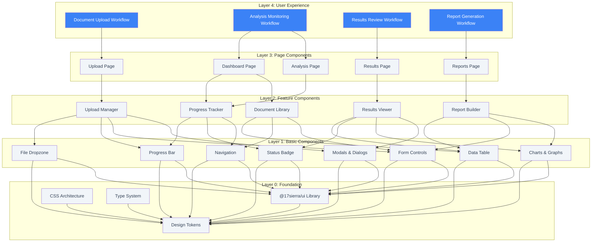

### Component Architecture Principles

This layered architecture ensures:

1. **Clear Component Hierarchy**: Each layer builds on the layer below it
2. **Predictable Data Flow**: Data and events flow up and down through defined interfaces
3. **Reusable Building Blocks**: Basic components can be used across multiple features
4. **Maintainable Complexity**: Complex features are broken down into manageable pieces
5. **Testable Components**: Each layer can be tested independently

### Service Architecture and Component Integration

The two-service architecture integrates seamlessly with the component layers, providing clear separation between frontend components and backend processing:

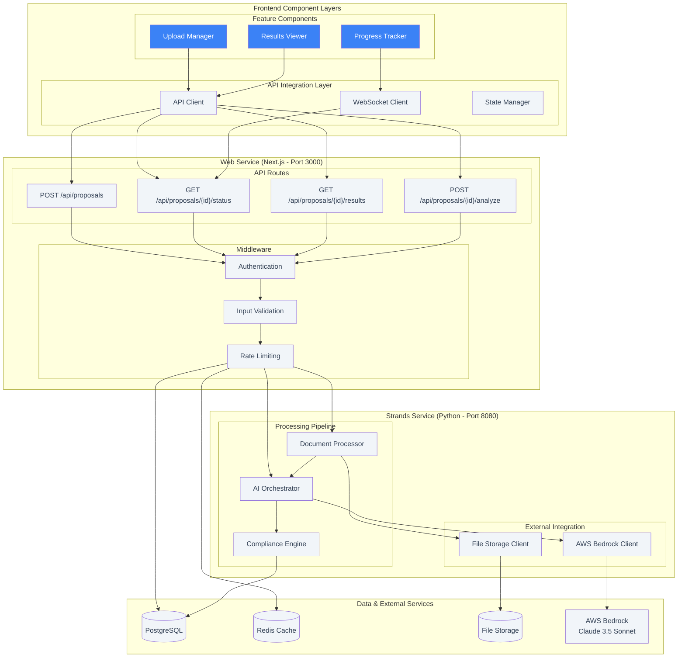

### Service Communication Patterns

**Component-to-Service Flow**:
1. **Upload Manager** → API Client → Upload API → Document Processor
2. **Progress Tracker** → WebSocket Client → Status API → AI Orchestrator  
3. **Results Viewer** → API Client → Results API → Compliance Engine

**Data Flow Characteristics**:
- **Synchronous**: File uploads, metadata operations, result retrieval
- **Asynchronous**: Document processing, AI analysis, progress updates
- **Real-time**: Progress tracking via WebSocket connections
- **Cached**: Frequently accessed data via Redis
- **Persistent**: Analysis results and user data via PostgreSQL

## Components and Interfaces

This section details how basic components combine into feature components, and how feature components integrate to create complete user workflows. Each component is designed with clear inputs, outputs, and responsibilities.

### Layer 0: Foundation Components

#### Design Token System

**Color System**: Primary blue scale (#3b82f6), secondary gray scale, success green, warning yellow, error red, neutral grays

**Typography System**: Inter font family, responsive font sizes (12px-48px), font weights (400-700), line heights (1.2-1.8)

**Spacing System**: 4px base unit with consistent scaling (4px-96px)

**Border Radius**: 2px-24px scale for consistent corner rounding

**Shadow System**: 4 elevation levels for depth and hierarchy

#### @17sierra/ui Library Integration
- **Base Components**: Button, Input, Select, Checkbox, Radio, Switch
- **Layout Components**: Container, Grid, Flex, Stack, Spacer
- **Feedback Components**: Alert, Toast, Progress, Spinner, Badge
- **Overlay Components**: Modal, Popover, Tooltip, Dropdown
- **Navigation Components**: Tabs, Breadcrumb, Pagination, Menu

### Layer 1: Basic Components

#### File Dropzone Component
**Purpose**: Handle file drag-and-drop with visual feedback and validation

**Composition**:
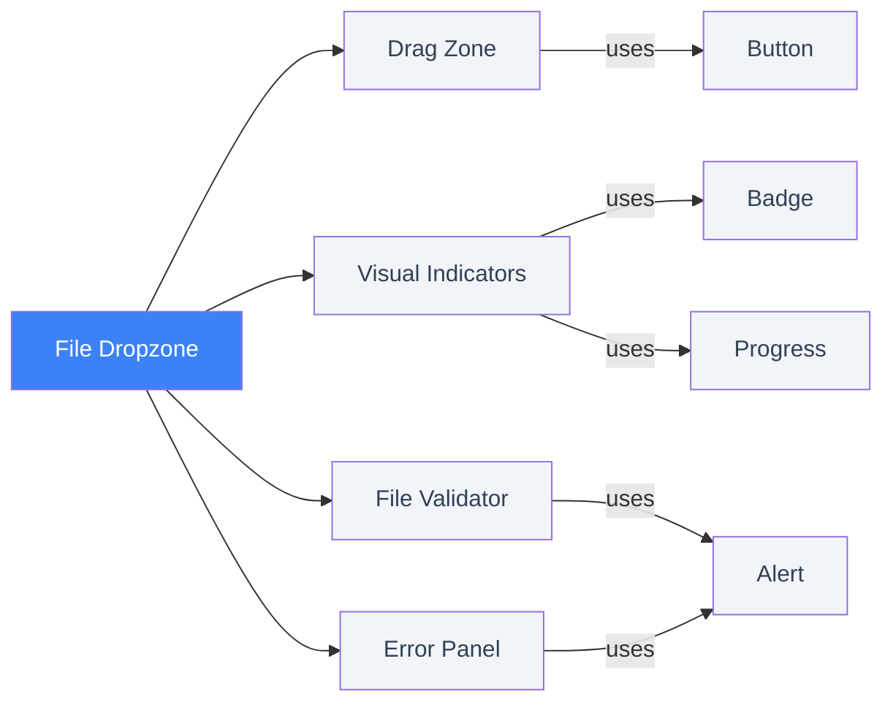

**Key Properties**:
- **Accepted Types**: Array of supported file formats (PDF, DOC, DOCX, RTF)
- **File Limits**: Maximum file size (50MB) and count restrictions
- **Validation**: Real-time file validation with error reporting
- **Visual States**: Drag active, validation errors, file previews

#### Progress Bar Component  
**Purpose**: Display progress with real-time updates and status indicators

**Composition**:
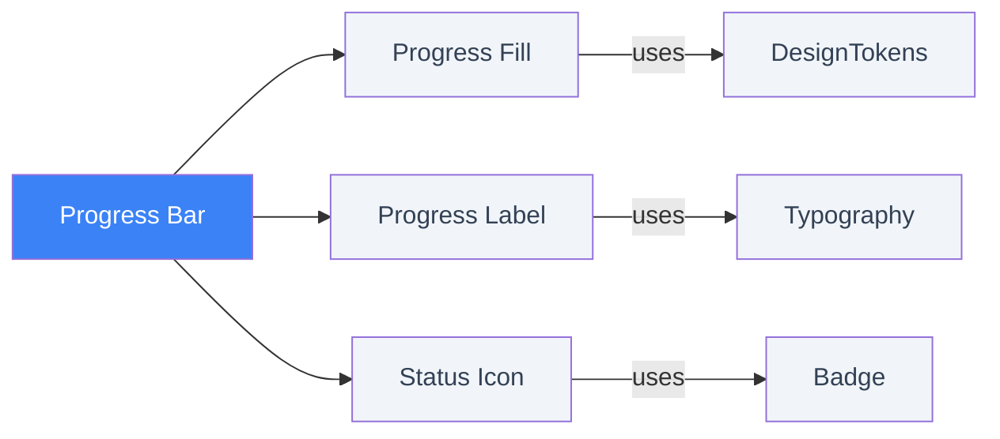

**Key Properties**:
- **Progress Value**: 0-100 numeric progress with optional maximum
- **Status States**: Idle, active, complete, error with visual indicators
- **Display Options**: Percentage display, custom labels, animations
- **Accessibility**: ARIA labels and progress announcements

#### Status Badge Component
**Purpose**: Display status with consistent visual treatment

**Composition**:
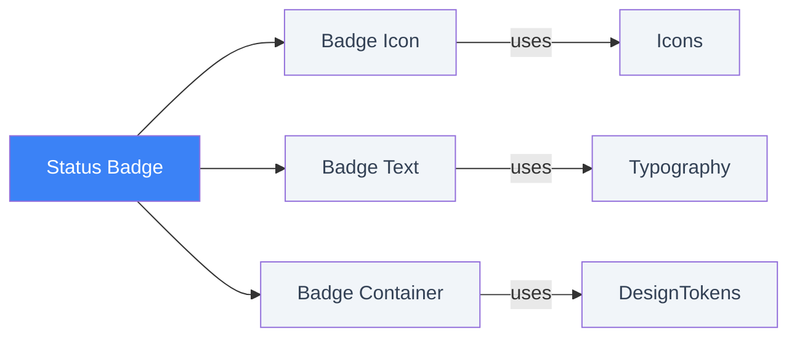

**Key Properties**:
- **Status Types**: Pass, fail, warning, pending, error with semantic colors
- **Size Variants**: Small, medium, large for different contexts
- **Visual Options**: Icons, solid/outline/subtle variants
- **Consistent Styling**: Uses design tokens for colors and spacing

#### Data Table Component
**Purpose**: Display structured data with sorting, filtering, and selection

**Composition**:
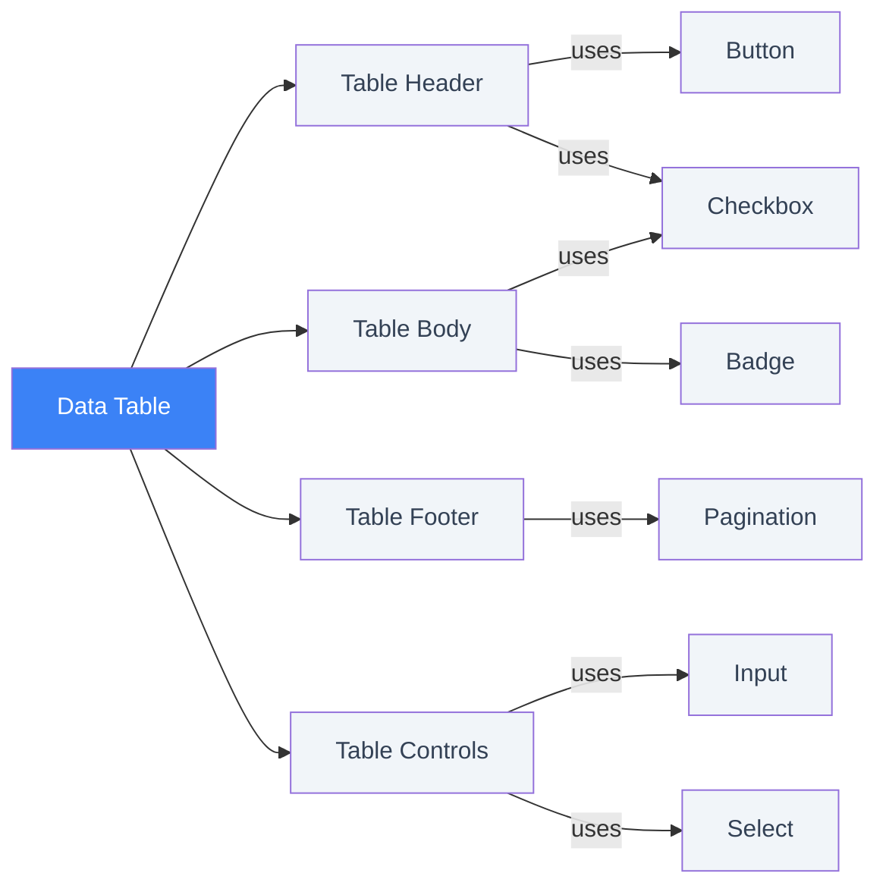

**Key Properties**:
- **Data Management**: Generic data array with column definitions
- **Interactive Features**: Sorting, filtering, row selection
- **Pagination**: Configurable pagination with page size options
- **Event Handling**: Sort, filter, and selection callbacks
- **Accessibility**: Keyboard navigation and screen reader support

### Layer 2: Feature Components

#### Upload Manager Component
**Purpose**: Orchestrate the complete file upload workflow

**Basic Component Composition**:
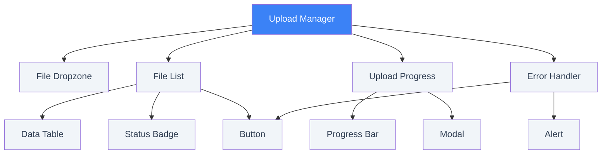

**Component Responsibilities**:
- **File Dropzone**: Handle file selection and drag-and-drop
- **File List**: Display selected files with metadata editing
- **Upload Progress**: Show real-time upload and processing progress  
- **Error Handler**: Manage validation errors and recovery options

**Key Properties**:
- **Upload Configuration**: File format restrictions, size limits, concurrency settings
- **State Management**: Selected files, active uploads, error tracking
- **Progress Tracking**: Individual and overall upload progress
- **Event Callbacks**: Upload completion, error handling, status updates

#### Progress Tracker Component
**Purpose**: Monitor and display real-time analysis progress

**Basic Component Composition**:
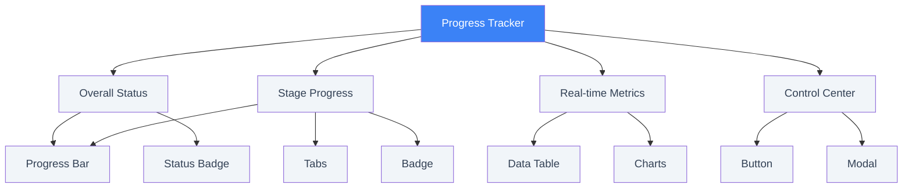

**Component Responsibilities**:
- **Overall Status**: Display high-level progress and completion estimates
- **Stage Progress**: Show detailed progress through analysis stages
- **Real-time Metrics**: Display processing metrics and performance data
- **Control Center**: Provide pause, resume, and cancel controls

**Key Properties**:
- **Analysis Control**: Analysis ID, cancel/pause/resume operations
- **Real-time Updates**: Configurable refresh intervals, WebSocket integration
- **Progress Data**: Status, completion percentage, stage information
- **Metrics Display**: Processing speed, resource usage, time estimates

#### Results Viewer Component
**Purpose**: Display comprehensive analysis results with interactive exploration

**Basic Component Composition**:
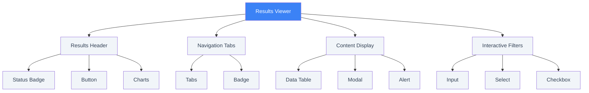

**Component Responsibilities**:
- **Results Header**: Display overall compliance status and key metrics
- **Navigation Tabs**: Organize findings, recommendations, and document structure
- **Content Display**: Show detailed findings with document references
- **Interactive Filters**: Enable filtering and sorting of results

**Key Properties**:
- **Results Data**: Analysis ID, findings, recommendations, document structure
- **Export Options**: Multiple format support (PDF, Word, Excel)
- **Interactive Features**: Tab navigation, filtering, sorting, selection
- **User Actions**: Finding selection, export generation, detail viewing

### Layer 3: Page Components

#### Upload Page Component
**Purpose**: Complete document upload experience

**Feature Component Composition**:
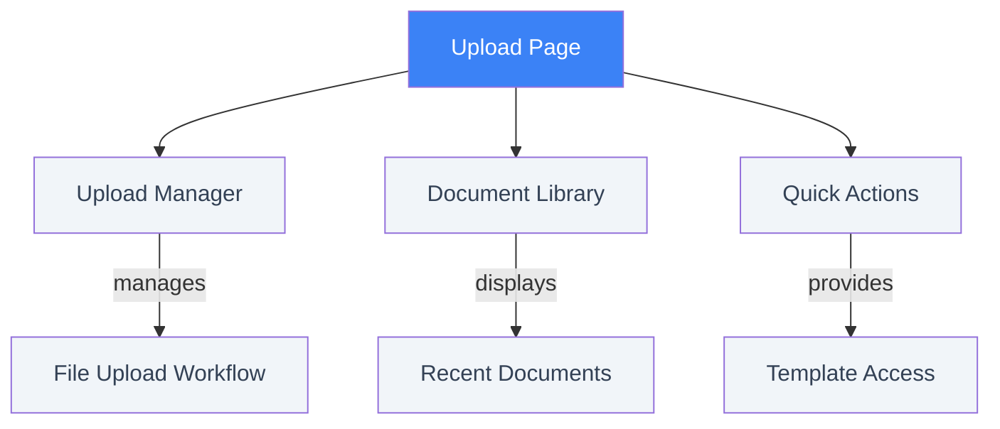

#### Analysis Page Component  
**Purpose**: Real-time analysis monitoring experience

**Feature Component Composition**:
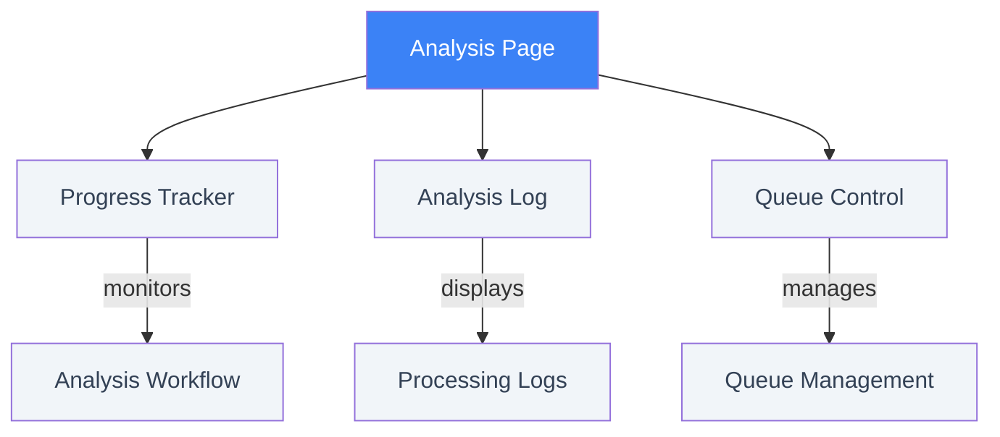

#### Results Page Component
**Purpose**: Comprehensive results exploration experience

**Feature Component Composition**:
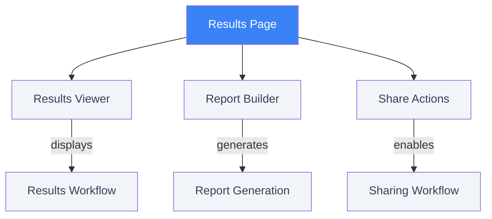

### Layer 4: User Experience Workflows

#### Document Upload Workflow
**Page Component Integration**:

**Component Data Flow**:
1. **Upload Page** → Upload Manager handles file selection and validation
2. **Upload Manager** → Progress Tracker monitors upload and initial processing  
3. **Progress Tracker** → Results Viewer displays completed analysis
4. **Results Viewer** → Report Builder generates final deliverables

### Service Integration Points

#### Web Service Components (Next.js - Port 3000)

**API Routes Supporting Component Layer**:
- `POST /api/proposals` → Upload Manager file processing
- `GET /api/proposals/{id}/status` → Progress Tracker real-time updates
- `GET /api/proposals/{id}/results` → Results Viewer data loading
- `POST /api/proposals/{id}/analyze` → Analysis initiation from any component

**Middleware Stack**:
- **Authentication Middleware** → Validates user sessions for all components
- **Input Validation** → Zod schema validation for component data
- **Rate Limiting** → Protects against component abuse
- **Error Handling** → Consistent error responses to components

#### Strands Service Components (Python - Port 8080)

**Processing Pipeline Supporting Frontend Components**:
- **Document Processor** → Handles Upload Manager file processing
- **AI Orchestrator** → Provides Progress Tracker status updates  
- **Compliance Engine** → Generates Results Viewer findings data

**External Integration**:
- **AWS Bedrock Client** → Claude 3.5 Sonnet integration for AI processing
- **File Storage Client** → Secure document storage and retrieval
- **Database Client** → PostgreSQL integration for persistent data

## Frontend Architecture and User Experience

### Core User Journey
The Proposal Prepper frontend provides a streamlined workflow for federal contractors:

1. **Upload**: Drag-and-drop document upload with real-time validation and progress tracking
2. **Analysis**: AI-powered compliance analysis with live progress monitoring
3. **Results**: Comprehensive findings display with actionable recommendations
4. **Export**: Professional reports and compliance documentation

### User Flow Diagram
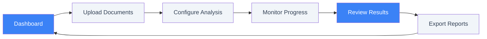

### Key Frontend Features

#### Document Upload System
- Multi-format support (PDF, DOC, DOCX, RTF) with drag-and-drop interface
- Real-time file validation and duplicate detection
- Batch upload with individual progress tracking
- Metadata editing and tagging capabilities

#### Analysis Monitoring
- Live progress tracking through analysis stages
- Queue management with estimated completion times
- Pause/resume/cancel controls with state preservation
- Real-time metrics and performance monitoring

#### Results Dashboard
- Compliance score visualization with pass/fail/warning indicators
- Filterable findings list with severity categorization
- Interactive document viewer with highlighted issues
- Bulk actions for findings management and resolution tracking

#### User Interface
- Responsive design optimized for desktop browsers
- @17sierra/ui component library with CSS tokens (no hard-coded values)
- Theme switching (light/dark mode) with user preferences
- Contextual navigation with breadcrumbs and progress indicators

## Data Models

### Core Entity Models

#### User Management
- **User**: ID, email, name, organization, password hash, email verification, timestamps, status, preferences
- **User Preferences**: Theme settings, notification preferences, default analysis settings

#### Document Management
- **Proposal**: ID, user ID, filename, file size, MIME type, file path, file hash, status, upload timestamp, metadata
- **Proposal Metadata**: Title, description, tags, document type, page count, extracted text, sections
- **Document Section**: ID, title, content, page range, section type, confidence score

#### Analysis Management
- **Analysis**: ID, proposal ID, analysis types, status, priority, progress, timestamps, configuration
- **Analysis Result**: ID, analysis ID, overall status, summary, findings, recommendations, document structure, metrics
- **Compliance Finding**: ID, result ID, rule ID, status, severity, description, document section, regulation reference
- **Recommendation**: ID, type, title, description, priority, estimated effort, related findings

#### Processing Metrics
- **Processing Metrics**: Total time, extraction time, analysis time, validation time, tokens used, API calls, error/retry counts

### Database Constraints and Relationships

#### Data Integrity
- **Unique Constraints**: User emails, proposal file hashes
- **Size Limits**: File size ≤ 50MB, email format validation
- **Progress Validation**: Analysis progress 0-100%
- **Foreign Key Relationships**: Proposals → Users, Analyses → Proposals, Findings → Results

#### Performance Indexes
- **User Operations**: (user_id, status) for proposal queries
- **Analysis Tracking**: (proposal_id, status) for active analyses
- **Results Filtering**: (analysis_result_id, severity) for findings
- **Active Monitoring**: Partial index on active analyses (queued, running)

## API Architecture

### RESTful API Design

The API layer provides secure, reliable endpoints with comprehensive error handling and authentication:

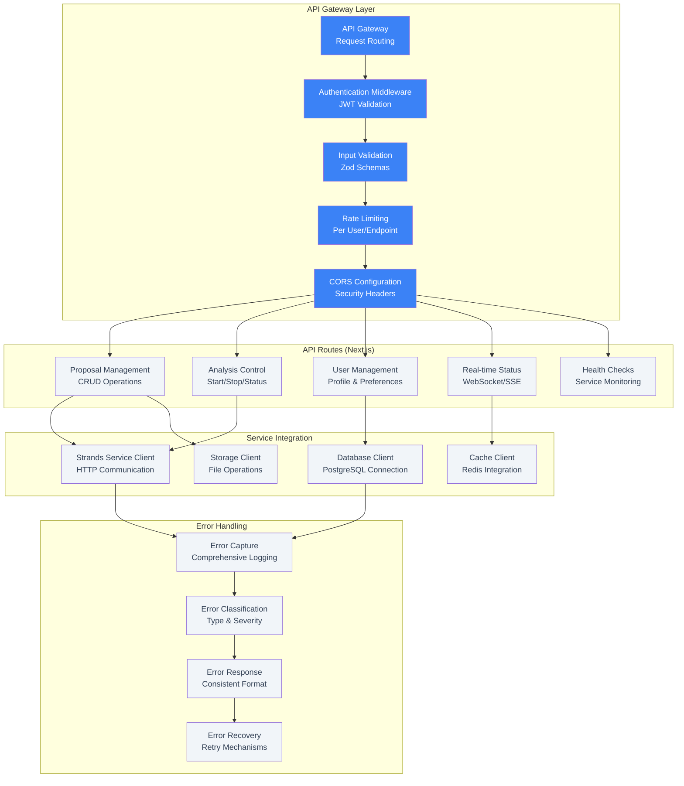

### API Endpoint Specifications

#### Proposal Management Endpoints
- **POST /api/proposals**: Document upload with file validation and metadata handling
- **GET /api/proposals/{id}**: Proposal retrieval with user authorization checks
- **GET /api/proposals**: List proposals with pagination, filtering, and sorting
- **DELETE /api/proposals/{id}**: Secure proposal deletion with cleanup

#### Analysis Control Endpoints
- **POST /api/proposals/{id}/analyze**: Analysis initiation with configuration options
- **GET /api/proposals/{id}/status**: Real-time analysis progress via WebSocket/SSE
- **GET /api/proposals/{id}/results**: Comprehensive compliance results with findings
- **POST /api/proposals/{id}/cancel**: Analysis cancellation with cleanup

#### User Management Endpoints
- **GET /api/user/profile**: User profile management with preferences
- **PUT /api/user/profile**: Profile updates with validation
- **GET /api/user/proposals**: User's proposal history with analytics
- **POST /api/auth/login**: Authentication with JWT token generation

### API Security and Validation

#### Authentication and Authorization
- **JWT Authentication**: Secure token-based authentication with RS256 signing
- **Session Management**: Secure session handling with HttpOnly, Secure, SameSite flags
- **Role-Based Access**: User permissions with resource-level authorization
- **Rate Limiting**: Configurable limits (10 uploads/15min, 50 analysis requests/hour)

#### Input Validation and Error Handling
- **Zod Schema Validation**: Comprehensive validation for all API inputs
- **File Validation**: Format, size, and content validation for uploads
- **Error Response Format**: Consistent error structure with recovery guidance
- **Request Sanitization**: Protection against XSS, injection, and malicious inputs

## Correctness Properties

*A property is a characteristic or behavior that should hold true across all valid executions of a system-essentially, a formal statement about what the system should do. Properties serve as the bridge between human-readable specifications and machine-verifiable correctness guarantees.*

### Core Correctness Properties

**Property 1: Document Upload Validation**
*For any* valid document file (PDF, DOC, DOCX, RTF), the upload system should accept the file, validate its format and size, display progress during processing, and confirm successful completion
**Validates: Requirements 1.1, 1.2, 1.3, 1.4, 1.5**

**Property 2: Text Extraction Accuracy**
*For any* PDF document with known text content, the AI analysis engine should extract text with at least 99% accuracy when compared to the expected content
**Validates: Requirements 2.1**

**Property 3: Document Structure Analysis**
*For any* proposal document, the AI analysis engine should identify and classify document sections (executive summary, technical approach, management plan) with appropriate confidence scores
**Validates: Requirements 2.2**

**Property 4: Compliance Rule Mapping**
*For any* compliance finding generated by the system, the finding should reference both a specific FAR/DFARS regulation and the exact document section where the issue was identified
**Validates: Requirements 2.4, 3.2, 3.4, 3.5**

**Property 5: Analysis Result Completeness**
*For any* completed analysis, the results should include a clear pass/fail/warning status, detailed explanations for each finding, and specific regulation citations
**Validates: Requirements 2.5, 3.1**

**Property 6: Error Handling Consistency**
*For any* error condition in the system, the user interface should display helpful error messages with recovery options, and the API should return consistent error responses with appropriate HTTP status codes
**Validates: Requirements 4.2, 9.4**

**Property 7: Performance Thresholds**
*For any* system operation (page loads, file processing, analysis), the operation should complete within defined performance thresholds and provide real-time progress feedback
**Validates: Requirements 5.1, 5.2, 5.4, 5.5**

**Property 8: Data Security Round Trip**
*For any* sensitive data (documents, user information), the data should be encrypted during storage and transmission, and should be retrievable in its original form while maintaining security
**Validates: Requirements 7.1, 7.3, 11.1, 12.2**

**Property 9: Design Token Consistency**
*For any* UI component in the system, all styling values should be derived from design tokens with no hard-coded values present in the component code
**Validates: Requirements 8.2**

**Property 10: API Authentication Security**
*For any* API endpoint that handles sensitive operations, the endpoint should require proper authentication, validate all inputs, and use secure communication protocols
**Validates: Requirements 9.1, 9.5, 11.2, 12.1**

## Error Handling

### Error Categories and Recovery Strategies

#### User Input Errors
- **File Format Errors**: Clear messaging for unsupported formats with format conversion suggestions
- **File Size Errors**: Size limit notifications with compression recommendations
- **Validation Errors**: Real-time field validation with specific correction guidance

#### System Errors
- **AI Service Errors**: Graceful degradation with retry mechanisms and fallback options
- **Storage Errors**: Automatic retry with exponential backoff and user notification
- **Network Errors**: Connection monitoring with offline mode and sync capabilities

#### Security Errors
- **Authentication Errors**: Clear login prompts with account recovery options
- **Authorization Errors**: Appropriate access denied messages with escalation paths
- **Input Validation Errors**: Sanitization with user-friendly error explanations

### Error Recovery Mechanisms
- **Exponential Backoff**: For transient failures (network, rate limiting)
- **Circuit Breaker**: For service failures to prevent cascade failures
- **Graceful Degradation**: Fallback to basic functionality when AI services are unavailable
- **User Guidance**: Clear recovery instructions with alternative workflows

## Testing Strategy

### Dual Testing Approach

The testing strategy employs both unit testing and property-based testing to ensure comprehensive coverage:

- **Unit tests** verify specific examples, edge cases, and error conditions
- **Property tests** verify universal properties that should hold across all inputs
- Together they provide comprehensive coverage: unit tests catch concrete bugs, property tests verify general correctness

### Unit Testing
**Framework**: Vitest with React Testing Library
**Coverage Target**: 80% code coverage for critical paths
**Focus Areas**: Component rendering, user interactions, API integration, error conditions

### Property-Based Testing
**Framework**: fast-check (JavaScript property-based testing library)
**Configuration**: Minimum 100 iterations per property test
**Implementation**: Each correctness property implemented as executable test with design document reference

### Integration Testing
- **API Integration**: Service-to-service communication validation
- **Database Integration**: Data persistence and retrieval testing
- **External Service Integration**: AWS Bedrock integration with mocked responses

### End-to-End Testing
**Framework**: Playwright
**Scope**: Critical user journeys from upload to results
**Environment**: Automated testing against staging environment

## Security Architecture

### Comprehensive Security Framework

#### Data Protection and Encryption
- **Encryption at Rest**: AES-256-GCM encryption for all stored documents and sensitive data
- **Encryption in Transit**: TLS 1.3 for all communications with perfect forward secrecy
- **Key Management**: Secure key derivation using PBKDF2 with 100,000 iterations
- **Data Classification**: Proposals and analysis results classified as confidential

#### Authentication and Authorization
- **JWT Authentication**: Secure token-based authentication with RS256 signing
- **Session Management**: Secure session handling with HttpOnly, Secure, SameSite flags
- **Password Security**: Bcrypt hashing with minimum 12-character complexity
- **Role-Based Access Control**: User, admin, auditor roles with granular permissions

#### API Security Controls
- **Input Validation**: Comprehensive validation using Zod schemas for all API inputs
- **Rate Limiting**: Configurable rate limits (10 uploads/15min, 50 analysis requests/hour)
- **CORS Configuration**: Strict CORS policies with allowed origins and methods
- **Security Headers**: HSTS, CSP, X-Frame-Options, and other security headers

#### OpenSSF Baseline Level 1 Compliance
- **Dependency Scanning**: Automated vulnerability scanning with critical vulnerability blocking
- **Static Analysis Security Testing (SAST)**: ESLint security plugins, Semgrep integration
- **Secret Management**: Pre-commit hooks preventing secrets in version control
- **Software Bill of Materials (SBOM)**: Automated SBOM generation in SPDX/CycloneDX formats

## Performance Architecture

### Performance Requirements and Targets

#### Response Time Targets
- **Page Load**: < 3 seconds for initial page load on standard connections
- **File Upload**: Progress feedback within 100ms of upload initiation
- **Analysis Completion**: < 5 minutes for typical 50-page proposal documents
- **Results Display**: < 2 seconds for complete results page rendering
- **API Response**: < 200ms for metadata requests, < 500ms for detailed data

#### Scalability and Optimization
- **Concurrent Users**: Support 50 concurrent users with horizontal scaling capability
- **File Processing**: Handle 10 simultaneous document analyses with queue management
- **Caching Strategy**: Redis caching for sessions (30min TTL), API responses (5min TTL)
- **Database Optimization**: Query optimization with proper indexing and connection pooling

## Infrastructure and Deployment

### Containerized Infrastructure Design

#### Development Environment
- **Docker Compose Orchestration**: Complete two-service stack (Web + Strands)
- **Service Dependencies**: Automated startup sequencing with health check dependencies
- **Database Services**: PostgreSQL with automated initialization and seed data
- **Cache Services**: Redis for session management and API response caching

#### Service Orchestration and Management
- **Health Monitoring**: Comprehensive health checks for all services with automatic restart policies
- **Dependency Management**: Proper service startup sequencing and graceful shutdown
- **Resource Management**: Memory and CPU limits with monitoring and alerting
- **Backup and Recovery**: Automated backup procedures with point-in-time recovery