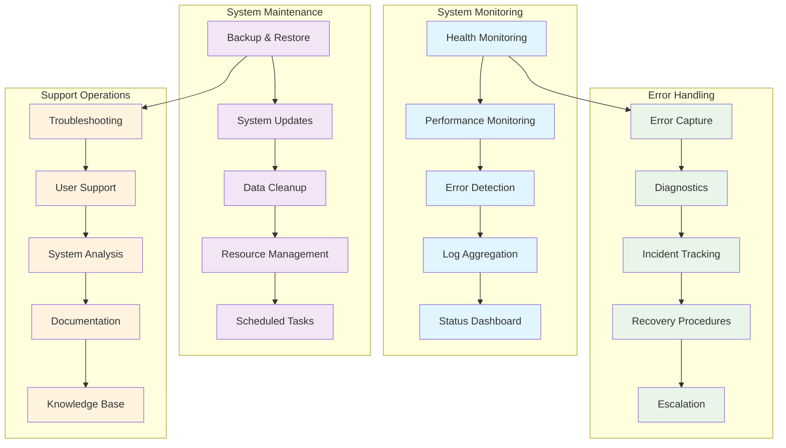

<!--
SPDX-License-Identifier: PolyForm-Perimeter-1.0.0
SPDX-FileCopyrightText: 2025 Seventeen Sierra LLC
-->

# Threshold Operations Design Document

## Overview

The Operations component provides essential system monitoring, maintenance, and support capabilities for the Proposal Prepper application. The design focuses on proactive monitoring, automated maintenance procedures, and effective error handling to ensure reliable system operation and quick issue resolution.

## Architecture

### Operations Architecture


## System Monitoring

### Health Monitoring System
```typescript
interface HealthMonitoringSystem {
  performHealthChecks(): Promise<HealthCheckResults>;
  monitorServiceHealth(): Promise<ServiceHealthStatus[]>;
  trackSystemMetrics(): Promise<SystemMetrics>;
  generateHealthReports(): Promise<HealthReport>;
}

interface HealthCheckResults {
  timestamp: Date;
  overallStatus: 'healthy' | 'degraded' | 'unhealthy';
  services: ServiceHealthCheck[];
  infrastructure: InfrastructureHealthCheck[];
  dependencies: DependencyHealthCheck[];
  summary: HealthSummary;
}

interface ServiceHealthCheck {
  serviceName: string;
  status: 'healthy' | 'unhealthy' | 'starting' | 'unknown';
  responseTime: number;
  uptime: number;
  lastCheck: Date;
  checks: IndividualCheck[];
  metrics: ServiceMetrics;
}

interface IndividualCheck {
  name: string;
  status: 'pass' | 'fail' | 'warn';
  message: string;
  duration: number;
  details?: Record<string, any>;
}

interface SystemMetrics {
  timestamp: Date;
  cpu: CPUMetrics;
  memory: MemoryMetrics;
  disk: DiskMetrics;
  network: NetworkMetrics;
  processes: ProcessMetrics[];
}

interface CPUMetrics {
  usage: number;
  cores: number;
  loadAverage: number[];
  temperature?: number;
  frequency?: number;
}

interface MemoryMetrics {
  used: number;
  available: number;
  total: number;
  percentage: number;
  swap: SwapMetrics;
  buffers: number;
  cached: number;
}

interface DiskMetrics {
  used: number;
  available: number;
  total: number;
  percentage: number;
  iops: IOPSMetrics;
  throughput: ThroughputMetrics;
}

interface NetworkMetrics {
  bytesIn: number;
  bytesOut: number;
  packetsIn: number;
  packetsOut: number;
  connections: ConnectionMetrics;
  latency: LatencyMetrics;
}
```

### Performance Monitoring
```typescript
interface PerformanceMonitor {
  trackApplicationPerformance(): Promise<ApplicationPerformance>;
  monitorDatabasePerformance(): Promise<DatabasePerformance>;
  analyzeResponseTimes(): Promise<ResponseTimeAnalysis>;
  generatePerformanceReport(): Promise<PerformanceReport>;
}

interface ApplicationPerformance {
  timestamp: Date;
  requests: RequestMetrics;
  responses: ResponseMetrics;
  errors: ErrorMetrics;
  throughput: ThroughputMetrics;
  resources: ResourceUtilization;
}

interface RequestMetrics {
  total: number;
  rate: number;
  concurrent: number;
  queued: number;
  byEndpoint: EndpointMetrics[];
}

interface ResponseMetrics {
  averageTime: number;
  medianTime: number;
  p95Time: number;
  p99Time: number;
  slowestRequests: SlowRequest[];
}

interface DatabasePerformance {
  connections: ConnectionPoolMetrics;
  queries: QueryPerformanceMetrics;
  transactions: TransactionMetrics;
  locks: LockMetrics;
  storage: StorageMetrics;
}

interface QueryPerformanceMetrics {
  totalQueries: number;
  averageExecutionTime: number;
  slowQueries: SlowQuery[];
  queryTypes: QueryTypeMetrics[];
  indexUsage: IndexUsageMetrics;
}

interface SlowQuery {
  query: string;
  executionTime: number;
  timestamp: Date;
  parameters?: any[];
  explain?: QueryExplain;
}
```

### Error Detection and Alerting
```typescript
interface ErrorDetectionSystem {
  detectErrors(): Promise<ErrorDetectionResult>;
  classifyErrors(): Promise<ErrorClassification[]>;
  generateAlerts(): Promise<AlertGeneration>;
  trackErrorTrends(): Promise<ErrorTrendAnalysis>;
}

interface ErrorDetectionResult {
  timestamp: Date;
  errors: DetectedError[];
  patterns: ErrorPattern[];
  anomalies: ErrorAnomaly[];
  summary: ErrorSummary;
}

interface DetectedError {
  id: string;
  timestamp: Date;
  level: 'debug' | 'info' | 'warn' | 'error' | 'fatal';
  message: string;
  source: string;
  stackTrace?: string;
  context: ErrorContext;
  classification: ErrorClassification;
}

interface ErrorContext {
  userId?: string;
  sessionId?: string;
  requestId?: string;
  endpoint?: string;
  userAgent?: string;
  ipAddress?: string;
  environment: Record<string, any>;
}

interface ErrorClassification {
  category: 'application' | 'system' | 'network' | 'database' | 'external';
  severity: 'low' | 'medium' | 'high' | 'critical';
  type: string;
  recurring: boolean;
  impact: ImpactAssessment;
}

interface ImpactAssessment {
  usersAffected: number;
  servicesAffected: string[];
  businessImpact: 'low' | 'medium' | 'high' | 'critical';
  estimatedDowntime?: number;
}

interface AlertGeneration {
  alerts: GeneratedAlert[];
  suppressedAlerts: SuppressedAlert[];
  escalations: EscalationAction[];
}

interface GeneratedAlert {
  id: string;
  timestamp: Date;
  severity: 'info' | 'warning' | 'critical';
  title: string;
  description: string;
  source: string;
  channels: AlertChannel[];
  acknowledgment?: AlertAcknowledgment;
}

interface AlertChannel {
  type: 'email' | 'slack' | 'webhook' | 'sms' | 'dashboard';
  target: string;
  sent: boolean;
  sentAt?: Date;
  error?: string;
}
```

## System Maintenance

### Backup and Restore System
```typescript
interface BackupRestoreSystem {
  performBackup(): Promise<BackupResult>;
  scheduleBackups(): Promise<BackupSchedule>;
  restoreFromBackup(backupId: string): Promise<RestoreResult>;
  validateBackups(): Promise<BackupValidation>;
}

interface BackupResult {
  backupId: string;
  timestamp: Date;
  type: 'full' | 'incremental' | 'differential';
  components: BackupComponent[];
  size: number;
  duration: number;
  compression: CompressionInfo;
  encryption: EncryptionInfo;
  verification: BackupVerification;
}

interface BackupComponent {
  name: string;
  type: 'database' | 'files' | 'configuration' | 'logs';
  path: string;
  size: number;
  checksum: string;
  compressed: boolean;
  encrypted: boolean;
}

interface RestoreResult {
  restoreId: string;
  backupId: string;
  timestamp: Date;
  components: RestoredComponent[];
  duration: number;
  success: boolean;
  errors: RestoreError[];
  verification: RestoreVerification;
}

interface BackupSchedule {
  schedules: ScheduledBackup[];
  retention: RetentionPolicy;
  storage: StorageConfiguration;
}

interface ScheduledBackup {
  name: string;
  type: 'full' | 'incremental' | 'differential';
  schedule: string; // cron expression
  components: string[];
  retention: number; // days
  enabled: boolean;
}

interface RetentionPolicy {
  daily: number;
  weekly: number;
  monthly: number;
  yearly: number;
  autoCleanup: boolean;
}
```

### System Updates and Maintenance
```typescript
interface SystemMaintenanceManager {
  planMaintenance(): Promise<MaintenancePlan>;
  executeUpdates(): Promise<UpdateResult>;
  performDataCleanup(): Promise<CleanupResult>;
  manageResources(): Promise<ResourceManagement>;
}

interface MaintenancePlan {
  id: string;
  scheduledDate: Date;
  duration: number;
  type: 'routine' | 'security' | 'emergency' | 'upgrade';
  tasks: MaintenanceTask[];
  impact: MaintenanceImpact;
  rollbackPlan: RollbackPlan;
}

interface MaintenanceTask {
  id: string;
  name: string;
  description: string;
  type: 'update' | 'patch' | 'cleanup' | 'optimization' | 'backup';
  estimatedDuration: number;
  dependencies: string[];
  riskLevel: 'low' | 'medium' | 'high';
  rollbackProcedure?: string;
}

interface UpdateResult {
  updateId: string;
  timestamp: Date;
  updates: AppliedUpdate[];
  success: boolean;
  duration: number;
  errors: UpdateError[];
  rollbackRequired: boolean;
}

interface AppliedUpdate {
  component: string;
  fromVersion: string;
  toVersion: string;
  type: 'security' | 'feature' | 'bugfix' | 'dependency';
  success: boolean;
  duration: number;
  changes: ChangeDescription[];
}

interface CleanupResult {
  cleanupId: string;
  timestamp: Date;
  tasks: CleanupTask[];
  spaceReclaimed: number;
  duration: number;
  errors: CleanupError[];
}

interface CleanupTask {
  name: string;
  type: 'logs' | 'temp_files' | 'old_backups' | 'cache' | 'database';
  itemsProcessed: number;
  spaceReclaimed: number;
  success: boolean;
}
```

## Error Handling and Recovery

### Incident Management System
```typescript
interface IncidentManagementSystem {
  createIncident(error: DetectedError): Promise<Incident>;
  trackIncident(incidentId: string): Promise<IncidentStatus>;
  resolveIncident(incidentId: string, resolution: Resolution): Promise<IncidentResolution>;
  generateIncidentReport(): Promise<IncidentReport>;
}

interface Incident {
  id: string;
  title: string;
  description: string;
  severity: 'low' | 'medium' | 'high' | 'critical';
  status: 'open' | 'investigating' | 'resolved' | 'closed';
  createdAt: Date;
  updatedAt: Date;
  assignee?: string;
  tags: string[];
  timeline: IncidentEvent[];
  impact: IncidentImpact;
  resolution?: Resolution;
}

interface IncidentEvent {
  timestamp: Date;
  type: 'created' | 'updated' | 'escalated' | 'resolved' | 'closed';
  description: string;
  actor: string;
  details?: Record<string, any>;
}

interface IncidentImpact {
  usersAffected: number;
  servicesAffected: string[];
  businessFunctions: string[];
  estimatedCost?: number;
  reputationImpact: 'none' | 'low' | 'medium' | 'high';
}

interface Resolution {
  type: 'fixed' | 'workaround' | 'duplicate' | 'not_reproducible' | 'wont_fix';
  description: string;
  steps: ResolutionStep[];
  preventionMeasures: PreventionMeasure[];
  lessonsLearned: string[];
}

interface ResolutionStep {
  order: number;
  action: string;
  description: string;
  timestamp: Date;
  actor: string;
  result: string;
}
```

### Recovery Procedures
```typescript
interface RecoveryProcedureManager {
  executeRecoveryProcedure(procedureId: string): Promise<RecoveryResult>;
  createRecoveryPlan(incident: Incident): Promise<RecoveryPlan>;
  validateRecoveryProcedures(): Promise<ProcedureValidation>;
  updateRecoveryProcedures(): Promise<ProcedureUpdate>;
}

interface RecoveryPlan {
  id: string;
  incidentId: string;
  procedures: RecoveryProcedure[];
  estimatedTime: number;
  riskAssessment: RiskAssessment;
  approvalRequired: boolean;
  rollbackPlan?: RollbackPlan;
}

interface RecoveryProcedure {
  id: string;
  name: string;
  description: string;
  steps: RecoveryStep[];
  prerequisites: string[];
  estimatedDuration: number;
  riskLevel: 'low' | 'medium' | 'high';
  automatable: boolean;
}

interface RecoveryStep {
  order: number;
  action: string;
  description: string;
  command?: string;
  expectedResult: string;
  verification: VerificationStep;
  rollbackAction?: string;
}

interface RecoveryResult {
  procedureId: string;
  executionId: string;
  timestamp: Date;
  success: boolean;
  duration: number;
  steps: ExecutedStep[];
  errors: RecoveryError[];
  rollbackExecuted: boolean;
}
```

## Support Operations

### Troubleshooting System
```typescript
interface TroubleshootingSystem {
  diagnoseIssue(symptoms: Symptom[]): Promise<DiagnosisResult>;
  provideSolutions(diagnosis: Diagnosis): Promise<Solution[]>;
  createTroubleshootingGuide(): Promise<TroubleshootingGuide>;
  updateKnowledgeBase(): Promise<KnowledgeBaseUpdate>;
}

interface DiagnosisResult {
  diagnosisId: string;
  timestamp: Date;
  symptoms: Symptom[];
  possibleCauses: PossibleCause[];
  recommendedActions: RecommendedAction[];
  confidence: number;
  additionalTests: DiagnosticTest[];
}

interface Symptom {
  description: string;
  category: 'performance' | 'error' | 'behavior' | 'availability';
  severity: 'low' | 'medium' | 'high';
  frequency: 'once' | 'intermittent' | 'frequent' | 'constant';
  context: SymptomContext;
}

interface PossibleCause {
  description: string;
  likelihood: number;
  category: 'configuration' | 'resource' | 'network' | 'code' | 'external';
  diagnosticTests: string[];
  solutions: string[];
}

interface Solution {
  id: string;
  title: string;
  description: string;
  difficulty: 'easy' | 'medium' | 'hard';
  estimatedTime: number;
  steps: SolutionStep[];
  prerequisites: string[];
  risks: Risk[];
  successCriteria: SuccessCriteria[];
}

interface TroubleshootingGuide {
  categories: TroubleshootingCategory[];
  commonIssues: CommonIssue[];
  diagnosticTools: DiagnosticTool[];
  escalationProcedures: EscalationProcedure[];
}

interface CommonIssue {
  title: string;
  description: string;
  symptoms: string[];
  causes: string[];
  solutions: string[];
  prevention: string[];
  relatedIssues: string[];
}
```

### Knowledge Base Management
```typescript
interface KnowledgeBaseManager {
  createKnowledgeArticle(article: KnowledgeArticle): Promise<ArticleCreationResult>;
  searchKnowledgeBase(query: string): Promise<SearchResult[]>;
  updateArticle(articleId: string, updates: ArticleUpdate): Promise<UpdateResult>;
  generateReports(): Promise<KnowledgeBaseReport>;
}

interface KnowledgeArticle {
  id: string;
  title: string;
  content: string;
  category: string;
  tags: string[];
  author: string;
  createdAt: Date;
  updatedAt: Date;
  status: 'draft' | 'review' | 'published' | 'archived';
  metadata: ArticleMetadata;
  attachments: Attachment[];
}

interface ArticleMetadata {
  difficulty: 'beginner' | 'intermediate' | 'advanced';
  estimatedReadTime: number;
  applicableVersions: string[];
  prerequisites: string[];
  relatedArticles: string[];
  feedback: ArticleFeedback[];
}

interface ArticleFeedback {
  rating: number;
  comment?: string;
  helpful: boolean;
  timestamp: Date;
  userId?: string;
}

interface KnowledgeBaseReport {
  totalArticles: number;
  articlesByCategory: CategoryStats[];
  popularArticles: PopularArticle[];
  searchAnalytics: SearchAnalytics;
  contentGaps: ContentGap[];
  userFeedback: FeedbackSummary;
}
```

## Performance and Monitoring

### Operations Performance Metrics
- **System Uptime**: 99.9% availability target
- **Response Time**: Health checks < 5 seconds
- **Error Detection**: < 1 minute from occurrence to detection
- **Recovery Time**: < 15 minutes for automated recovery
- **Backup Completion**: < 30 minutes for full backup

### Operations Dashboard
```typescript
interface OperationsDashboard {
  displaySystemStatus(): Promise<SystemStatusDisplay>;
  showPerformanceMetrics(): Promise<PerformanceDisplay>;
  presentAlerts(): Promise<AlertDisplay>;
  generateOperationsReport(): Promise<OperationsReport>;
}

interface SystemStatusDisplay {
  overallStatus: 'operational' | 'degraded' | 'outage';
  services: ServiceStatusDisplay[];
  infrastructure: InfrastructureStatusDisplay;
  recentIncidents: RecentIncident[];
  uptime: UptimeDisplay;
}

interface OperationsReport {
  period: DateRange;
  summary: OperationsSummary;
  incidents: IncidentSummary[];
  maintenance: MaintenanceSummary[];
  performance: PerformanceSummary;
  recommendations: OperationalRecommendation[];
}

const operationsConfig = {
  monitoring: {
    healthCheckInterval: 30, // seconds
    metricsRetention: 2592000, // 30 days
    alertThresholds: {
      cpu: 80,
      memory: 85,
      disk: 90,
      responseTime: 5000
    }
  },
  maintenance: {
    backupSchedule: '0 2 * * *', // Daily at 2 AM
    cleanupSchedule: '0 3 * * 0', // Weekly on Sunday at 3 AM
    updateCheckSchedule: '0 4 * * 1' // Weekly on Monday at 4 AM
  },
  alerting: {
    channels: ['email', 'dashboard'],
    escalationDelay: 900, // 15 minutes
    maxRetries: 3
  }
};
```