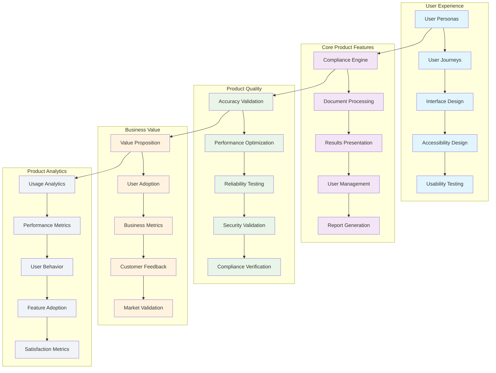

<!--
SPDX-License-Identifier: PolyForm-Perimeter-1.0.0
SPDX-FileCopyrightText: 2025 Seventeen Sierra LLC
-->

# Threshold Product Design Document

## Overview

The Product component defines the core product strategy, user experience design, and business value proposition for the Proposal Prepper application. The design focuses on delivering essential value to federal contractors through accurate compliance validation, intuitive user interfaces, and reliable performance that builds user trust and adoption.

## Architecture

### Product Architecture


## User Experience Design

### User Personas and Needs
```typescript
interface UserPersonaSystem {
  definePrimaryPersonas(): Promise<UserPersona[]>;
  analyzeUserNeeds(): Promise<UserNeedAnalysis>;
  mapUserJourneys(): Promise<UserJourney[]>;
  validatePersonas(): Promise<PersonaValidation>;
}

interface UserPersona {
  id: string;
  name: string;
  role: string;
  organization: string;
  demographics: Demographics;
  goals: Goal[];
  painPoints: PainPoint[];
  behaviors: Behavior[];
  technicalProficiency: 'low' | 'medium' | 'high';
  complianceExperience: 'novice' | 'intermediate' | 'expert';
  primaryUseCases: UseCase[];
}

interface Demographics {
  ageRange: string;
  education: string;
  experience: string;
  organizationSize: 'small' | 'medium' | 'large' | 'enterprise';
  industry: string[];
}

interface Goal {
  description: string;
  priority: 'low' | 'medium' | 'high' | 'critical';
  frequency: 'daily' | 'weekly' | 'monthly' | 'quarterly';
  successCriteria: string[];
  currentSolution?: string;
  frustrations: string[];
}

interface PainPoint {
  description: string;
  impact: 'low' | 'medium' | 'high' | 'critical';
  frequency: 'rare' | 'occasional' | 'frequent' | 'constant';
  currentWorkaround?: string;
  costOfPain: CostOfPain;
}

interface CostOfPain {
  timeWasted: number; // hours per month
  errorRate: number; // percentage
  opportunityCost: string;
  stressLevel: 'low' | 'medium' | 'high';
}

// Primary personas for Proposal Prepper
const primaryPersonas: UserPersona[] = [
  {
    id: 'federal-contractor',
    name: 'Sarah Chen',
    role: 'Proposal Manager',
    organization: 'Mid-size Defense Contractor',
    demographics: {
      ageRange: '35-45',
      education: 'Masters in Business Administration',
      experience: '10+ years in federal contracting',
      organizationSize: 'medium',
      industry: ['defense', 'aerospace', 'technology']
    },
    goals: [
      {
        description: 'Submit compliant proposals that win contracts',
        priority: 'critical',
        frequency: 'monthly',
        successCriteria: ['Zero compliance violations', 'Faster review process', 'Higher win rate'],
        currentSolution: 'Manual review with legal team',
        frustrations: ['Time-consuming', 'Error-prone', 'Expensive']
      }
    ],
    painPoints: [
      {
        description: 'Manual compliance checking is slow and error-prone',
        impact: 'high',
        frequency: 'frequent',
        currentWorkaround: 'Hire external compliance consultants',
        costOfPain: {
          timeWasted: 40,
          errorRate: 15,
          opportunityCost: 'Lost contract opportunities',
          stressLevel: 'high'
        }
      }
    ],
    behaviors: [
      { type: 'workflow', description: 'Prefers step-by-step guidance' },
      { type: 'communication', description: 'Values clear, actionable feedback' },
      { type: 'technology', description: 'Comfortable with web applications' }
    ],
    technicalProficiency: 'medium',
    complianceExperience: 'intermediate',
    primaryUseCases: ['proposal-validation', 'compliance-checking', 'report-generation']
  }
];
```

### User Journey Mapping
```typescript
interface UserJourneyMapper {
  mapCoreJourneys(): Promise<UserJourney[]>;
  identifyTouchpoints(): Promise<Touchpoint[]>;
  analyzePainPoints(): Promise<JourneyPainPoint[]>;
  optimizeExperience(): Promise<ExperienceOptimization>;
}

interface UserJourney {
  id: string;
  name: string;
  persona: string;
  scenario: string;
  stages: JourneyStage[];
  emotions: EmotionalJourney[];
  opportunities: ImprovementOpportunity[];
  metrics: JourneyMetrics;
}

interface JourneyStage {
  name: string;
  description: string;
  actions: UserAction[];
  touchpoints: Touchpoint[];
  painPoints: JourneyPainPoint[];
  emotions: Emotion[];
  duration: number;
  successCriteria: string[];
}

interface UserAction {
  description: string;
  type: 'click' | 'upload' | 'review' | 'download' | 'navigate';
  effort: 'low' | 'medium' | 'high';
  frequency: number;
  alternatives?: string[];
}

interface Touchpoint {
  name: string;
  type: 'web_interface' | 'email' | 'documentation' | 'support';
  description: string;
  quality: 'poor' | 'fair' | 'good' | 'excellent';
  improvementPotential: 'low' | 'medium' | 'high';
}

interface EmotionalJourney {
  stage: string;
  emotion: 'frustrated' | 'confused' | 'confident' | 'satisfied' | 'delighted';
  intensity: number; // 1-10 scale
  triggers: string[];
  impact: 'negative' | 'neutral' | 'positive';
}

// Core user journey: Proposal Compliance Validation
const proposalValidationJourney: UserJourney = {
  id: 'proposal-validation',
  name: 'Proposal Compliance Validation',
  persona: 'federal-contractor',
  scenario: 'Sarah needs to validate a proposal for FAR/DFARS compliance before submission',
  stages: [
    {
      name: 'Preparation',
      description: 'User prepares proposal document for validation',
      actions: [
        { description: 'Gather proposal documents', type: 'review', effort: 'medium', frequency: 1 },
        { description: 'Review compliance requirements', type: 'review', effort: 'high', frequency: 1 }
      ],
      touchpoints: [
        { name: 'Documentation', type: 'documentation', description: 'Compliance guidelines', quality: 'good', improvementPotential: 'medium' }
      ],
      painPoints: [
        { description: 'Unclear which documents are needed', severity: 'medium', impact: 'time_delay' }
      ],
      emotions: [
        { emotion: 'confident', intensity: 6, reason: 'Familiar with process' }
      ],
      duration: 30,
      successCriteria: ['All required documents ready', 'Compliance requirements understood']
    },
    {
      name: 'Upload',
      description: 'User uploads proposal document to the system',
      actions: [
        { description: 'Navigate to upload page', type: 'navigate', effort: 'low', frequency: 1 },
        { description: 'Select and upload file', type: 'upload', effort: 'low', frequency: 1 },
        { description: 'Verify upload success', type: 'review', effort: 'low', frequency: 1 }
      ],
      touchpoints: [
        { name: 'Upload Interface', type: 'web_interface', description: 'File upload form', quality: 'excellent', improvementPotential: 'low' }
      ],
      painPoints: [],
      emotions: [
        { emotion: 'confident', intensity: 7, reason: 'Simple, clear interface' }
      ],
      duration: 5,
      successCriteria: ['File uploaded successfully', 'Processing initiated']
    }
  ],
  emotions: [],
  opportunities: [
    { area: 'preparation', description: 'Provide document checklist', impact: 'medium' },
    { area: 'guidance', description: 'Add contextual help', impact: 'high' }
  ],
  metrics: {
    completionRate: 0.85,
    averageDuration: 45,
    satisfactionScore: 7.2,
    dropOffPoints: ['preparation']
  }
};
```

### Interface Design System
```typescript
interface InterfaceDesignSystem {
  defineDesignPrinciples(): Promise<DesignPrinciple[]>;
  createComponentLibrary(): Promise<ComponentLibrary>;
  establishInteractionPatterns(): Promise<InteractionPattern[]>;
  implementAccessibilityStandards(): Promise<AccessibilityImplementation>;
}

interface DesignPrinciple {
  name: string;
  description: string;
  rationale: string;
  examples: DesignExample[];
  measurements: DesignMetric[];
}

interface ComponentLibrary {
  components: UIComponent[];
  patterns: DesignPattern[];
  guidelines: DesignGuideline[];
  tokens: DesignToken[];
}

interface UIComponent {
  name: string;
  purpose: string;
  variants: ComponentVariant[];
  states: ComponentState[];
  accessibility: AccessibilityFeature[];
  usageGuidelines: UsageGuideline[];
  examples: ComponentExample[];
}

interface InteractionPattern {
  name: string;
  context: string;
  problem: string;
  solution: string;
  implementation: ImplementationGuide;
  usability: UsabilityConsideration[];
  accessibility: AccessibilityConsideration[];
}

// Design principles for Proposal Prepper
const designPrinciples: DesignPrinciple[] = [
  {
    name: 'Clarity First',
    description: 'Every interface element should have a clear, obvious purpose',
    rationale: 'Users need to quickly understand compliance results and take action',
    examples: [
      { description: 'Clear pass/fail indicators with color and text', type: 'visual' },
      { description: 'Plain language explanations of compliance issues', type: 'content' }
    ],
    measurements: [
      { metric: 'task_completion_rate', target: 0.9 },
      { metric: 'time_to_understand', target: 30 }
    ]
  },
  {
    name: 'Progressive Disclosure',
    description: 'Show essential information first, details on demand',
    rationale: 'Prevents cognitive overload while providing access to detailed information',
    examples: [
      { description: 'Summary view with expandable details', type: 'interaction' },
      { description: 'Layered navigation from overview to specifics', type: 'navigation' }
    ],
    measurements: [
      { metric: 'cognitive_load_score', target: 7 },
      { metric: 'information_findability', target: 0.85 }
    ]
  }
];
```

## Core Product Features

### Compliance Engine Design
```typescript
interface ComplianceEngineProduct {
  defineAccuracyRequirements(): Promise<AccuracyRequirements>;
  specifyValidationRules(): Promise<ValidationRuleSet>;
  designResultsPresentation(): Promise<ResultsDesign>;
  implementFeedbackLoop(): Promise<FeedbackSystem>;
}

interface AccuracyRequirements {
  overallAccuracy: AccuracyTarget;
  byRuleCategory: CategoryAccuracy[];
  byDocumentType: DocumentAccuracy[];
  confidenceThresholds: ConfidenceThreshold[];
  validationMethods: ValidationMethod[];
}

interface AccuracyTarget {
  minimum: number; // 85%
  target: number;   // 90%
  stretch: number;  // 95%
  measurement: AccuracyMeasurement;
}

interface AccuracyMeasurement {
  method: 'expert_review' | 'automated_testing' | 'user_feedback' | 'benchmark_comparison';
  sampleSize: number;
  frequency: 'continuous' | 'weekly' | 'monthly' | 'quarterly';
  criteria: MeasurementCriteria[];
}

interface ValidationRuleSet {
  farRules: ComplianceRule[];
  dfarsRules: ComplianceRule[];
  customRules: ComplianceRule[];
  ruleHierarchy: RuleHierarchy;
  updateProcess: RuleUpdateProcess;
}

interface ComplianceRule {
  id: string;
  name: string;
  description: string;
  regulation: RegulationReference;
  category: 'mandatory' | 'recommended' | 'best_practice';
  severity: 'critical' | 'high' | 'medium' | 'low';
  applicability: ApplicabilityCondition[];
  validation: ValidationLogic;
  remediation: RemediationGuidance;
}

interface ResultsDesign {
  summaryView: SummaryViewDesign;
  detailView: DetailViewDesign;
  reportFormats: ReportFormat[];
  exportOptions: ExportOption[];
  visualizations: VisualizationDesign[];
}

interface SummaryViewDesign {
  overallStatus: StatusIndicatorDesign;
  keyMetrics: MetricDisplayDesign[];
  criticalIssues: IssueHighlightDesign;
  actionItems: ActionItemDesign[];
  progressIndicators: ProgressDesign[];
}
```

### Document Processing Features
```typescript
interface DocumentProcessingProduct {
  defineFileSupport(): Promise<FileSupportSpecification>;
  designUploadExperience(): Promise<UploadExperienceDesign>;
  specifyProcessingFeedback(): Promise<ProcessingFeedbackDesign>;
  implementProgressTracking(): Promise<ProgressTrackingSystem>;
}

interface FileSupportSpecification {
  supportedFormats: FileFormat[];
  sizeLimit: FileSizeLimit;
  qualityRequirements: QualityRequirement[];
  processingCapabilities: ProcessingCapability[];
}

interface FileFormat {
  extension: string;
  mimeType: string;
  description: string;
  priority: 'primary' | 'secondary' | 'experimental';
  limitations: FormatLimitation[];
  processingNotes: string[];
}

interface UploadExperienceDesign {
  dragDropInterface: DragDropDesign;
  fileSelection: FileSelectionDesign;
  validationFeedback: ValidationFeedbackDesign;
  progressIndicator: ProgressIndicatorDesign;
  errorHandling: ErrorHandlingDesign;
}

interface ProcessingFeedbackDesign {
  stages: ProcessingStage[];
  statusUpdates: StatusUpdateDesign[];
  timeEstimates: TimeEstimateDesign;
  cancellationOptions: CancellationDesign;
  errorRecovery: ErrorRecoveryDesign;
}

interface ProcessingStage {
  name: string;
  description: string;
  userMessage: string;
  estimatedDuration: number;
  visualIndicator: VisualIndicatorDesign;
  troubleshooting: TroubleshootingInfo[];
}

// File support specification
const fileSupportSpec: FileSupportSpecification = {
  supportedFormats: [
    {
      extension: '.pdf',
      mimeType: 'application/pdf',
      description: 'Portable Document Format',
      priority: 'primary',
      limitations: ['Text must be selectable', 'Maximum 50MB'],
      processingNotes: ['OCR available for scanned documents', 'Form fields supported']
    },
    {
      extension: '.docx',
      mimeType: 'application/vnd.openxmlformats-officedocument.wordprocessingml.document',
      description: 'Microsoft Word Document',
      priority: 'secondary',
      limitations: ['Maximum 50MB', 'Complex formatting may be simplified'],
      processingNotes: ['Track changes ignored', 'Comments preserved']
    }
  ],
  sizeLimit: {
    maximum: 52428800, // 50MB
    recommended: 10485760, // 10MB
    warning: 20971520 // 20MB
  },
  qualityRequirements: [
    { aspect: 'text_clarity', minimum: 0.8, description: 'Text must be clearly readable' },
    { aspect: 'structure_integrity', minimum: 0.9, description: 'Document structure must be intact' }
  ],
  processingCapabilities: [
    { name: 'text_extraction', accuracy: 0.99, description: 'Extract text content' },
    { name: 'structure_analysis', accuracy: 0.95, description: 'Identify document sections' },
    { name: 'table_processing', accuracy: 0.90, description: 'Process tabular data' }
  ]
};
```

## Product Quality Assurance

### Accuracy Validation System
```typescript
interface AccuracyValidationSystem {
  establishBaselines(): Promise<AccuracyBaseline>;
  implementContinuousTesting(): Promise<ContinuousTestingSystem>;
  createFeedbackLoop(): Promise<AccuracyFeedbackLoop>;
  generateAccuracyReports(): Promise<AccuracyReport>;
}

interface AccuracyBaseline {
  testDatasets: TestDataset[];
  expertValidation: ExpertValidationResult[];
  benchmarkComparisons: BenchmarkComparison[];
  accuracyMetrics: AccuracyMetric[];
}

interface TestDataset {
  id: string;
  name: string;
  description: string;
  documentCount: number;
  documentTypes: string[];
  complianceScenarios: ComplianceScenario[];
  expertAnnotations: ExpertAnnotation[];
  lastUpdated: Date;
}

interface ComplianceScenario {
  id: string;
  description: string;
  expectedOutcome: ExpectedOutcome;
  difficulty: 'easy' | 'medium' | 'hard' | 'expert';
  rulesCovered: string[];
  edgeCases: EdgeCase[];
}

interface ExpectedOutcome {
  overallStatus: 'pass' | 'fail' | 'warning';
  specificFindings: ExpectedFinding[];
  confidenceRange: ConfidenceRange;
  processingTime: TimeRange;
}

interface AccuracyFeedbackLoop {
  userFeedback: UserFeedbackCollection;
  expertReview: ExpertReviewProcess;
  modelImprovement: ModelImprovementProcess;
  continuousLearning: ContinuousLearningSystem;
}

interface UserFeedbackCollection {
  feedbackMechanisms: FeedbackMechanism[];
  feedbackAnalysis: FeedbackAnalysisProcess;
  actionableInsights: ActionableInsight[];
  improvementTracking: ImprovementTracking;
}

interface FeedbackMechanism {
  type: 'rating' | 'correction' | 'suggestion' | 'report_error';
  placement: 'inline' | 'summary' | 'dedicated_page';
  userExperience: FeedbackUXDesign;
  dataCollection: FeedbackDataCollection;
}
```

### Performance and Reliability
```typescript
interface PerformanceReliabilitySystem {
  definePerformanceTargets(): Promise<PerformanceTarget[]>;
  implementReliabilityMeasures(): Promise<ReliabilityMeasure[]>;
  createMonitoringSystem(): Promise<PerformanceMonitoringSystem>;
  establishSLAs(): Promise<ServiceLevelAgreement[]>;
}

interface PerformanceTarget {
  metric: string;
  target: number;
  measurement: string;
  context: string;
  priority: 'critical' | 'high' | 'medium' | 'low';
  consequences: PerformanceConsequence[];
}

interface ReliabilityMeasure {
  aspect: 'availability' | 'consistency' | 'error_rate' | 'recovery_time';
  target: number;
  measurement: ReliabilityMeasurement;
  implementation: ReliabilityImplementation[];
}

interface ServiceLevelAgreement {
  service: string;
  metrics: SLAMetric[];
  availability: AvailabilityTarget;
  performance: PerformanceTarget[];
  support: SupportCommitment;
  penalties: SLAPenalty[];
}

// Performance targets for Proposal Prepper
const performanceTargets: PerformanceTarget[] = [
  {
    metric: 'document_processing_time',
    target: 300, // 5 minutes
    measurement: 'seconds for typical 50-page document',
    context: 'Standard proposal document processing',
    priority: 'critical',
    consequences: [
      { threshold: 600, impact: 'user_frustration', severity: 'medium' },
      { threshold: 900, impact: 'user_abandonment', severity: 'high' }
    ]
  },
  {
    metric: 'system_availability',
    target: 99.9, // 99.9%
    measurement: 'percentage uptime per month',
    context: 'Business hours (8 AM - 6 PM EST)',
    priority: 'critical',
    consequences: [
      { threshold: 99.0, impact: 'business_disruption', severity: 'high' },
      { threshold: 95.0, impact: 'reputation_damage', severity: 'critical' }
    ]
  },
  {
    metric: 'accuracy_rate',
    target: 90, // 90%
    measurement: 'percentage of correct compliance determinations',
    context: 'Validated against expert review',
    priority: 'critical',
    consequences: [
      { threshold: 85, impact: 'user_trust_loss', severity: 'high' },
      { threshold: 80, impact: 'product_failure', severity: 'critical' }
    ]
  }
];
```

## Business Value and Metrics

### Value Proposition Framework
```typescript
interface ValuePropositionFramework {
  defineValueProposition(): Promise<ValueProposition>;
  measureBusinessImpact(): Promise<BusinessImpactMetrics>;
  trackUserAdoption(): Promise<AdoptionMetrics>;
  calculateROI(): Promise<ROIAnalysis>;
}

interface ValueProposition {
  primaryValue: PrimaryValueStatement;
  secondaryValues: SecondaryValueStatement[];
  targetOutcomes: TargetOutcome[];
  competitiveAdvantages: CompetitiveAdvantage[];
  valueValidation: ValueValidationMethod[];
}

interface PrimaryValueStatement {
  statement: string;
  quantification: ValueQuantification;
  beneficiaries: Beneficiary[];
  timeframe: string;
  confidence: number;
}

interface ValueQuantification {
  metric: string;
  baseline: number;
  improvement: number;
  unit: string;
  methodology: string;
}

interface BusinessImpactMetrics {
  timeReduction: TimeReductionMetric[];
  errorReduction: ErrorReductionMetric[];
  costSavings: CostSavingsMetric[];
  revenueImpact: RevenueImpactMetric[];
  riskMitigation: RiskMitigationMetric[];
}

interface TimeReductionMetric {
  process: string;
  baselineTime: number;
  improvedTime: number;
  reductionPercentage: number;
  frequency: string;
  annualSavings: number;
}

interface AdoptionMetrics {
  userAcquisition: UserAcquisitionMetric[];
  userEngagement: UserEngagementMetric[];
  userRetention: UserRetentionMetric[];
  featureAdoption: FeatureAdoptionMetric[];
  userSatisfaction: UserSatisfactionMetric[];
}

// Primary value proposition for Proposal Prepper
const valueProposition: ValueProposition = {
  primaryValue: {
    statement: 'Reduce proposal compliance review time by 75% while improving accuracy',
    quantification: {
      metric: 'compliance_review_time',
      baseline: 40, // hours
      improvement: 10, // hours
      unit: 'hours per proposal',
      methodology: 'Time tracking study with pilot users'
    },
    beneficiaries: [
      { role: 'proposal_manager', impact: 'high', description: 'Faster proposal turnaround' },
      { role: 'compliance_officer', impact: 'high', description: 'Reduced manual review burden' },
      { role: 'business_development', impact: 'medium', description: 'More proposals submitted' }
    ],
    timeframe: 'Immediate upon first use',
    confidence: 0.85
  },
  secondaryValues: [
    {
      statement: 'Improve proposal win rate through better compliance',
      quantification: {
        metric: 'proposal_win_rate',
        baseline: 15, // percent
        improvement: 20, // percent
        unit: 'percentage points',
        methodology: 'Historical analysis of compliant vs non-compliant proposals'
      }
    }
  ],
  targetOutcomes: [
    { outcome: 'Faster proposal submission', measurement: 'Days to submit', target: 50 },
    { outcome: 'Higher compliance scores', measurement: 'Compliance rating', target: 25 },
    { outcome: 'Reduced legal review costs', measurement: 'Legal hours per proposal', target: 60 }
  ],
  competitiveAdvantages: [
    { advantage: 'AI-powered analysis', description: 'Automated compliance checking vs manual review' },
    { advantage: 'Real-time feedback', description: 'Immediate results vs days of waiting' },
    { advantage: 'Comprehensive coverage', description: 'Full FAR/DFARS coverage vs partial checking' }
  ],
  valueValidation: [
    { method: 'pilot_study', participants: 10, duration: 30, metrics: ['time_savings', 'accuracy'] },
    { method: 'user_interviews', participants: 25, duration: 60, metrics: ['satisfaction', 'adoption'] }
  ]
};
```

### Product Analytics System
```typescript
interface ProductAnalyticsSystem {
  trackUsageMetrics(): Promise<UsageMetrics>;
  analyzeUserBehavior(): Promise<BehaviorAnalysis>;
  measureFeatureAdoption(): Promise<FeatureAdoptionAnalysis>;
  generateInsights(): Promise<ProductInsights>;
}

interface UsageMetrics {
  activeUsers: ActiveUserMetrics;
  sessionMetrics: SessionMetrics;
  featureUsage: FeatureUsageMetrics;
  contentMetrics: ContentMetrics;
  performanceMetrics: UserPerformanceMetrics;
}

interface ActiveUserMetrics {
  daily: number;
  weekly: number;
  monthly: number;
  trends: UsageTrend[];
  cohorts: CohortAnalysis[];
  segments: UserSegmentMetrics[];
}

interface BehaviorAnalysis {
  userFlows: UserFlowAnalysis[];
  dropOffPoints: DropOffAnalysis[];
  conversionFunnels: ConversionFunnelAnalysis[];
  engagementPatterns: EngagementPattern[];
  satisfactionCorrelations: SatisfactionCorrelation[];
}

interface FeatureAdoptionAnalysis {
  adoptionRates: FeatureAdoptionRate[];
  usagePatterns: FeatureUsagePattern[];
  userSegmentation: FeatureSegmentation[];
  valueRealization: FeatureValueRealization[];
  improvementOpportunities: FeatureImprovement[];
}

interface ProductInsights {
  keyFindings: KeyFinding[];
  actionableRecommendations: ActionableRecommendation[];
  riskAreas: RiskArea[];
  opportunityAreas: OpportunityArea[];
  nextSteps: NextStep[];
}

const analyticsConfig = {
  tracking: {
    events: [
      'document_upload',
      'analysis_start',
      'analysis_complete',
      'results_view',
      'report_download',
      'feedback_submit'
    ],
    properties: [
      'user_id',
      'session_id',
      'document_type',
      'file_size',
      'processing_time',
      'accuracy_score',
      'user_satisfaction'
    ]
  },
  reporting: {
    frequency: 'daily',
    dashboards: ['executive', 'product', 'engineering'],
    alerts: ['adoption_drop', 'performance_degradation', 'error_spike']
  },
  privacy: {
    dataRetention: 365, // days
    anonymization: true,
    consentRequired: true,
    gdprCompliant: true
  }
};
```

## Product Performance Metrics

### Key Performance Indicators
- **User Adoption**: 80% of pilot users become regular users within 30 days
- **Task Completion**: 90% of users successfully complete proposal validation
- **Time to Value**: Users see value within first 15 minutes of use
- **Accuracy Achievement**: Maintain 90%+ compliance detection accuracy
- **User Satisfaction**: Net Promoter Score (NPS) > 50

### Success Metrics Dashboard
```typescript
interface ProductMetricsDashboard {
  displayKPIs(): Promise<KPIDashboard>;
  showUserMetrics(): Promise<UserMetricsDashboard>;
  presentBusinessMetrics(): Promise<BusinessMetricsDashboard>;
  generateExecutiveSummary(): Promise<ExecutiveSummary>;
}

interface KPIDashboard {
  primaryKPIs: KPIMetric[];
  secondaryKPIs: KPIMetric[];
  trends: MetricTrend[];
  alerts: MetricAlert[];
  targets: MetricTarget[];
}

interface KPIMetric {
  name: string;
  value: number;
  unit: string;
  change: MetricChange;
  status: 'on_track' | 'at_risk' | 'off_track';
  target: number;
  benchmark?: number;
}

const productKPIs = {
  userAdoption: {
    target: 0.8,
    measurement: 'percentage of pilot users becoming regular users',
    frequency: 'monthly',
    owner: 'product_manager'
  },
  taskCompletion: {
    target: 0.9,
    measurement: 'percentage of successful proposal validations',
    frequency: 'weekly',
    owner: 'ux_designer'
  },
  timeToValue: {
    target: 15,
    measurement: 'minutes until first successful validation',
    frequency: 'daily',
    owner: 'product_manager'
  },
  accuracyRate: {
    target: 0.9,
    measurement: 'percentage of correct compliance determinations',
    frequency: 'continuous',
    owner: 'ai_engineer'
  },
  userSatisfaction: {
    target: 50,
    measurement: 'Net Promoter Score',
    frequency: 'monthly',
    owner: 'customer_success'
  }
};
```