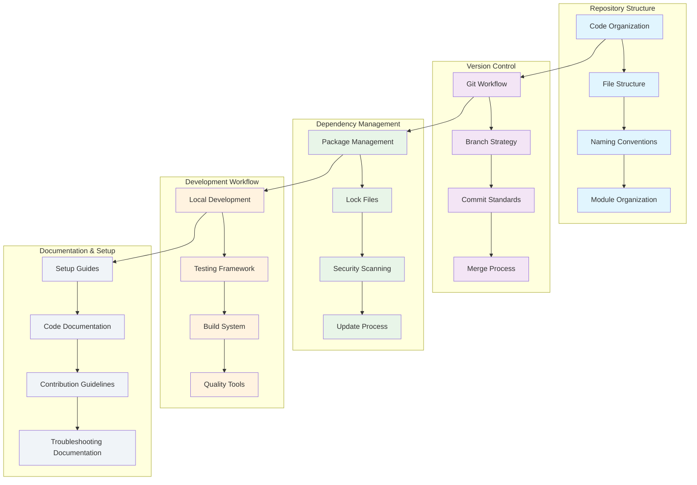

<!--
SPDX-License-Identifier: PolyForm-Perimeter-1.0.0
SPDX-FileCopyrightText: 2025 Seventeen Sierra LLC
-->

# Threshold Repository Design Document

## Overview

The Repository component defines the code organization, version control workflow, dependency management, and development processes for the Proposal Prepper application. The design emphasizes clear structure, efficient workflows, and maintainable development practices that support team collaboration and code quality.

## Architecture

### Repository Architecture


## Repository Structure and Organization

### Code Organization System
```typescript
interface RepositoryStructure {
  defineDirectoryStructure(): Promise<DirectoryStructure>;
  establishNamingConventions(): Promise<NamingConventions>;
  organizeModules(): Promise<ModuleOrganization>;
  createFileTemplates(): Promise<FileTemplate[]>;
}

interface DirectoryStructure {
  rootLevel: RootDirectory[];
  sourceCode: SourceCodeStructure;
  configuration: ConfigurationStructure;
  documentation: DocumentationStructure;
  testing: TestingStructure;
}

interface RootDirectory {
  name: string;
  purpose: string;
  contents: DirectoryContent[];
  permissions: FilePermissions;
  gitignore: GitIgnoreRule[];
}

interface SourceCodeStructure {
  webService: WebServiceStructure;
  strandsService: StrandsServiceStructure;
  sharedLibraries: SharedLibraryStructure;
  utilities: UtilityStructure;
}

interface WebServiceStructure {
  components: ComponentStructure;
  pages: PageStructure;
  api: APIStructure;
  hooks: HookStructure;
  utils: UtilityStructure;
  types: TypeStructure;
}

// Repository directory structure
const repositoryStructure: DirectoryStructure = {
  rootLevel: [
    {
      name: 'src',
      purpose: 'Main application source code',
      contents: ['app/', 'components/', 'lib/', 'types/'],
      permissions: { read: true, write: true, execute: false },
      gitignore: []
    },
    {
      name: 'services',
      purpose: 'Backend service implementations',
      contents: ['strands/', 'shared/'],
      permissions: { read: true, write: true, execute: false },
      gitignore: ['**/__pycache__/', '**/*.pyc']
    }
  ],
  sourceCode: {
    webService: {
      components: {
        path: 'src/components',
        structure: 'feature-based',
        naming: 'PascalCase',
        indexFiles: true
      },
      pages: {
        path: 'src/app',
        structure: 'route-based',
        naming: 'kebab-case',
        fileConvention: 'page.tsx'
      },
      api: {
        path: 'src/app/api',
        structure: 'endpoint-based',
        naming: 'kebab-case',
        fileConvention: 'route.ts'
      }
    }
  }
};
```