<!--
SPDX-License-Identifier: PolyForm-Perimeter-1.0.0
SPDX-FileCopyrightText: 2025 Seventeen Sierra LLC
-->

# Threshold Security Design Document

## Overview

The Security component provides comprehensive protection for the Proposal Prepper application, implementing essential security controls to protect sensitive proposal data, ensure secure authentication, and meet OpenSSF baseline security requirements. The design focuses on defense-in-depth principles with practical, implementable security measures.

## Architecture

### Security Architecture

```mermaid
graph TB
    subgraph "Application Security Layer"
        Auth[Authentication & Authorization]
        Input[Input Validation & Sanitization]
        Session[Session Management]
        CSRF[CSRF Protection]
    end
    
    subgraph "Data Security Layer"
        Encryption[Data Encryption]
        KeyMgmt[Key Management]
        DataClass[Data Classification]
        SecureDel[Secure Deletion]
    end
    
    subgraph "Network Security Layer"
        TLS[TLS/HTTPS Enforcement]
        Firewall[Basic Firewall Rules]
        API[API Security Controls]
        RateLimit[Rate Limiting]
    end
    
    subgraph "Infrastructure Security"
        Container[Container Security]
        Secrets[Secret Management]
        Access[Access Controls]
        Hardening[Security Hardening]
    end
    
    subgraph "Security Monitoring"
        Logging[Security Logging]
        Monitoring[Event Monitoring]
        Audit[Audit Trails]
        Alerts[Security Alerts]
    end
    
    subgraph "Vulnerability Management"
        Scanning[Dependency Scanning]
        SAST[Static Analysis]
        Patching[Patch Management]
        Tracking[Vulnerability Tracking]
    end
    
    Auth --> Session
    Input --> Auth
    Session --> CSRF
    
    Encryption --> KeyMgmt
    DataClass --> Encryption
    KeyMgmt --> SecureDel
    
    TLS --> API
    Firewall --> TLS
    API --> RateLimit
    
    Container --> Secrets
    Secrets --> Access
    Access --> Hardening
    
    Logging --> Monitoring
    Monitoring --> Audit
    Audit --> Alerts
    
    Scanning --> SAST
    SAST --> Patching
    Patching --> Tracking
    
    classDef application fill:#e1f5fe
    classDef data fill:#f3e5f5
    classDef network fill:#e8f5e8
    classDef infrastructure fill:#fff3e0
    classDef monitoring fill:#f0f4f8
    classDef vulnerability fill:#fce4ec
    
    class Auth,Input,Session,CSRF application
    class Encryption,KeyMgmt,DataClass,SecureDel data
    class TLS,Firewall,API,RateLimit network
    class Container,Secrets,Access,Hardening infrastructure
    class Logging,Monitoring,Audit,Alerts monitoring
    class Scanning,SAST,Patching,Tracking vulnerability
```



## Security Components

### Authentication and Authorization

#### Authentication System
```typescript
interface AuthenticationService {
  authenticateUser(credentials: UserCredentials): Promise<AuthResult>;
  validateSession(sessionToken: string): Promise<SessionValidation>;
  refreshSession(refreshToken: string): Promise<TokenPair>;
  revokeSession(sessionId: string): Promise<void>;
  lockAccount(userId: string, reason: string): Promise<void>;
}

interface UserCredentials {
  email: string;
  password: string;
  mfaToken?: string;
}

interface AuthResult {
  success: boolean;
  user?: User;
  tokens?: TokenPair;
  error?: AuthError;
  requiresMFA?: boolean;
}

interface TokenPair {
  accessToken: string;
  refreshToken: string;
  expiresAt: Date;
}
```

#### Password Security
```typescript
interface PasswordSecurity {
  hashPassword(password: string): Promise<string>;
  verifyPassword(password: string, hash: string): Promise<boolean>;
  validatePasswordStrength(password: string): PasswordValidation;
  generateSecurePassword(): string;
}

interface PasswordValidation {
  isValid: boolean;
  score: number; // 0-4 strength score
  feedback: string[];
  requirements: {
    minLength: boolean;
    hasUppercase: boolean;
    hasLowercase: boolean;
    hasNumbers: boolean;
    hasSpecialChars: boolean;
  };
}

// Password requirements
const passwordRequirements = {
  minLength: 12,
  requireUppercase: true,
  requireLowercase: true,
  requireNumbers: true,
  requireSpecialChars: true,
  maxAge: 90, // days
  preventReuse: 5 // last 5 passwords
};
```

#### Role-Based Access Control (RBAC)
```typescript
interface AccessControl {
  checkPermission(userId: string, resource: string, action: string): Promise<boolean>;
  assignRole(userId: string, role: Role): Promise<void>;
  revokeRole(userId: string, role: Role): Promise<void>;
  getUserPermissions(userId: string): Promise<Permission[]>;
}

enum Role {
  USER = 'user',
  ADMIN = 'admin',
  AUDITOR = 'auditor'
}

interface Permission {
  resource: string;
  actions: string[];
  conditions?: AccessCondition[];
}

interface AccessCondition {
  field: string;
  operator: 'equals' | 'in' | 'contains';
  value: any;
}

// Permission definitions
const permissions = {
  proposals: {
    user: ['create', 'read:own', 'update:own', 'delete:own'],
    admin: ['create', 'read:all', 'update:all', 'delete:all'],
    auditor: ['read:all']
  },
  analyses: {
    user: ['create:own', 'read:own'],
    admin: ['create:all', 'read:all', 'cancel:all'],
    auditor: ['read:all']
  }
};
```

### Data Security

#### Encryption Implementation
```typescript
interface DataEncryption {
  encryptAtRest(data: Buffer, keyId: string): Promise<EncryptedData>;
  decryptAtRest(encryptedData: EncryptedData, keyId: string): Promise<Buffer>;
  encryptInTransit(data: any): Promise<string>;
  decryptInTransit(encryptedData: string): Promise<any>;
}

interface EncryptedData {
  ciphertext: Buffer;
  iv: Buffer;
  authTag: Buffer;
  keyId: string;
  algorithm: string;
}

// Encryption configuration
const encryptionConfig = {
  atRest: {
    algorithm: 'aes-256-gcm',
    keyLength: 32,
    ivLength: 16
  },
  inTransit: {
    tlsVersion: '1.3',
    cipherSuites: [
      'TLS_AES_256_GCM_SHA384',
      'TLS_CHACHA20_POLY1305_SHA256'
    ]
  }
};
```

#### Key Management
```typescript
interface KeyManagement {
  generateKey(purpose: KeyPurpose): Promise<CryptoKey>;
  rotateKey(keyId: string): Promise<string>;
  revokeKey(keyId: string): Promise<void>;
  getKey(keyId: string): Promise<CryptoKey>;
  deriveKey(masterKey: CryptoKey, context: string): Promise<CryptoKey>;
}

enum KeyPurpose {
  DATA_ENCRYPTION = 'data_encryption',
  SESSION_SIGNING = 'session_signing',
  API_AUTHENTICATION = 'api_authentication'
}

interface KeyRotationPolicy {
  automatic: boolean;
  interval: number; // days
  warningPeriod: number; // days before expiration
  gracePeriod: number; // days to keep old key active
}

const keyRotationPolicies = {
  [KeyPurpose.DATA_ENCRYPTION]: {
    automatic: true,
    interval: 365,
    warningPeriod: 30,
    gracePeriod: 7
  },
  [KeyPurpose.SESSION_SIGNING]: {
    automatic: true,
    interval: 90,
    warningPeriod: 7,
    gracePeriod: 1
  }
};
```

#### Data Classification
```typescript
interface DataClassification {
  classifyData(data: any, context: string): DataClass;
  applyProtection(data: any, classification: DataClass): ProtectedData;
  validateAccess(userId: string, classification: DataClass): boolean;
}

enum DataClass {
  PUBLIC = 'public',
  INTERNAL = 'internal',
  CONFIDENTIAL = 'confidential',
  RESTRICTED = 'restricted'
}

interface ProtectedData {
  data: any;
  classification: DataClass;
  protections: DataProtection[];
  accessLog: AccessLogEntry[];
}

interface DataProtection {
  type: 'encryption' | 'masking' | 'redaction';
  applied: boolean;
  keyId?: string;
}

// Classification rules
const classificationRules = {
  proposals: DataClass.CONFIDENTIAL,
  analysisResults: DataClass.CONFIDENTIAL,
  userProfiles: DataClass.INTERNAL,
  systemLogs: DataClass.INTERNAL,
  publicDocumentation: DataClass.PUBLIC
};
```

### Network Security

#### TLS/HTTPS Enforcement
```typescript
interface NetworkSecurity {
  enforceHTTPS(request: Request): boolean;
  validateTLSVersion(connection: TLSConnection): boolean;
  checkCertificate(certificate: Certificate): CertificateValidation;
  configureSecurityHeaders(response: Response): Response;
}

interface SecurityHeaders {
  'Strict-Transport-Security': string;
  'Content-Security-Policy': string;
  'X-Frame-Options': string;
  'X-Content-Type-Options': string;
  'Referrer-Policy': string;
  'Permissions-Policy': string;
}

const securityHeaders: SecurityHeaders = {
  'Strict-Transport-Security': 'max-age=31536000; includeSubDomains; preload',
  'Content-Security-Policy': "default-src 'self'; script-src 'self' 'unsafe-inline'; style-src 'self' 'unsafe-inline'",
  'X-Frame-Options': 'DENY',
  'X-Content-Type-Options': 'nosniff',
  'Referrer-Policy': 'strict-origin-when-cross-origin',
  'Permissions-Policy': 'camera=(), microphone=(), geolocation=()'
};
```

#### API Security Controls
```typescript
interface APISecurityControls {
  validateAPIKey(apiKey: string): Promise<APIKeyValidation>;
  enforceRateLimit(clientId: string, endpoint: string): Promise<RateLimitResult>;
  validateInput(input: any, schema: ValidationSchema): ValidationResult;
  sanitizeInput(input: any): any;
}

interface RateLimitConfig {
  requests: number;
  windowMs: number;
  skipSuccessfulRequests: boolean;
  skipFailedRequests: boolean;
}

const rateLimits = {
  '/api/proposals': {
    requests: 10,
    windowMs: 15 * 60 * 1000, // 15 minutes
    skipSuccessfulRequests: false,
    skipFailedRequests: true
  },
  '/api/auth/login': {
    requests: 5,
    windowMs: 15 * 60 * 1000, // 15 minutes
    skipSuccessfulRequests: true,
    skipFailedRequests: false
  }
};
```

### Security Monitoring and Logging

#### Security Event Logging
```typescript
interface SecurityLogging {
  logAuthenticationEvent(event: AuthEvent): Promise<void>;
  logAccessEvent(event: AccessEvent): Promise<void>;
  logSecurityViolation(event: SecurityViolation): Promise<void>;
  querySecurityLogs(query: LogQuery): Promise<SecurityLogEntry[]>;
}

interface SecurityLogEntry {
  id: string;
  timestamp: Date;
  eventType: SecurityEventType;
  severity: SecuritySeverity;
  userId?: string;
  ipAddress: string;
  userAgent?: string;
  resource?: string;
  action?: string;
  result: 'success' | 'failure' | 'blocked';
  details: Record<string, any>;
  riskScore: number;
}

enum SecurityEventType {
  AUTHENTICATION = 'authentication',
  AUTHORIZATION = 'authorization',
  DATA_ACCESS = 'data_access',
  CONFIGURATION_CHANGE = 'configuration_change',
  SECURITY_VIOLATION = 'security_violation',
  SUSPICIOUS_ACTIVITY = 'suspicious_activity'
}

enum SecuritySeverity {
  LOW = 'low',
  MEDIUM = 'medium',
  HIGH = 'high',
  CRITICAL = 'critical'
}
```

#### Security Monitoring
```typescript
interface SecurityMonitoring {
  detectAnomalousActivity(userId: string): Promise<AnomalyDetection>;
  monitorFailedLogins(): Promise<LoginMonitoringResult>;
  trackSuspiciousPatterns(): Promise<PatternAnalysis>;
  generateSecurityAlerts(): Promise<SecurityAlert[]>;
}

interface AnomalyDetection {
  isAnomalous: boolean;
  confidence: number;
  indicators: AnomalyIndicator[];
  recommendedActions: string[];
}

interface AnomalyIndicator {
  type: 'unusual_location' | 'unusual_time' | 'unusual_behavior' | 'rapid_requests';
  severity: SecuritySeverity;
  description: string;
  evidence: Record<string, any>;
}
```

### Vulnerability Management

#### Dependency Scanning
```typescript
interface VulnerabilityScanning {
  scanDependencies(): Promise<VulnerabilityReport>;
  scanContainerImages(): Promise<ContainerScanResult>;
  performSAST(): Promise<SASTResult>;
  trackVulnerabilities(): Promise<VulnerabilityTracker>;
}

interface VulnerabilityReport {
  scanId: string;
  timestamp: Date;
  summary: {
    total: number;
    critical: number;
    high: number;
    medium: number;
    low: number;
  };
  vulnerabilities: Vulnerability[];
  recommendations: Recommendation[];
}

interface Vulnerability {
  id: string;
  cve?: string;
  severity: VulnerabilitySeverity;
  package: string;
  version: string;
  fixedVersion?: string;
  description: string;
  references: string[];
  exploitability: number;
  impact: number;
}

enum VulnerabilitySeverity {
  CRITICAL = 'critical',
  HIGH = 'high',
  MEDIUM = 'medium',
  LOW = 'low',
  INFO = 'info'
}
```

#### Static Analysis Security Testing (SAST)
```typescript
interface SASTConfiguration {
  rules: SASTRule[];
  excludePatterns: string[];
  severity: VulnerabilitySeverity;
  reportFormat: 'json' | 'xml' | 'sarif';
}

interface SASTRule {
  id: string;
  name: string;
  description: string;
  category: SASTCategory;
  severity: VulnerabilitySeverity;
  enabled: boolean;
}

enum SASTCategory {
  INJECTION = 'injection',
  AUTHENTICATION = 'authentication',
  AUTHORIZATION = 'authorization',
  CRYPTOGRAPHY = 'cryptography',
  INPUT_VALIDATION = 'input_validation',
  ERROR_HANDLING = 'error_handling',
  LOGGING = 'logging'
}

const sastRules = [
  {
    id: 'sql-injection',
    name: 'SQL Injection Detection',
    description: 'Detects potential SQL injection vulnerabilities',
    category: SASTCategory.INJECTION,
    severity: VulnerabilitySeverity.HIGH,
    enabled: true
  },
  {
    id: 'hardcoded-secrets',
    name: 'Hardcoded Secrets Detection',
    description: 'Detects hardcoded passwords, API keys, and secrets',
    category: SASTCategory.CRYPTOGRAPHY,
    severity: VulnerabilitySeverity.CRITICAL,
    enabled: true
  }
];
```

## Security Policies and Procedures

### Security Configuration
```typescript
interface SecurityConfig {
  authentication: {
    sessionTimeout: number; // minutes
    maxLoginAttempts: number;
    lockoutDuration: number; // minutes
    passwordPolicy: PasswordPolicy;
  };
  encryption: {
    algorithm: string;
    keyRotationInterval: number; // days
    backupEncryption: boolean;
  };
  monitoring: {
    logRetention: number; // days
    alertThresholds: AlertThresholds;
    anomalyDetection: boolean;
  };
  compliance: {
    openSSFBaseline: boolean;
    auditLogging: boolean;
    dataRetention: number; // days
  };
}

const securityConfig: SecurityConfig = {
  authentication: {
    sessionTimeout: 30,
    maxLoginAttempts: 5,
    lockoutDuration: 15,
    passwordPolicy: {
      minLength: 12,
      requireComplexity: true,
      maxAge: 90,
      preventReuse: 5
    }
  },
  encryption: {
    algorithm: 'AES-256-GCM',
    keyRotationInterval: 365,
    backupEncryption: true
  },
  monitoring: {
    logRetention: 90,
    alertThresholds: {
      failedLogins: 10,
      suspiciousActivity: 5,
      dataAccess: 100
    },
    anomalyDetection: true
  },
  compliance: {
    openSSFBaseline: true,
    auditLogging: true,
    dataRetention: 2555 // 7 years
  }
};
```

### Incident Response
```typescript
interface IncidentResponse {
  detectIncident(event: SecurityEvent): Promise<IncidentDetection>;
  classifyIncident(incident: SecurityIncident): IncidentClassification;
  respondToIncident(incident: SecurityIncident): Promise<IncidentResponse>;
  documentIncident(incident: SecurityIncident): Promise<IncidentReport>;
}

interface SecurityIncident {
  id: string;
  timestamp: Date;
  type: IncidentType;
  severity: SecuritySeverity;
  description: string;
  affectedSystems: string[];
  affectedUsers: string[];
  evidence: Evidence[];
  status: IncidentStatus;
}

enum IncidentType {
  DATA_BREACH = 'data_breach',
  UNAUTHORIZED_ACCESS = 'unauthorized_access',
  MALWARE = 'malware',
  DENIAL_OF_SERVICE = 'denial_of_service',
  INSIDER_THREAT = 'insider_threat',
  SYSTEM_COMPROMISE = 'system_compromise'
}

enum IncidentStatus {
  DETECTED = 'detected',
  INVESTIGATING = 'investigating',
  CONTAINED = 'contained',
  RESOLVED = 'resolved',
  CLOSED = 'closed'
}
```

## Testing Strategy

### Security Testing
```typescript
interface SecurityTesting {
  testAuthentication(): Promise<AuthTestResult>;
  testAuthorization(): Promise<AuthzTestResult>;
  testInputValidation(): Promise<ValidationTestResult>;
  testEncryption(): Promise<EncryptionTestResult>;
  performPenetrationTest(): Promise<PenTestResult>;
}

// Security test cases
const securityTestCases = [
  {
    name: 'SQL Injection Prevention',
    type: 'input_validation',
    severity: VulnerabilitySeverity.HIGH,
    testInputs: ["'; DROP TABLE users; --", "1' OR '1'='1", "admin'/*"]
  },
  {
    name: 'XSS Prevention',
    type: 'input_validation',
    severity: VulnerabilitySeverity.MEDIUM,
    testInputs: ["<script>alert('xss')</script>", "javascript:alert(1)", ""]
  },
  {
    name: 'Authentication Bypass',
    type: 'authentication',
    severity: VulnerabilitySeverity.CRITICAL,
    testCases: ['invalid_token', 'expired_token', 'malformed_token']
  }
];
```

### Compliance Testing
```typescript
interface ComplianceTesting {
  testOpenSSFBaseline(): Promise<ComplianceResult>;
  validateSecurityControls(): Promise<ControlValidation>;
  auditSecurityConfiguration(): Promise<ConfigurationAudit>;
  generateComplianceReport(): Promise<ComplianceReport>;
}

interface ComplianceResult {
  standard: string;
  version: string;
  overallScore: number;
  passedControls: number;
  totalControls: number;
  findings: ComplianceFinding[];
  recommendations: string[];
}
```

## Performance and Scalability

### Security Performance
- **Authentication**: < 100ms for login validation
- **Authorization**: < 50ms for permission checks
- **Encryption**: < 10ms for data encryption/decryption
- **Logging**: < 5ms for security event logging

### Scalability Considerations
- **Concurrent Users**: Support 1000+ concurrent authenticated users
- **Log Volume**: Handle 10,000+ security events per hour
- **Key Management**: Support 100+ active encryption keys
- **Monitoring**: Real-time processing of security events