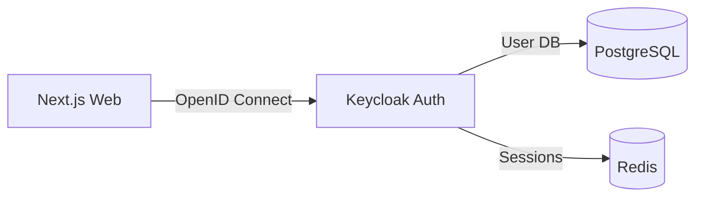

# Proposal Prepper Auth Microservice

Self-hosted authentication service using Keycloak for role-based access control.

## Overview

This microservice provides:
- **Role-based access**: Bidder vs Government user roles
- **Demo mode**: Secure demo credentials with CAPTCHA protection
- **OpenID Connect**: Standard protocol for web integration
- **Self-hosted**: No vendor lock-in, runs in containerized stack

## Ports

- **8180**: Keycloak admin console and API

## Quick Start

```bash
# Start auth service
cd proposal-prepper-auth
docker compose up -d

# Check health
curl http://localhost:8180/health/ready

# Access admin console
open http://localhost:8180
# Username: admin
# Password: admin (development only)
```

## Configuration

### Realm Configuration

The realm is automatically imported from `config/realm-export.json` on startup:
- **Realm**: proposal-prepper
- **Client**: proposal-prepper-web
- **Roles**: bidder, government, anonymous
- **Demo user**: demo:demo (with CAPTCHA requirement)

### Database

Keycloak uses the same PostgreSQL instance as other services:
- **Database**: proposal_prepper
- **Schema**: keycloak
- **Connection**: postgres:5432

## Integration

### With Main Stack

The auth service connects to the main `proposal-prepper-network`:

```bash
# Start main stack first
cd ../proposal-prepper-infra/containers
docker compose up -d

# Then start auth
cd ../../proposal-prepper-auth
docker compose up -d
```

### NextAuth Configuration

See `proposal-prepper-web` for NextAuth.js integration.

## Security

**Development Mode**:
- Admin credentials: admin:admin
- Demo credentials: demo:demo
- HTTP enabled for local development

**Production Mode**:
- Use strong admin password (via secrets)
- HTTPS only (proxy handles TLS)
- CAPTCHA protection for all logins

## Architecture



## License

SPDX-License-Identifier: PolyForm-Strict-1.0.0  
SPDX-FileCopyrightText: 2025 Seventeen Sierra LLC
