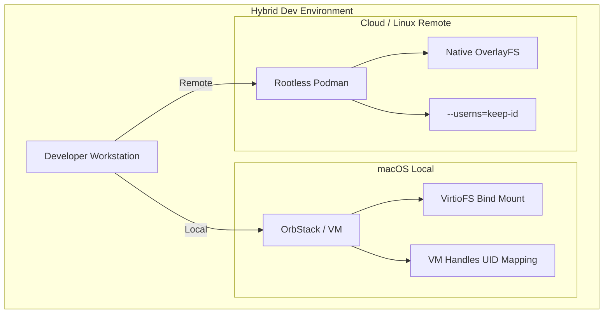
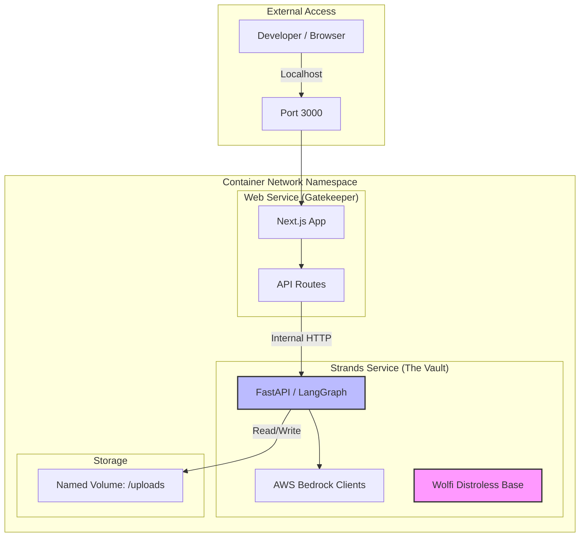

# Strategic Response: Adapting Secure Architecture for Proposal Prepper

**To:** Architecture Review Board
**From:** Proposal Prepper Engineering (Antigravity)
**Date:** 2025-12-14
**Subject:** Alignment Strategy for "Secure-by-Design" Container Implementation

## Executive Summary

We have reviewed the proposed *"Secure-by-Design Architecture for Containerized Development Environments"* and endorse its core philosophy: **security must be intrinsic to the environment, not an afterthought.**

However, to ensure successful adoption for the **Proposal Prepper** application, the generic recommendations must be adapted to our specific operational realities:
1.  **Primary Development on macOS:** Our "local" environment is macOS, where Linux container primitives (namespaces, cgroups) run inside a VM.
2.  **Hybrid Deployment (Local + Cloud):** The setup must seamlessly bridge the gap between a local MacBook and a remote Cloud Workstation.
3.  **Modern Toolchain:** We utilize **Biome** for zero-config, high-performance linting, replacing the ESLint/Prettier stack.
4.  **Federated Mesh Architecture:** Our two-service architecture (Web + Strands) requires specific network orchestration that goes beyond simple sidecars.

This document serves as the implementation directive for adapting the generic secure architecture to our specific needs.

---

## 1. Operational Reality: The macOS Constraint

The reference architecture heavily relies on **Rootless Podman** and `userspace` mapping (`keep-id`). While this is native and performant on Linux (Cloud Workstations), it presents specific challenges on macOS.

### 1.1 The Virtualization Gap
On macOS, containers do not run natively; they run inside a Linux VM.
*   **Challenge:** "Rootless" on macOS adds a second layer of abstraction (Host -> VM -> Rootless Container), which can severely impact I/O performance (file watching) and networking (port forwarding) if not managed correctly. `keep-id` is less relevant on macOS because the Docker/Podman Desktop VM usually handles the UID mapping (Host User -> VM Root) transparently for bind mounts.
*   **Generic Risk:** Strictly enforcing `keep-id` in a `devcontainer.json` intended for Linux might break volume permissions on macOS, or vice versa.

### 1.2 The "Hybrid" Solution (Mac + Remote)
We will adopt a **Interface-Agnostic Configuration**:
*   **Local (macOS):** We recommend **OrbStack** or **Podman Desktop** with VirtioFS enabled. These provide the "secure sandbox" effectively through virtualization. The `devcontainer.json` should detect the OS and apply `keep-id` *only* when running on a true Linux host (Cloud).
*   **Remote (Cloud):** The strict Rootless Podman configuration outlined in the proposal is **mandatory** here. This is where the supply chain risks are highest and the Linux primitives are native.

**Decision:** We will script our bootstrap to handle conditional runtime arguments (effectively "Secure Graceful Degradation" for macOS) while enforcing the full "Paranoid Mode" on Cloud instances.

### 1.3 Architecture Visualization



---

## 2. Toolchain Modernization: The Biome Shift

The proposal recommends **ESLint + Prettier** for the "Shift Left" security strategy. For `proposal-prepper`, we have standardized on **Biome**.

### 2.1 Why Biome Fits "Secure-by-Design" Better
*   **Performance:** Biome is Rust-based and orders of magnitude faster. This directly addresses the "Security Fatigue" concern in the report—developers are less likely to disable a linter that runs instantly.
*   **Unified Chain:** Biome handles formatting, linting, and import sorting in one pass. This reduces the number of pre-commit hooks and failure points.
*   **Supply Chain:** Replacing `eslint`, `prettier`, and their dozens of plugins (`eslint-plugin-security`, `eslint-config-airbnb`, etc.) with a single binary drastically reduces our `npm` dependency tree, shrinking the attack surface.

### 2.2 Biome Integration Flow

```mermaid
sequenceDiagram
    participant Dev as Developer
    participant Git as Pre-Commit Hook
    participant Biome as Biome CLI
    participant Repo as Repository
    
    Dev->>Git: git commit
    Git->>Biome: biome ci .
    
    rect rgb(30, 30, 30)
        note right of Biome: Single Pass Performance
        Biome->>Biome: Linting
        Biome->>Biome: Formatting
        Biome->>Biome: Import Sorting
    end
    
    alt Success
        Biome-->>Git: Pass (0ms - 50ms)
        Git-->>Repo: Commit Accepted
    else Failure
        Biome-->>Git: Fail with fixes
        Git-->>Dev: Commit Blocked
    end
```



**Implementation Adjustment:**
We will replace the `eslint-plugin-security` requirement with **Biome's strict ruleset** and potentially supplement with a specialized security scanner like **Semgrep** for deep logical security flaws that Biome doesn't cover yet, keeping the "Shift Left" velocity high.

---

## 3. Architecture Alignment: Federated Mesh (Web + Strands)

The "Sidecar Networking" pattern proposed (`network_mode: service:db`) is excellent but needs expansion for our **Web (Next.js)** and **Strands (Python)** architecture.

### 3.1 The Strands Isolation Imperative
Our **Strands Service** processes sensitive proposal documents against FAR/DFARS regulations. It is the highest-risk component.
*   **Distroless is Critical Here:** The proposal's recommendation for **Chainguard/Wolfi** images must be strictly enforced for the `strands` service. If an RCE occurs during document parsing (a common vector), the attacker must find themselves in a barren environment (no shell, no curls).
*   **Web as the Gatekeeper:** The `web` service should be the *only* service exposing a port to the developer (via port forwarding). The `strands` service should listen *only* on the internal container network, accessible via the `web` app's API routes.

**Architecture Refinement:**
```yaml
# Conceptual docker-compose.yml
services:
  # The Gatekeeper
  web:
    image: node-dev-distroless
    network_mode: bridge # Exposes to VS Code Port Forwarding
    links:
      - strands

  # The Vault (High Risk Processing)
  strands:
    image: python-distroless # Strict Wolfi image
    network_mode: service:web # Shares namespace or restricted internal net
    # NO PORTS EXPOSED to host
```

### 3.3 The Gatekeeper Pattern



### 3.2 AI credential Injection
The report glossed over secret management for AI services. Since `strands` connects to **AWS Bedrock** and **Anthropic**, we must ensure these credentials are never baked into the image.
*   **Requirement:** We will use **DevContainer Secrets** (or 1Password CLI integration) to inject these at runtime. The `postCreateCommand` must verify these secrets exist but *never* log them.

---

## 4. Integration with .kiro/specs

Our `.kiro` specifications emphasize "Threshold functionality" and "Compliance".

### 4.1 Compliance-as-Code
The "Secure-by-Design" setup helps us meet NIST 800-171 requirements (often relevant for FAR compliance software) by proving that the *development environment itself* tracks dependencies and vulnerabilities.
*   **SBOM Generation:** We will implement the configured `trivy` scans to generate an SBOM for every build of `strands`. This becomes a compliance artifact we can show to users/auditors.

### 4.2 Data Persistence
The report mentions isolating the DB. For `proposal-prepper`, we have local document storage (uploads).
*   **Constraint:** On macOS, bind-mounting large document folders can be slow.
*   **Action:** We will use a named volume for the `uploads` directory to ensure I/O performance, rather than a direct bind mount to the MacOS host filesystem, unless direct debugging of the PDF files is required.

---

## Conclusion & Next Steps

We accept the "Secure-by-Design" architecture with the following modifications:

1.  **Draft `devcontainer.json`:** configured for **Dual-Target** (macOS/OrbStack + Linux/Podman).
2.  **Base Images:** Adopt **Wolfi/Chainguard** immediately for `strands` (Python).
3.  **Linting:** Configure **Biome** in the DevContainer features, replacing ESLint.
4.  **Networking:** Implement the "Gatekeeper" pattern where `web` proxies to the isolated `strands` service.

This strategy balances the theoretical security maximums of the original report with the practical realities of our macOS-based engineering team.
