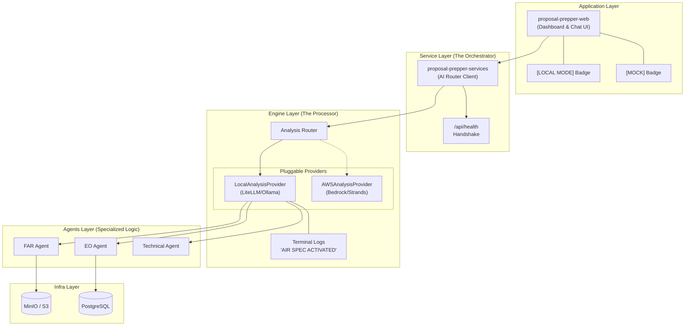

# Architecture: Pipeline Duality (Local vs. Cloud)

The `proposal-prepper-backend` service is the "Analysis Engine" of the application. It is designed with a **Unified Codebase** that adapts its behavior based on the environment it's running in.

## High-Level Architecture

## The 8-Step Analysis Flow (Local Mode Demo)

This flow illustrates how a document moves from the Web UI through the local AI pipeline.

### Step 0: Environment & Entry (The Demo Setup)
| Substep | Action | Acceptance Criteria |
| :--- | :--- | :--- |
| **0.1** | Web UI Access | `http://localhost:3000` loads the dashboard. |
| **0.2** | Mode Validation | UI confirms `Local Mode` via configuration check. |
| **0.3** | Backend Handshake | `GET /api/health` returns `healthy` with `air_spec_mode: true`. |
| **0.4** | Terminal Monitor | Logs show: `AIR SPEC ACTIVATED: Using llama3.2...` |
| **0.5** | UI Branding | TopBar displays a green **LOCAL MODE** status badge. |

### Step 1: Document Upload (Entry Point)
| Substep | Action | Acceptance Criteria |
| :--- | :--- | :--- |
| **1.1** | File Validation | `proposal-prepper-web` confirms PDF type and < 50MB. |
| **1.2** | API Upload Call | `POST /api/documents/upload` returns `200 OK` with `sessionId`. |
| **1.3** | MinIO Storage | File exists at `uploads/{sessionId}/{filename}` in MinIO. |
| **1.4** | DB Indexing | Record created in PostgreSQL `documents` table. |

### Step 2: Extraction (Data Preparation)
| Substep | Action | Acceptance Criteria |
| :--- | :--- | :--- |
| **2.1** | S3 Retrieval | `proposal-prepper-backend` fetches bytes from MinIO. |
| **2.2** | `pypdf` Parsing | PDF text and metadata extracted into memory. |
| **2.3** | Text Cleaning | Whitespace normalized; page markers injected. |
| **2.4** | Status Update | WebSocket broadcasts `status: extracting` (30%). |

### Step 3: FAR Scan (Initial AI Analysis)
| Substep | Action | Acceptance Criteria |
| :--- | :--- | :--- |
| **3.1** | Thermal Guard | Logs show CPU check (and pause if > threshold). |
| **3.2** | Prompt Build | Specialized FAR context generated for the LLM. |
| **3.3** | LiteLLM Call | Local AI (Ollama) receives prompt and starts generation. |
| **3.4** | Status Update | WebSocket broadcasts `status: analyzing` (45%). |

### Step 4: DFARS Audit (Regulatory Depth)
| Substep | Action | Acceptance Criteria |
| :--- | :--- | :--- |
| **4.1** | Reference Lookup | Logic cross-references text against DFARS specific sections. |
| **4.2** | Finding Pairing | AI identifies specific DFARS conflicts. |
| **4.3** | Progress Update | WebSocket broadcasts `status: analyzing` (55%). |

### Step 5: Security Review (Integrity Check)
| Substep | Action | Acceptance Criteria |
| :--- | :--- | :--- |
| **5.1** | Internal Audit | Backend validates AI findings for consistency. |
| **5.2** | Severity Score | Critical/Warning/Info badges assigned to findings. |
| **5.3** | Progress Update | WebSocket broadcasts `status: validating` (65%). |

### Step 6: Policy Check (Final Verification)
| Substep | Action | Acceptance Criteria |
| :--- | :--- | :--- |
| **6.1** | Citation Check | Final verification of FAR/DFARS links and URLs. |
| **6.2** | Confidence Score | Confidence percentage calculated for each issue. |
| **6.3** | Progress Update | WebSocket broadcasts `status: validating` (75%). |

### Step 7: Report Generation (Delivery)
| Substep | Action | Acceptance Criteria |
| :--- | :--- | :--- |
| **7.1** | Report Synthesis | Final JSON object aggregated with summary and counts. |
| **7.2** | Results DB Store | Compliance results written to PostgreSQL `results` table. |
| **7.3** | WS Broadcast | WebSocket sends `type: analysis_complete`. |
| **7.4** | UI Rendering | Web UI renders the results panel and chat interface. |

## CLI Flag & UI Badge Catalog

The startup behavior is controlled by `proposal-prepper-infra/containers/start.sh`.

| Command Flag | Mode | Expected UI Badge | Backend Status | Persistence |
| :--- | :--- | :--- | :--- | :--- |
| (None) | **Local Mode** | `[LOCAL MODE]` (Green) | Running (8080) | Enabled |
| `-m`, `--mock` | **Mock Mode** | `[MOCK]` (Amber) | **Offline** | Disabled (UI Only) |
| `-d`, `--detach` | **Background** | Same as above | Detached | Enabled |

### Foreground vs. Background
- **Foreground (Default)**: `docker-compose up`. Logs stream directly to your terminal. Useful for monitoring Step 0 (Health Checks) and Step 3 (LiteLLM calls) in real-time. Terminating the terminal process (Ctrl+C) stops the services.
- **Background (`-d`)**: `docker-compose up -d`. Services run in the "background" (detached). Control is returned to your terminal immediately. You must use `docker logs -f` or `docker-compose logs -f` to see activity.

## Environment Breakdown

| Component | Local / Demo Environment | Production (AWS) Environment |
| :--- | :--- | :--- |
| **Web UI** | `proposal-prepper-web` (Dev) | `proposal-prepper-web` (Amplify/S3) |
| **Orchestrator** | `proposal-prepper-services` | `proposal-prepper-services` (Lambda) |
| **Analysis Engine**| `proposal-prepper-backend` | `proposal-prepper-backend` (ECS) |
| **AI Provider** | **LiteLLM** (Ollama: Llama 3.2) | **AWS Bedrock** (Claude 3.5 Sonnet) |
| **Storage (S3)** | MinIO Container | AWS S3 Bucket |
| **Database** | PostgreSQL Container | AWS RDS (PostgreSQL) |

> [!IMPORTANT]
> This "Environment Duality" ensures that 100% of the core agent logic tested locally is the same that runs in production. The only shift is the **Analysis Provider** adapter.
