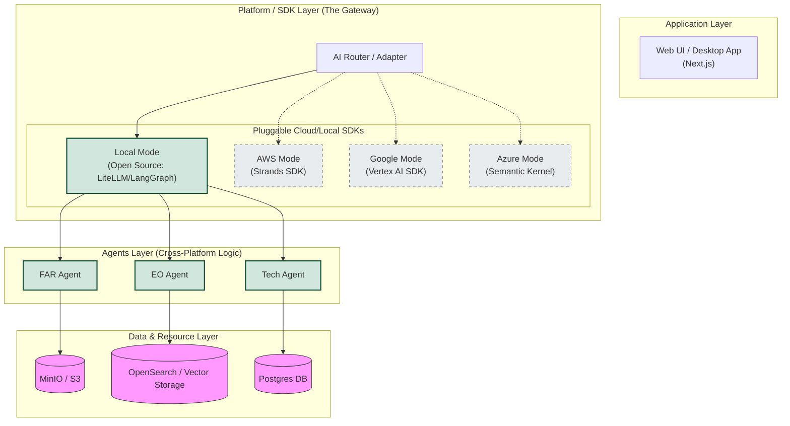

# Architecture: Strands Service Duality (Local vs. Cloud)

The `strands` service is the "Analysis Engine" of the Proposal Prepper application. It is designed with a **Unified Codebase** that adapts its behavior based on the environment it's running in.

## High-Level Architecture

## The Multi-Cloud "Pluggable" Strategy

Our architecture is designed so that the **Agents** (FAR, EO, Tech) are independent of the cloud provider. We use a **Platform / SDK Layer** to bridge the gap.

### 1. Local / Demo Phase (Current)
Locally, we use **LiteLLM + LangGraph** as our open-source equivalent to the Strands SDK.
- **LiteLLM**: Provides a unified API to talk to local models (like Llama/Mistral) or mock providers.
- **LangGraph**: Orchestrates the agents (FAR/EO) just like Strands would in the cloud.
- **Local Infra**: MinIO and OpenSearch containers provide the S3 and Vector storage equivalents.

### 2. AWS / Strands Phase (Future)
When we switch to AWS, we swap the `LOCAL_SDK` for the `AWS_SDK (Strands)`. 
- The **Agents** remains exactly the same.
- We point the storage and vector connections to real AWS S3 and Managed OpenSearch.

### 3. Google & Microsoft Phase (Future)
By using this "Adapter" pattern, we can easily add:
- **Google Cloud**: Using Vertex AI and Cloud Storage.
- **Azure**: Using Azure OpenAI and Azure AI Search.

## Why this makes sense for the Demo

This approach proves that our application is **Cloud-Agnostic**. 
- For the demo, we show everything running on the desktop using the **Open Source Stack**.
- We point out that by simply flipping a configuration switch, the exact same Agents will start talking through the **Strands SDK** on AWS, or **Vertex AI** on Google Cloud.

> [!TIP]
> This design ensures no vendor lock-in. We are building the "Agents" (the value), and treating the "Cloud Platform" as a swappable resource.

## Environment Breakdown

| Component | Local / Demo Environment | Production (AWS) Environment |
| :--- | :--- | :--- |
| **Logic** | `strands` Container (Same Code) | `strands` on ECS/Lambda (Same Code) |
| **Database** | Postgres Container | AWS RDS (Postgres) |
| **Storage** | MinIO Container | AWS S3 Bucket |
| **Vector Search** | OpenSearch Container | AWS OpenSearch Service |
| **AI Analysis** | `fallback_analysis.py` | AWS Bedrock (Claude 3) |

> [!IMPORTANT]
> This "Environment Duality" ensures that 100% of the code you test locally is the same code that will run in production. The only difference is where the service endpoints point to.
鼓
