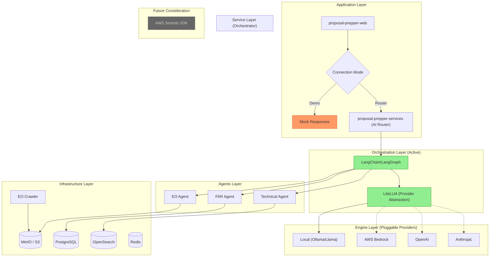

<!--
SPDX-License-Identifier: PolyForm-Strict-1.0.0
SPDX-FileCopyrightText: 2025 Seventeen Sierra LLC
-->

# Architecture: Hierarchical Connection Modes

The Proposal Prepper application uses a **Hierarchical Connection Mode** system that allows developers to work at different levels of infrastructure complexity—from a pure UI demo to full AI-powered analysis.

## Prerequisites

> [!IMPORTANT]
> This project requires **Nix** for reproducible development environments.
> ```bash
> # Enter the development environment before running ANY commands
> nix develop
> 
> # Then install dependencies
> pnpm install
> ```

## High-Level Architecture



| Mode | TopBar Badge | start.sh | Backend |
|------|--------------|----------|---------|
| Demo | `DEMO: MANUAL` | `--mode demo-manual` | Mock only |
| Router | `ROUTER: LOCAL` | `--mode router-local` | Full stack |


## Hierarchical Connection Modes

The application's mode is controlled by **two tiers** in the Connection Settings UI:

### Tier 1: Connection Mode

| Mode | UI Badge | Description |
|------|----------|-------------|
| **Front-end (Demo)** | `DEMO: MANUAL` | UI-only mode, no backend required |
| **AI Router (Live)** | `ROUTER: LOCAL` | Full stack with AI analysis engine |

### Tier 2: Orchestration & Providers

**Current Architecture** (Active):
| Component | Technology | Status | Description |
|-----------|-----------|--------|-------------|
| **Orchestration** | LangChain/LangGraph | ✅ Active | Multi-agent workflow coordination |
| **Provider Abstraction** | LiteLLM | ✅ Active | Unified interface for all LLM providers |
| **Local Model** | Ollama (Llama 3.2) | ✅ Active | Privacy-first local inference |
| **Cloud Providers** | Bedrock/OpenAI/Anthropic | ⚠️ Available | Via LiteLLM, opt-in only |

**Historical Context**:
| Component | Technology | Status | Notes |
|-----------|-----------|--------|-------|
| **AWS Strands SDK** | Python orchestration | 🚫 Not Adopted | Considered but opted for provider-agnostic approach |

> [!NOTE]
> We chose **LangChain + LiteLLM** over AWS Strands to maintain provider independence and support fully local development with Llama models.

> [!WARNING]
> Cloud providers are intentionally disabled in `start.sh` to prevent accidental cloud costs during development.

---

## Orchestration Architecture (Current)

> [!IMPORTANT]
> The application uses **LangChain + LiteLLM** for agent orchestration, providing provider independence and local-first development.

### Architecture Layers

```python
# LangChain handles multi-agent workflows
from langchain.agents import AgentExecutor
from langchain.tools import tool

# LiteLLM provides provider abstraction  
from litellm import completion

# Same code works with ANY provider
def analyze_document(text, provider="ollama"):
    response = completion(
        model=f"{provider}/llama3.2",  # or "bedrock/claude", "gpt-4", etc.
        messages=[{"role": "user", "content": text}]
    )
    return response
```

### Benefits

1. **Provider Independence**: Switch between Ollama, Bedrock, OpenAI, Anthropic with 1 line change
2. **Local-First**: Full functionality with local Llama models (no cloud required)
3. **Cost Control**: Choose provider based on cost/performance needs
4. **Privacy**: Sensitive documents can stay 100% local
5. **Production-Ready**: LangChain is battle-tested for multi-agent systems

---

## AWS Cloud Architecture (Historical Reference)

> [!NOTE]
> This architecture represents the **original AWS Strands SDK plan** that is **not currently implemented**. We opted for LangChain + LiteLLM instead for provider independence.
>
> Strands remains a **future consideration** if AWS-specific optimizations become necessary.


### Components

| Component | Service | Purpose |
|-----------|---------|---------|
| **FAR Agent** | Strands Agents SDK | FAR/DFARS compliance analysis |
| **EO Agent** | Strands Agents SDK | Executive Order validation |
| **Tech Agent** | Strands Agents SDK | Technical requirements check |
| **FAR Document** | S3 | Federal Acquisition Regulation storage |
| **Executive Orders** | S3 | EO document storage |
| **Vector Storage** | OpenSearch | Semantic search embeddings |
| **LLM** | Amazon Bedrock (Nova Pro) | AI inference |
| **EO Crawler** | Lambda | National Archives sync |

### Region
- **us-east-1** (primary deployment region)

---

## Development Modes

### Mode 1: Demo (UI Only)

**Use when**: Testing UI components, no backend needed.

```bash
# Option A: Local dev server (recommended for development)
nix develop
cd proposal-prepper-web
pnpm dev
# Open http://localhost:3000

# Option B: Containerized demo
cd proposal-prepper-infra/containers
./start.sh --mode demo-manual -d
```

**What's running**:
- Web UI on port 3000
- Mock API responses (simulated)
- No backend services

---

### Mode 2: Router Local (Full Stack)

**Use when**: Testing end-to-end AI analysis flow.

```bash
# Ensure Podman machine is running
podman machine start

# Start full infrastructure (detached)
cd proposal-prepper-infra/containers
./start.sh --mode router-local -d

# View logs
podman-compose -p proposal-prepper logs -f
```

**What's running**:
| Service | Port | Purpose |
|---------|------|---------|
| web | 3000 | Next.js frontend |
| analysis-engine | 8080 | Python AI backend |
| postgres | 5432 | Document & results storage |
| minio | 9000-9001 | Object storage (S3-compatible) |
| redis | 6379 | Cache & session storage |
| opensearch | 9200 | Vector search |

---

## The 8-Step Analysis Flow

When using **Router: Local** mode, documents flow through this pipeline:

### Step 0: Environment Entry
| Check | Acceptance Criteria |
|-------|---------------------|
| Web UI Access | `http://localhost:3000` loads |
| Mode Badge | TopBar shows `ROUTER: LOCAL` |
| Health Check | `GET /api/health` → `{"status":"healthy"}` |

### Step 1: Document Upload
| Action | Result |
|--------|--------|
| PDF Validation | Confirms file type, < 50MB |
| API Call | `POST /api/documents/upload` → `sessionId` |
| Storage | File saved to MinIO bucket |

### Steps 2-6: Analysis Pipeline
| Step | Phase | Status |
|------|-------|--------|
| 2 | Extraction | PDF text extraction via pypdf |
| 3 | FAR Scan | Initial compliance check |
| 4 | DFARS Audit | Regulatory depth analysis |
| 5 | Security Review | Findings validation |
| 6 | Policy Check | Citation verification |

### Step 7: Report Generation
| Action | Result |
|--------|--------|
| Synthesis | Final compliance report JSON |
| Storage | Results saved to PostgreSQL |
| UI Update | Results panel rendered |

---

## CLI Reference

```bash
./start.sh [OPTIONS]
```

| Option | Description |
|--------|-------------|
| `--mode demo-manual` | UI-only demo mode (default) |
| `--mode demo-simulated` | UI with simulated responses |
| `--mode router-local` | Full stack with local AI |
| `--no-web` | Skip web container (use with `pnpm dev`) |
| `-d, --detach` | Run in background |
| `-b, --build` | Rebuild containers |

**Examples**:
```bash
# Development: local dev server + backend containers
./start.sh --mode router-local --no-web -d
cd ../proposal-prepper-web && pnpm dev

# Demo: just the UI
./start.sh --mode demo-manual -d

# Full rebuild
./start.sh --mode router-local -b -d
```

---

## Environment Comparison

| Component | Local (Podman) | Production (AWS) |
|-----------|----------------|------------------|
| **Web UI** | Next.js dev server | Amplify / S3 |
| **Analysis Engine** | Python container | ECS Fargate |
| **AI Provider** | LiteLLM + Ollama | AWS Bedrock (Claude 3.5) |
| **Storage** | MinIO container | S3 |
| **Database** | PostgreSQL container | RDS PostgreSQL |
| **Vector DB** | OpenSearch container | OpenSearch Service |

> [!IMPORTANT]
> The **Environment Duality** design ensures 100% of core agent logic tested locally is identical to production. Only the **Analysis Provider** adapter changes.

---

## Troubleshooting

### Podman Machine Not Running
```
Error: Cannot connect to Podman... connection refused
```
**Fix**: `podman machine start`

### Container Dependency Errors
```
Error: "proposal-prepper_analysis-engine_1" is not a valid container
```
**Cause**: Demo mode tries to resolve analysis-engine dependency  
**Fix**: Use `--mode demo-manual` which only starts the web container

### Nix Environment Missing
```
sh: pnpm: command not found
```
**Fix**: Run `nix develop` before any pnpm commands
