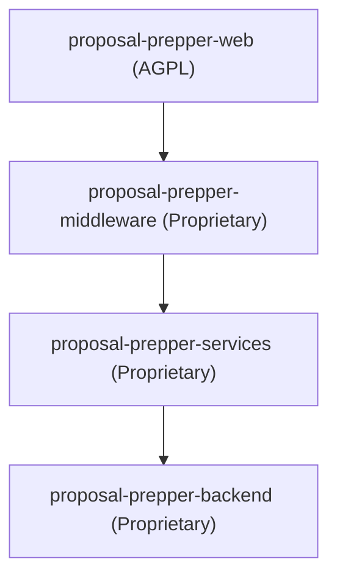

<!-- SPDX-License-Identifier: CC-BY-SA-4.0 -->
<!-- SPDX-FileCopyrightText: 2025 Seventeen Sierra LLC -->

# Proposal Prepper Repository Structure

This document outlines the current monorepo structure and the licensing of its components.

## Repository Layout

| Directory | Purpose | Primary License |
| :--- | :--- | :--- |
| `proposal-prepper-web/` | Next.js Frontend UI | AGPL-3.0-or-later |
| `proposal-prepper-middleware/` | API Traffic Coordination | Proprietary (UNLICENSED) |
| `proposal-prepper-services/` | Shared Business Logic & Clients | Proprietary (UNLICENSED) |
| `proposal-prepper-backend/` | Python/FastAPI AI Service | Proprietary (UNLICENSED) |
| `proposal-prepper-infra/` | DevOps & Infrastructure | PolyForm-Strict-1.0.0 |
| `proposal-prepper-tests/` | Integrated Verification Suite | PolyForm-Strict-1.0.0 |
| `proposal-prepper-docs/` | Project Documentation | CC-BY-SA-4.0 |
| `.agent/` | AI Agent Configuration | PolyForm-Perimeter-1.0.0 |
| `.kiro/` | IDE Specifications | PolyForm-Perimeter-1.0.0 |

## Component Hierarchy

## Branch Strategy

The project follows a standard Git workflow:

- **main**: Production-ready code.
- **develop**: Integration branch for new features.
- **feat/*, fix/*, refactor/**: Short-lived feature branches.

All development occurs within this single monorepo. Mixed licensing is managed at the file and directory level using SPDX headers.
