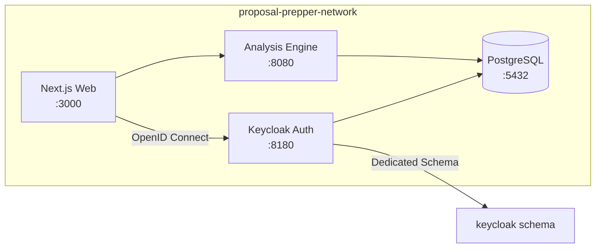

# Session 15: Keycloak Authentication Implementation

**Date**: December 30, 2025  
**Session Type**: Feature Implementation  
**Branch**: `feature/auth`  
**Status**: In Progress - Section 1 Complete

---

## Overview

Session 15 implements self-hosted authentication using Keycloak as a dedicated microservice with role-based access control (Bidder/Government/Anonymous), demo mode security with CAPTCHA, and user-scoped document ownership.

### Why Auth First?

**Critical Prerequisites**:
1. **Security**: Backend routes currently exposed and need protection before public deployment
2. **Data Ownership**: Document uploads (especially J&A + RFP pairs) require user association
3. **Role Workflows**: Bidder/Government-specific features depend on authentication

### Why Keycloak?

- ✅ Open source - No vendor lock-in
- ✅ Self-hosted - Runs in containerized stack (local-first)
- ✅ Production-ready - Industry standard (Red Hat)
- ✅ Role-based access - Built-in RBAC
- ✅ OpenID Connect - Standard protocol for Next.js integration

---

## Session Structure

Session 15 is organized into 7 commit-boundary sections:

1. **✅ Section 1**: Auth Microservice Setup (COMPLETE)
2. **Section 2**: Keycloak Realm Configuration
3. **Section 3**: CAPTCHA Integration (Cloudflare Turnstile)
4. **Section 4**: NextAuth Integration
5. **Section 5**: Database Schema (Users, Documents, Proposals)
6. **Section 6**: Protected Routes
7. **Section 7**: Role-Based UI

---

## Section 1: Auth Microservice Setup ✅

**Commit**: `0b19dd0` - `feat(auth): add Keycloak microservice with role-based access`  
**Date**: December 30, 2025  
**Files Changed**: 10 files, 663 insertions, 2 deletions

### What Was Built

Created `proposal-prepper-auth` microservice as a standalone authentication service:

**Infrastructure**:
- **Keycloak 23.0** container (multi-stage build for optimization)
- **Port 8180** (external), port 8080 (internal)
- **External network** integration with `proposal-prepper-network`
- **Shared PostgreSQL** with dedicated `keycloak` schema
- **Volume persistence** for Keycloak data

**Configuration**:
- **Automated realm import** via `realm-export.json`
- **Realm**: `proposal-prepper`
- **Roles**: `bidder`, `government`, `anonymous`
- **Demo user**: `demo:demo` (with bidder role)
- **Client**: `proposal-prepper-web` (OpenID Connect)

**Testing**:
- **Comprehensive test script** (`test.sh`) with 11 validation checks
- JSON syntax validation
- YAML syntax validation
- Docker build verification
- Health check testing
- Realm import verification
- Database schema validation
- Security scanning

### Files Created

```
proposal-prepper-auth/
├── .gitignore              # Standard ignores for Keycloak data
├── Containerfile           # Keycloak 23.0 multi-stage build
├── LICENSE                 # PolyForm Strict 1.0.0
├── README.md               # Architecture and usage documentation
├── compose.yaml            # Docker Compose configuration
├── test.sh                 # Automated validation script (11 checks)
├── config/
│   └── realm-export.json   # Keycloak realm configuration
└── themes/                 # Custom themes (future)

proposal-prepper-infra/
├── containers/
│   └── compose.yaml        # Updated with keycloak-schema.sql
└── database/
    └── keycloak-schema.sql # PostgreSQL schema for Keycloak

commitlint.config.mjs       # Added 'auth' scope
```

### Technical Decisions

**Dedicated Microservice**:
- Auth runs independently with its own compose.yaml
- Can be started/stopped separately from main stack
- Uses external network for inter-service communication
- Enables separate deployment lifecycle

**Shared PostgreSQL with Schema Isolation**:
- Reduces infrastructure complexity (no separate DB)
- Uses dedicated `keycloak` schema for security
- Keycloak auto-creates 100+ tables via Liquibase
- Simplifies connection management

**Port 8180**:
- Avoids conflict with analysis-engine (8080) and web (3000)
- Standard Keycloak development port
- Clear service separation

### Realm Configuration (realm-export.json)

**Key Features**:
- **Brute force protection**: 5 failed attempts = 15 min lockout
- **Email as username**: Simplified user experience
- **PKCE flow**: Enhanced security for public clients
- **Role claim mapping**: JWT tokens include user roles
- **Remember me**: Persistent sessions

**Security Note**: Fixed Keycloak 23.0 compatibility by removing deprecated `confidentialClient` field (replaced by `publicClient: false`).

### Test Script (`test.sh`)

Automated validation with 11 checks:

1. ✅ Required commands (docker, curl, jq, python3)
2. ✅ JSON syntax (realm-export.json)
3. ✅ YAML syntax (compose.yaml)
4. ✅ SPDX headers
5. ✅ PostgreSQL connectivity
6. ✅ Docker image build
7. ✅ Service startup
8. ✅ Health check endpoint (`/health/ready`)
9. ✅ Realm import verification
10. ✅ Database schema (92 tables created)
11. ✅ Security checks (no hardcoded secrets)

**Run with**: `./proposal-prepper-auth/test.sh`

### Browser Verification

Used automated browser testing to verify admin console functionality:


**Verified**:
- ✅ Admin console login (admin/admin)
- ✅ Realm switch to `proposal-prepper`
- ✅ Roles: `anonymous`, `bidder`, `government`
- ✅ Client: `proposal-prepper-web` with correct redirect URIs
- ✅ Demo user: `demo@proposal-prepper.local`

---

## Architecture



### Service Communication

**External Network Pattern**:
- All services connect to `proposal-prepper-network`
- Services discover each other by container name
- Auth accessible at `http://proposal-prepper-auth:8080` (internal)
- External access via `http://localhost:8180`

---

## Next Steps

### Section 2: Keycloak Realm Configuration (Planned)
- Verify realm is properly configured
- Test role assignments
- Configure client secrets
- Set up refresh token policies

### Section 3: CAPTCHA Integration (Planned)
- Sign up for Cloudflare Turnstile
- Add CAPTCHA to demo login page
- Create verification endpoint
- Test bot protection

### Section 4: NextAuth Integration (Planned)
- Install `next-auth` package
- Create `[...nextauth]/route.ts`
- Configure Keycloak provider
- Implement demo mode auto-login

### Section 5: Database Schema (Planned)
- Create `users` table
- Create `document_uploads` table  
- Create `proposals` table
- Add anonymous user constraints

### Section 6: Protected Routes (Planned)
- Create auth middleware
- Protect API routes
- Allow anonymous access with limits
- Keep health endpoints public

### Section 7: Role-Based UI (Planned)
- Create `useUserRole` hook
- Create `RoleGate` component
- Implement bidder view
- Implement government view

---

## Lessons Learned

### Branch Organization
Initially committed auth code to `docs/session-15-planning` branch. Fixed by:
1. Creating `feature/auth` branch from planning branch base
2. Cherry-picking auth commit to feature branch
3. Resetting docs branch to clean state
4. **Lesson**: Code goes on feature branches, planning goes on docs branches

### Keycloak Compatibility
Encountered deprecated field error during initial startup:
- **Issue**: `confidentialClient` field no longer valid in Keycloak 23.0
- **Fix**: Removed field (uses `publicClient: false` by default)
- **Lesson**: Always check Keycloak version compatibility for realm exports

### Pre-commit Validation
Added `auth` scope to commitlint.config.mjs after realizing it was missing:
- **Lesson**: Update tooling configuration before implementing new features
- **Benefit**: Proper commit message validation from the start

---

## References

- [Keycloak Documentation](https://www.keycloak.org/documentation)
- [OpenID Connect Spec](https://openid.net/connect/)
- [Session 15 Planning Docs](../planning/session-15/)
- [NextAuth.js Documentation](https://next-auth.js.org/) (for Section 4)

---

**Session Status**: Section 1 of 7 Complete  
**Next Session Prompt**: Continue with Section 2: Keycloak Realm Configuration
